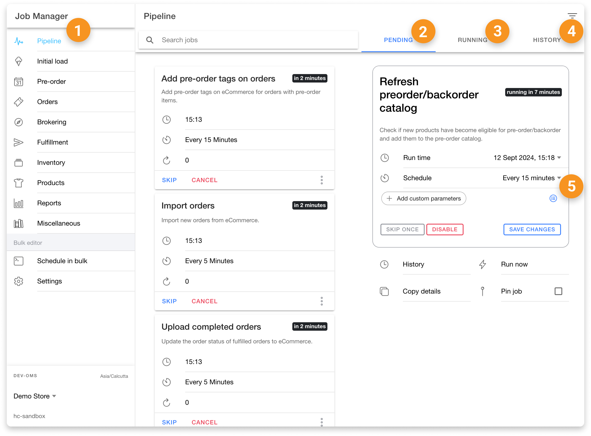
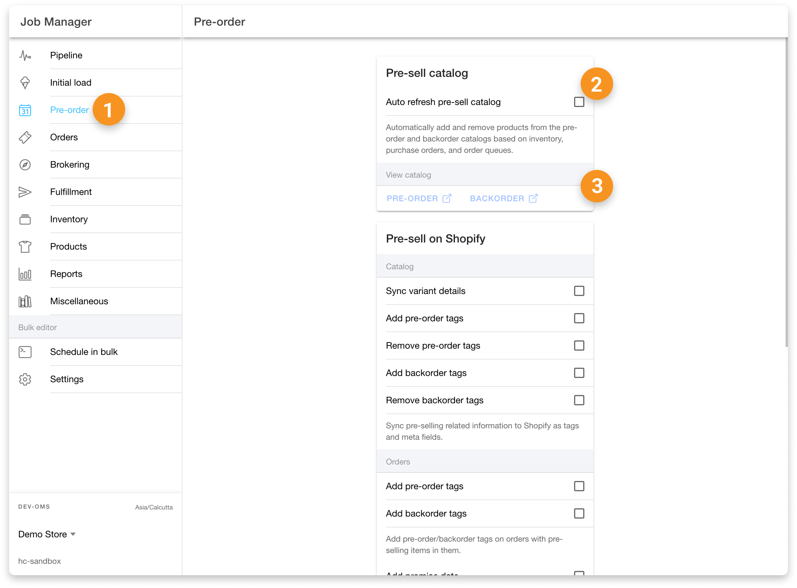
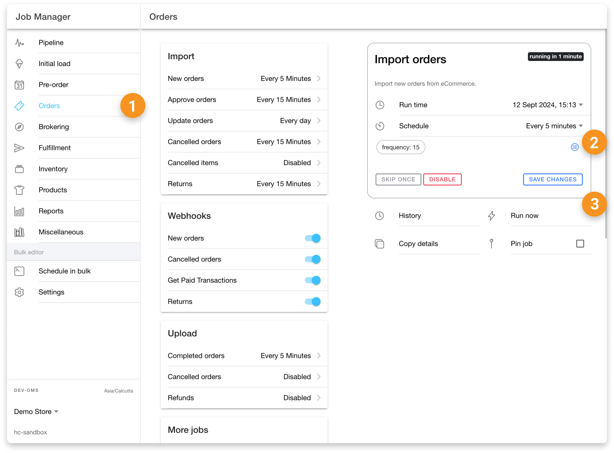
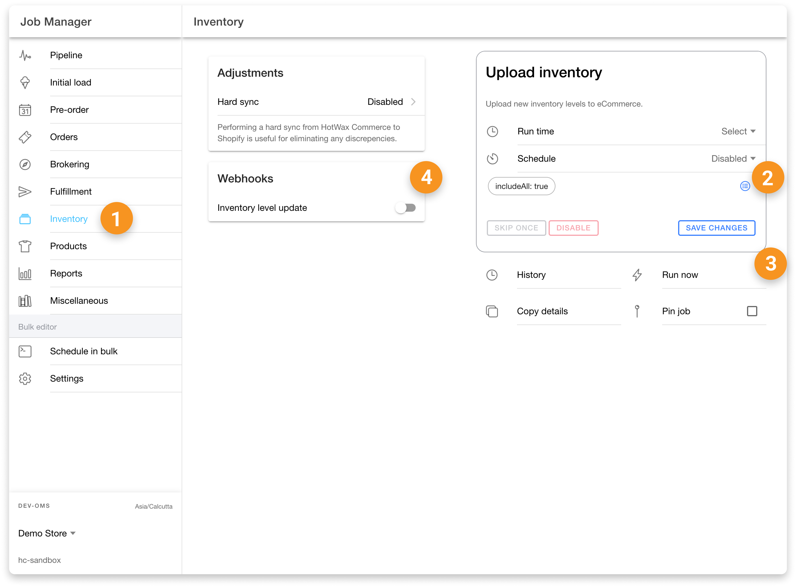
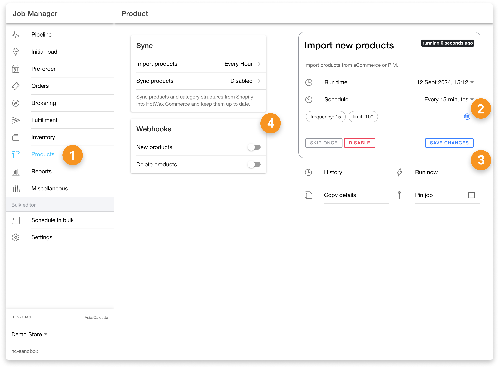
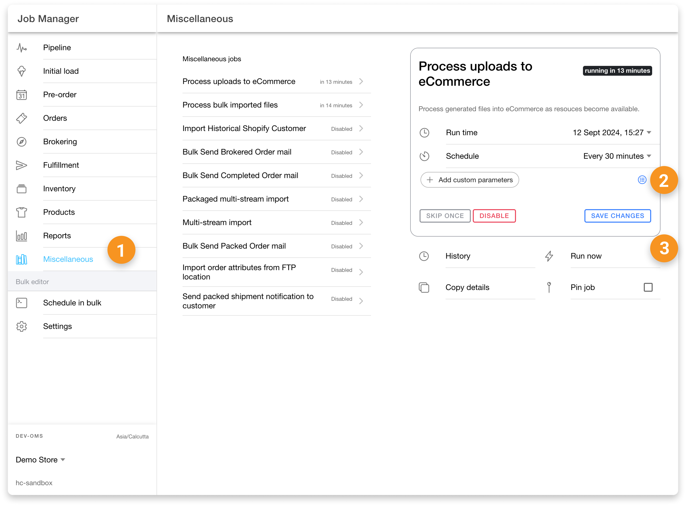

# Job Manager App

HotWax Commerce’s Job Manager App enables users to view, schedule, and update job workflows running within the Order Management System for operations related to orders, products, inventory, and more. Users can easily view all jobs to see which jobs are scheduled and when they will run. While no specific permissions are required for viewing jobs, advanced permissions are necessary to schedule or manage job workflows.

Below is a list of all the actions available in the Job Manager App, along with the specific permissions needed to perform them.

## Pipeline Page

| Serial No. | Action                    | Permission    | Description                                                                                         |
| ---------- | ------------------------- | ------------- | --------------------------------------------------------------------------------------------------- |
| 1          | View Page                 | -             | Allows users to view the Pipeline page, including the list of jobs                                  |
| 2          | View Pending Tab          | -             | View all the jobs that are scheduled to run.                                                        |
| 3          | View In Progress Jobs     | -             | View jobs that are currently in progress.                                                           |
| 4          | View Completed Jobs       | -             | View jobs that have already been completed.                                                         |
| 5          | Update Job Configurations | COMMON\_ADMIN | Allows updating job configurations including Skip Once, Disable, Save Changes, and Run Serial No.w. |

<figure><figcaption></figcaption></figure>

## Initial Load Page

| Serial No. | Action                  | Permission    | Description                                                                                                                                |
| ---------- | ----------------------- | ------------- | ------------------------------------------------------------------------------------------------------------------------------------------ |
| 1          | View Page               | -             | Allows users to view the Initial Load page, including the list of jobs and access to the initial load menu for managing related workflows. |
| 2          | Import Products in Bulk | COMMON\_ADMIN | Import products in bulk from Shopify into HotWax Commerce.                                                                                 |
| 3          | Import Orders in Bulk   | COMMON\_ADMIN | Import orders in bulk from Shopify into HotWax Commerce.                                                                                   |
| 4          | Process Bulk Imports    | COMMON\_ADMIN | Process bulk imported files from Shopify into HotWax Commerce.                                                                             |

<figure><figcaption></figcaption></figure>

## Pre-orders Page

| Serial No. | Action               | Permission    | Description                                                                                                                           |
| ---------- | -------------------- | ------------- | ------------------------------------------------------------------------------------------------------------------------------------- |
| 1          | View Page            | -             | Allows users to view the Pre-orders page, including the list of jobs and access to the pre-order menu for managing related workflows. |
| 2          | Enable/Disable Jobs  | COMMON\_ADMIN | Enable or disable pre-order jobs by checkbox.                                                                                         |
| 3          | View Presell Catalog | COMMON\_ADMIN | View items that are on pre-order and backorder catalog in HotWax Commerce.                                                            |

<figure><figcaption></figcaption></figure>

## Orders Page

| Serial No. | Action                    | Permission    | Description                                                                           |
| ---------- | ------------------------- | ------------- | ------------------------------------------------------------------------------------- |
| 1          | View Page                 | -             | View the Orders page, including scheduled and available jobs, and view history.       |
| 2          | Update Jobs               | COMMON\_ADMIN | Change job schedule, runtime, and parameters.                                         |
| 3          | Update Job Configurations | COMMON\_ADMIN | Skip once, Disable, Save Changes, and Run Serial No.w options for job configurations. |
| 4          | Order Webhooks            | COMMON\_ADMIN | Subscribe to Shopify webhooks related to orders.                                      |

<figure><figcaption></figcaption></figure>

## Brokering Page

| Serial No. | Action               | Permission    | Description                                                                    |
| ---------- | -------------------- | ------------- | ------------------------------------------------------------------------------ |
| 1          | View Page            | -             | Allows users to view the Brokering page, including the list of scheduled jobs. |
| 2          | Create Brokering Run | COMMON\_ADMIN | Create a new run for brokering orders.                                         |
| 3          | Update Schedule Runs | COMMON\_ADMIN | Update the runtime and frequency of brokering runs.                            |

## Fulfillment Page

| Serial No. | Action                           | Permission    | Description                                                                                    |
| ---------- | -------------------------------- | ------------- | ---------------------------------------------------------------------------------------------- |
| 1          | View Page                        | -             | View the Fulfillment page, including scheduled and available jobs, and view history.           |
| 2          | Update Jobs                      | COMMON\_ADMIN | Change job schedule, runtime, and parameters.                                                  |
| 3          | Update Job Configurations        | COMMON\_ADMIN | Skip once, Disable, Save Changes, and Run Serial No.w options for job configurations.          |
| 4          | Auto Cancellation Configurations | COMMON\_ADMIN | Manage auto-cancellation settings including days input, save button, and daily toggle options. |

<figure><figcaption></figcaption></figure>

## Inventory Page

| Serial No. | Action                    | Permission    | Description                                                                                                                       |
| ---------- | ------------------------- | ------------- | --------------------------------------------------------------------------------------------------------------------------------- |
| 1          | View Page                 | -             | Allows users to view the Inventory page, where they can see the scheduled and available inventory jobs and view the job history.  |
| 2          | Update Jobs               | COMMON\_ADMIN | Enables users to change the schedule, runtime, and parameters for inventory-related jobs.                                         |
| 3          | Update Job Configurations | COMMON\_ADMIN | Allows updating job configurations such as skipping a job once, disabling a job, saving changes, and running the job immediately. |
| 4          | Inventory Webhooks        | COMMON\_ADMIN | Manages Shopify webhooks related to inventory level updates, ensuring real-time synchronization between systems.                  |

<figure><figcaption></figcaption></figure>

## Product Page

| Serial No. | Action                    | Permission    | Description                                                                                                                          |
| ---------- | ------------------------- | ------------- | ------------------------------------------------------------------------------------------------------------------------------------ |
| 1          | View Page                 | -             | Allows users to view the Product page, where they can see the scheduled and available product-related jobs and view the job history. |
| 2          | Update Jobs               | COMMON\_ADMIN | Enables users to change the schedule, runtime, and parameters for product-related jobs.                                              |
| 3          | Update Job Configurations | COMMON\_ADMIN | Allows updating job configurations such as skipping a job once, disabling a job, saving changes, and running the job immediately.    |
| 4          | Product Webhooks          | COMMON\_ADMIN | Manages Shopify webhooks related to importing and deleting products, ensuring accurate product data management.                      |

<figure><figcaption></figcaption></figure>

## Reports Page

| Serial No. | Action                    | Permission    | Description                                                                                                                         |
| ---------- | ------------------------- | ------------- | ----------------------------------------------------------------------------------------------------------------------------------- |
| 1          | View Page                 | -             | Allows users to view the Reports page, where they can see the scheduled and available report-related jobs and view the job history. |
| 2          | Update Jobs               | COMMON\_ADMIN | Enables users to change the schedule, runtime, and parameters for report-related jobs.                                              |
| 3          | Update Job Configurations | COMMON\_ADMIN | Allows updating job configurations such as skipping a job once, disabling a job, saving changes, and running the job immediately.   |

## Miscellaneous Page

| Serial No. | Action                    | Permission    | Description                                                                                                                              |
| ---------- | ------------------------- | ------------- | ---------------------------------------------------------------------------------------------------------------------------------------- |
| 1          | View Page                 | -             | Allows users to view the Miscellaneous page, where they can see the scheduled and available miscellaneous jobs and view the job history. |
| 2          | Update Jobs               | COMMON\_ADMIN | Enables users to change the schedule, runtime, and parameters for miscellaneous jobs.                                                    |
| 3          | Update Job Configurations | COMMON\_ADMIN | Allows updating job configurations such as skipping a job once, disabling a job, saving changes, and running the job immediately.        |

<figure><figcaption></figcaption></figure>

## Schedule in Bulk Page

| Serial No. | Action        | Permission    | Description                                                                                 |
| ---------- | ------------- | ------------- | ------------------------------------------------------------------------------------------- |
| 1          | View Page     | COMMON\_ADMIN | Allows users to view the Schedule in Bulk page, where they can see the scheduled bulk jobs. |
| 2          | Schedule Jobs | COMMON\_ADMIN | Enables users to schedule multiple jobs in bulk, streamlining the job management process.   |

<figure><figcaption></figcaption></figure>
