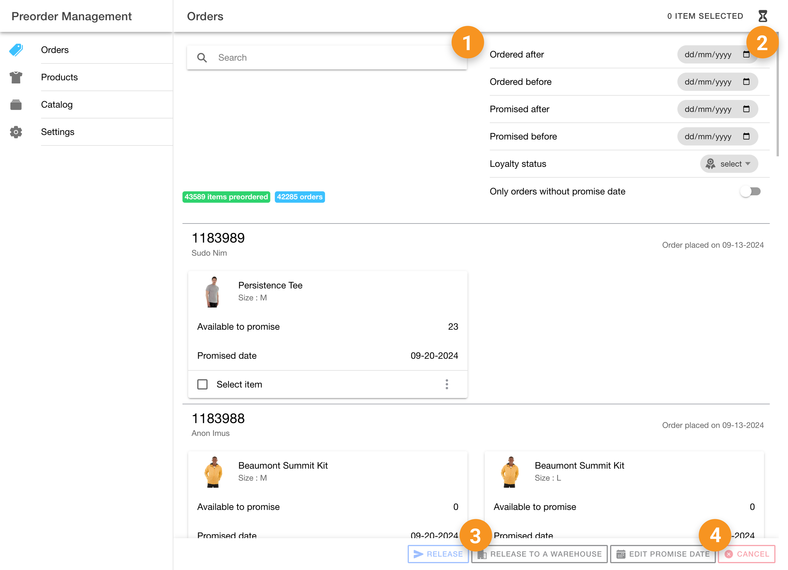
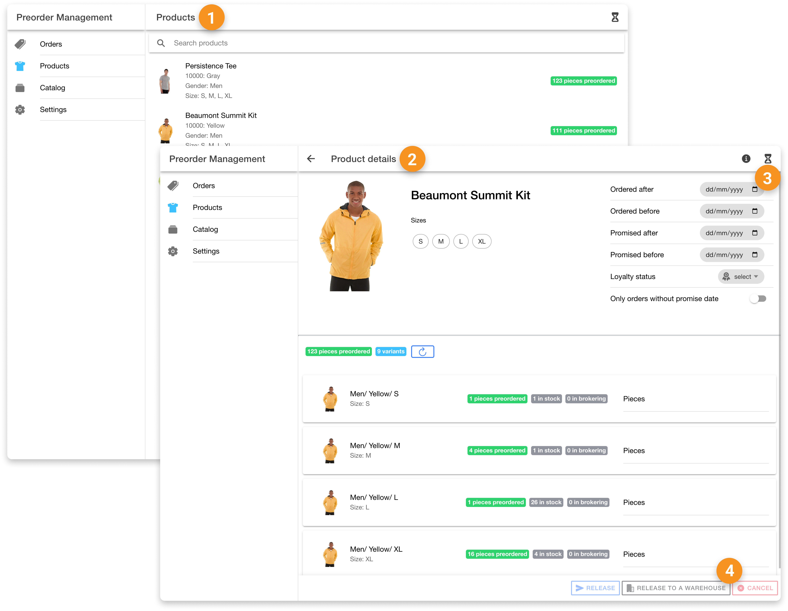
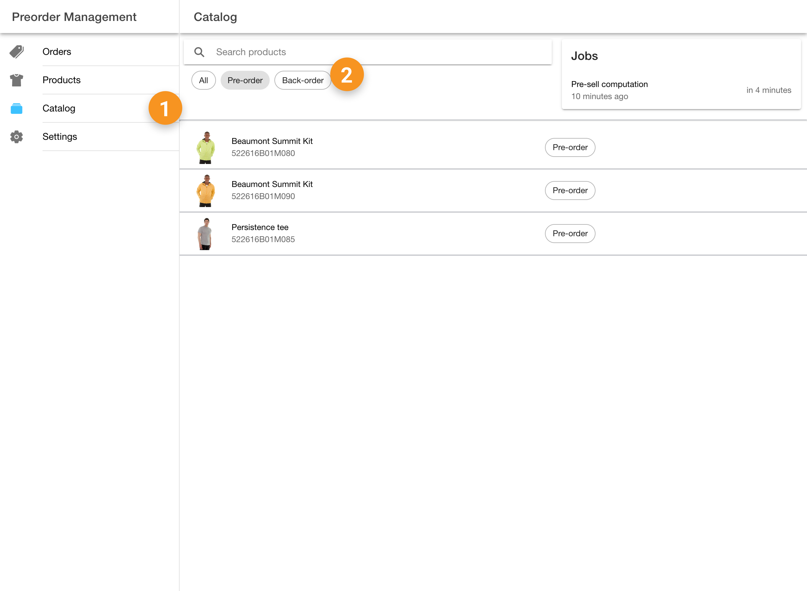
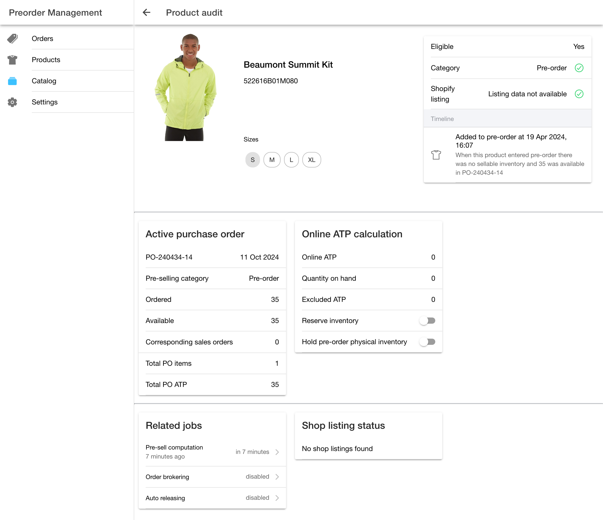

# Pre-Order App

The HotWax Commerce `Pre-Order` App is designed for merchandisers to gain a clear understanding of their presell catalog, allowing them to track the status of pre-orders and backorders, and confirm listed items on the eCommerce platform. This app enables merchandisers to efficiently manage all pre-orders, including the ability to release them manually. The Pre-Order App is designed specifically for merchandisers to get a full overview of the pre-order products; therefore, the "PRE-ORDER APP VIEW" permission is required to access the app. Furthermore, actions that involve pre-order inventory configurations also require higher-level permissions. Below is a list of all the actions available in the Pre-Order App, along with the specific permissions needed to perform them.

## Order Page

| Serial No. | Action            | Permissions Needed | Description                                                         |
| --- | ----------------- | ------------------ | ------------------------------------------------------------------- |
| 1   | Search Orders     | -                 | Search all the pre-orders within the system.                        |
| 2   | Filter Orders     | -                 | Filter orders based on order date, promise date, or loyalty status. |
| 3   | Release Items     | -                 | Release items from the parking queue to begin fulfillment.          |
| 4   | Edit Promise Date | -                 | Edit the promise date of the order as needed.                       |

<figure><figcaption></figcaption></figure>

## Products Page

| Serial No. | Action               | Permissions Needed | Description                                                                                     |
| --- | -------------------- | ------------------ | ----------------------------------------------------------------------------------------------- |
| 1   | View Products        | -                 | View all products currently on pre-order.                                                       |
| 2   | View Product Details | -                 | View detailed information and all orders for a specific product.                                |
| 3   | Filter Orders        | -                 | Filter orders for specific products based on size, order date, promise date, or loyalty status. |
| 4   | Release Orders       | -                 | Release all orders associated with the selected products.                                       |

<figure><figcaption></figcaption></figure>

## Catalog Page

| Serial No. | Action                 | Permissions Needed | Description                                                                |
| --- | ---------------------- | ------------------ | -------------------------------------------------------------------------- |
| 1   | View Product Catalog   | -                 | View the complete product catalog, including pre-orders and backorders.    |
| 2   | Filter Product Catalog | -                 | Filter the product catalog based on pre-order, backorder, or all products. |

<figure><figcaption></figcaption></figure>

## Product Audit Page

| Serial No. | Action                            | Permissions Needed | Description                                                                                                                                                              |
| --- | --------------------------------- | ------------------ | ------------------------------------------------------------------------------------------------------------------------------------------------------------------------ |
| 1   | View Pre-Order Listing Status     | -                 | View the listing status, eligibility, and pre-order timeline of products.                                                                                                |
| 2   | View Purchase Order Details       | -                 | View complete purchase order details, including purchase order date, ATP (Available to Promise) of the product, and already allocated inventory from the purchase order. |
| 3   | View Online ATP Computation       | -                 | View ATP computation details, including current online ATP, quantity on hand (QOH), and excluded ATP.                                                                    |
| 4   | Reserve Inventory                 | COMMON\_ADMIN      | Configure whether the OMS (Order Management System) should reserve inventory for pre-orders.                                                                             |
| 5   | Hold Pre-Order Physical Inventory | COMMON\_ADMIN      | Configure inventory computation to prevent physical inventory from being made available online for products with orders in the Pre-Order parking.                        |
| 6   | View Pre-Order Jobs               | -                 | View all pre-order jobs and their next scheduled run times.                                                                                                              |
| 7   | View Shopify Listing Status       | -                 | View the listing status of products on Shopify.                                                                                                                          |

<figure><figcaption></figcaption></figure>
