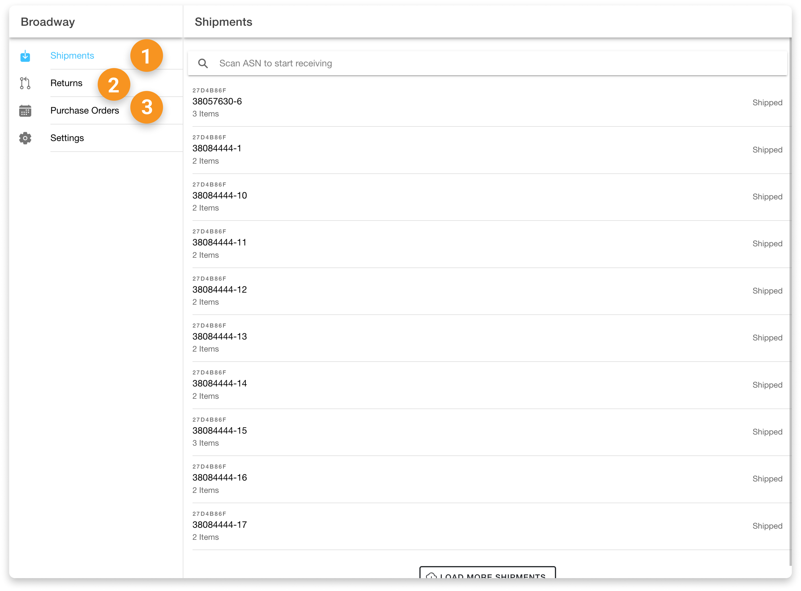
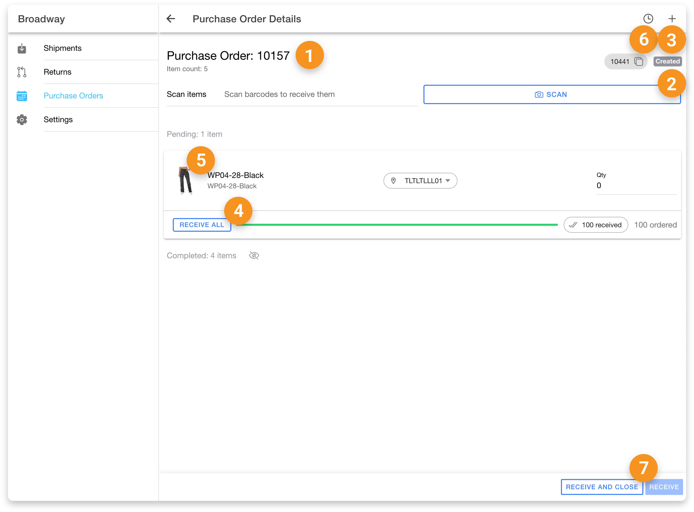

# Receiving App

The HotWax Commerce `Receiving` app is designed specifically for store associates to receive shipments arriving at their facilities. Since the app facilitates manual scanning and receiving by store associates, no specific permissions are required to access the app or to perform basic receiving tasks. However, to complete and close shipments, higher-level permissions are required. This ensures that only store managers, after verifying that the items have been received as requested and addressing any discrepancies, can finalize the shipment process.

Below is a list of all the actions available in the Receiving App, along with the specific permissions needed to perform them.

### Shipment Tabs

| No. | Action                  | Permission | Description                                                           |
| --- | ----------------------- | ---------- | --------------------------------------------------------------------- |
| 1   | View Shipments Tab      | -          | Allows users to view a list of shipments arriving at their facility.  |
| 2   | View Returns Tab        | -          | Enables users to view and manage shipments returning to the facility. |
| 3   | View Purchase Order Tab | -          | Allows users to view arriving purchase order (PO) shipments.          |

<figure><figcaption></figcaption></figure>

### Shipment Details Page

| No. | Action                      | Permission       | Description                                                                                       |
| --- | --------------------------- | ---------------- | ------------------------------------------------------------------------------------------------- |
| 1   | View Shipment Details       | -                | Allows users to view detailed information about a specific shipment.                              |
| 2   | Scan Items                  | -                | Enables users to scan items that are part of the shipment.                                        |
| 3   | Add Items                   | RECEIVING\_ADMIN | Allows users with higher permissions to add unexpected items to the shipment.                     |
| 4   | Receiving Items             | -                | Allows users to receive items listed in the shipment.                                             |
| 5   | Product Image               | -                | Enables users to view and enlarge the product image associated with the shipment.                 |
| 6   | View Receiving History      | -                | Allows users to view the history of receiving activities related to the items in the shipment.    |
| 7   | Receive and Close Shipments | RECEIVING\_ADMIN | Allows users with higher permissions to receive and close the shipment after verifying all items. |

<figure><figcaption></figcaption></figure>

### Settings Page

| No. | Action                    | Permission    | Description                                                                                   |
| --- | ------------------------- | ------------- | --------------------------------------------------------------------------------------------- |
| 1   | Select Product Identifier | COMMON\_ADMIN | Allows users to select the product identifier that will be used to view items within the app. |

<figure><figcaption></figcaption></figure>
