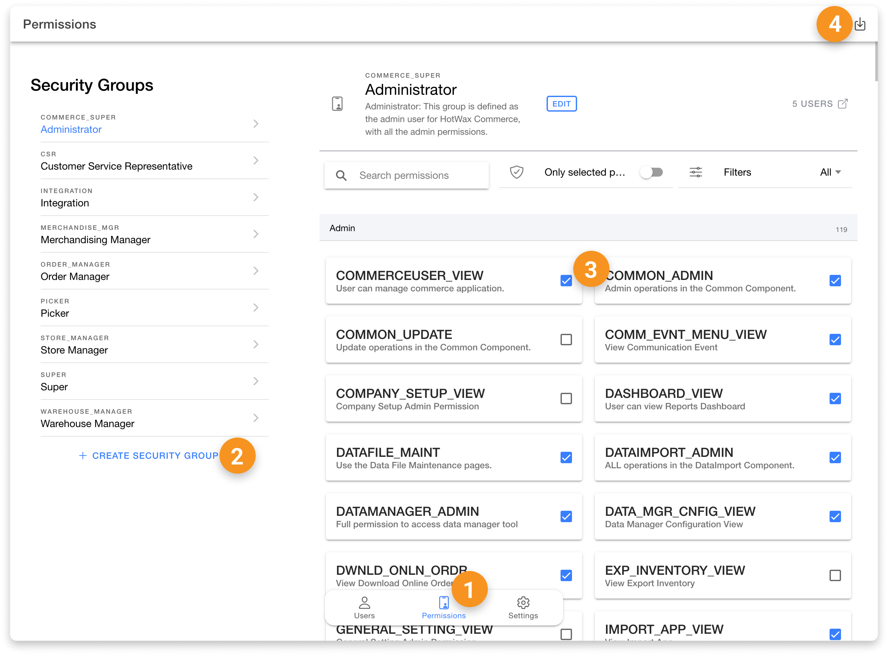

# Users App

The HotWax Commerce Users App is designed to manage user profiles and permissions within the system. Since all users are permitted to manage their own profiles, no specific permission is required to access the Users App for personal profile management. However, to add new users or to manage permissions specific to other users, additional higher-level permissions are required.

Below is a list of all the actions available in the Users App, along with the specific permissions needed to perform them.

### Users Tab

| Action       | Permission                          | Description                                                                      |
| ------------ | ----------------------------------- | -------------------------------------------------------------------------------- |
| View Users   | -                                   | Allows users to view all existing users within HotWax Commerce.                  |
| Search Users | -                                   | Enables users to search for specific users by name, email, or other identifiers. |
| Create Users | SECURITY\_CREATE OR SECURITY\_ADMIN | Provides the ability to create new user profiles within the system.              |

<figure><figcaption></figcaption></figure>

### User Details Page

| Action                      | Permission                          | Description                                                                                                 |
| --------------------------- | ----------------------------------- | ----------------------------------------------------------------------------------------------------------- |
| Edit Profile Information    | -                                   | Allows users to add a photo and edit personal information such as their name.                               |
| Block Login                 | SECURITY\_CREATE OR SECURITY\_ADMIN | Enables the ability to block a user's access to HotWax Commerce applications.                               |
| Reset Password              | -                                   | Allows users to reset their own password.                                                                   |
| Add Contact Details         | -                                   | Enables users to add or update contact information such as email, phone number, and external ID.            |
| Select Security Permissions | WEBTOOLS\_VIEW                      | Allows users to change security groups assigned to themselves or others.                                    |
| Add Product Store           | SECURITY\_CREATE OR SECURITY\_ADMIN | Provides the ability to assign users to a specific product store.                                           |
| Add to Facilities           | STOREFULFILLMENT\_ADMIN             | Enables the assignment of users to specific facilities for fulfillment tasks.                               |
| Add as Picker               | STOREFULFILLMENT\_ADMIN             | Allows the user to be added as a picker for fulfillment purposes.                                           |
| Select Favourite            | -                                   | Enables users to select a favorite product store and Shopify shop for preselection across all applications. |

<figure><figcaption></figcaption></figure>

### Permissions Tab

| Action                   | Permission                          | Description                                                                       |
| ------------------------ | ----------------------------------- | --------------------------------------------------------------------------------- |
| View Tab                 | SECURITY\_VIEW OR SECURITY\_ADMIN   | Allows users to view all permissions currently assigned within the system.        |
| Create Security Group    | SECURITY\_CREATE OR SECURITY\_ADMIN | Provides the ability to create new security groups for managing user permissions. |
| Add/Remove Permissions   | SECURITY\_CREATE OR SECURITY\_ADMIN | Enables users to add or remove permissions from existing security groups.         |
| Download Permission List | -                                   | Allows users to download a list of existing permissions within a security group.  |

<figure><figcaption></figcaption></figure>
