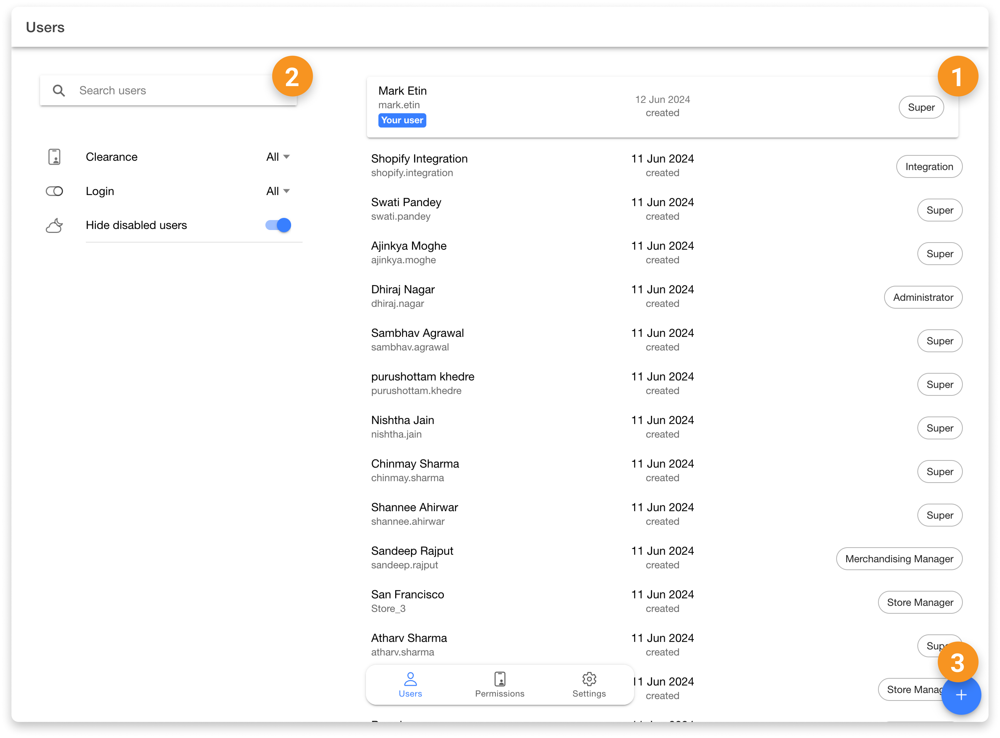
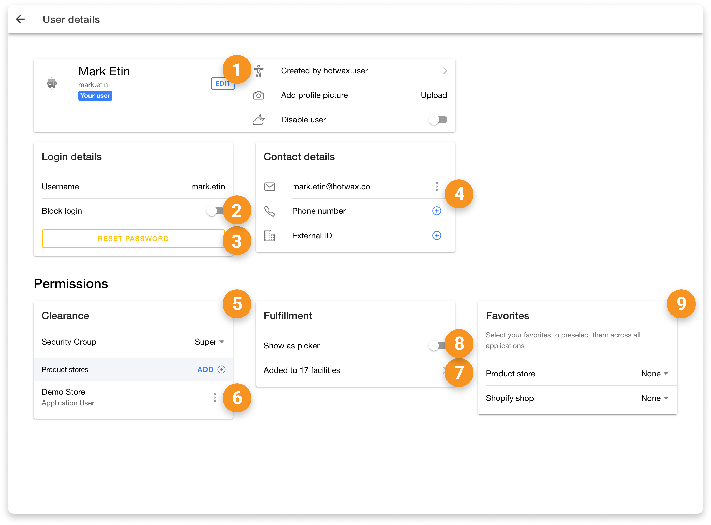
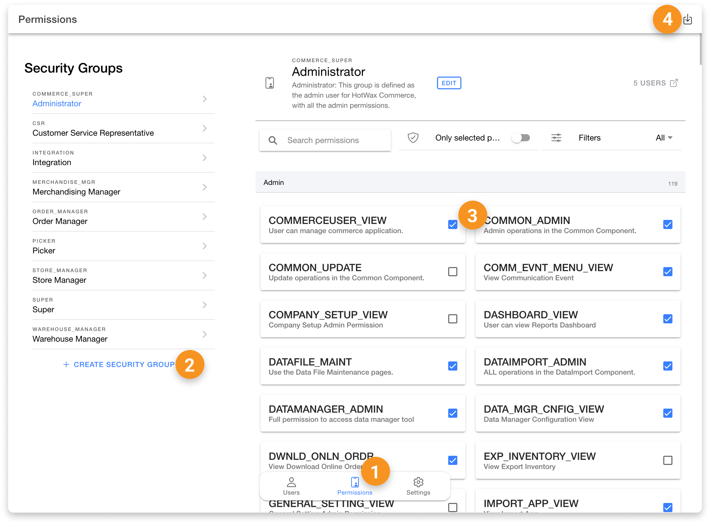

# Users App

The HotWax Commerce Users App is designed to manage user profiles and permissions within the system. Since all users are permitted to manage their own profiles, no specific permission is required to access the Users App for personal profile management. However, to add new users or to manage permissions specific to other users, additional higher-level permissions are required.

Below is a list of all the actions available in the Users App, along with the specific permissions needed to perform them.

### Users Tab

| No. | Action       | Permission                          | Description                                                                      |
| --- | ------------ | ----------------------------------- | -------------------------------------------------------------------------------- |
| 1   | View Users   | -                                   | Allows users to view all existing users within HotWax Commerce.                  |
| 2   | Search Users | -                                   | Enables users to search for specific users by name, email, or other identifiers. |
| 3   | Create Users | SECURITY\_CREATE OR SECURITY\_ADMIN | Provides the ability to create new user profiles within the system.              |

<figure><figcaption></figcaption></figure>

### User Details Page

| No. | Action                      | Permission                          | Description                                                                                                 |
| --- | --------------------------- | ----------------------------------- | ----------------------------------------------------------------------------------------------------------- |
| 1   | Edit Profile Information    | -                                   | Allows users to add a photo and edit personal information such as their name.                               |
| 2   | Block Login / Disable User  | SECURITY_CREATE OR SECURITY_ADMIN | Enables administrators to block or restore a user's access to HotWax Commerce applications.                 |
| 3   | Add Credentials             | SECURITY\_CREATE OR SECURITY\_ADMIN | Allows administrators to create login credentials for a user who does not yet have a login.                 |
| 4   | Reset Password              | SECURITY\_CREATE OR SECURITY\_ADMIN | Allows administrators to reset another user's password. Users can reset their own password from their own profile. |
| 5   | Force Logout                | SECURITY\_CREATE OR SECURITY\_ADMIN | Allows administrators to sign a user out of all active sessions immediately.                                |
| 6   | Add Contact Details         | -                                   | Enables users to add or update contact information such as email, phone number, and external ID.            |
| 7   | Add Security Group          | SECURITY\_CREATE OR SECURITY\_ADMIN | Allows users to assign or remove security groups for the selected user.                                     |
| 8   | Add Product Store           | SECURITY\_CREATE OR SECURITY\_ADMIN | Provides the ability to assign users to a specific product store.                                           |
| 9   | Add to Facilities           | STOREFULFILLMENT\_ADMIN             | Enables the assignment of users to specific facilities for fulfillment tasks.                               |
| 10  | Add as Picker               | STOREFULFILLMENT\_ADMIN             | Allows the user to be added as a picker for fulfillment purposes.                                           |
| 11  | Select Favorite            | -                                   | Enables users to select a favorite product store and Shopify shop for preselection across all applications. |

<figure><figcaption></figcaption></figure>

### Permissions Tab

| No. | Action                   | Permission                          | Description                                                                       |
| --- | ------------------------ | ----------------------------------- | --------------------------------------------------------------------------------- |
| 1   | View Tab                 | SECURITY\_VIEW OR SECURITY\_ADMIN   | Allows users to view all permissions currently assigned within the system.        |
| 2   | Create Security Group    | SECURITY\_CREATE OR SECURITY\_ADMIN | Provides the ability to create new security groups for managing user permissions. |
| 3   | Add/Remove Permissions   | SECURITY\_CREATE OR SECURITY\_ADMIN | Enables users to add or remove permissions from existing security groups.         |
| 4   | Download Permission List | -                                   | Allows users to download a list of existing permissions within a security group.  |

<figure><figcaption></figcaption></figure>

### Setting Page

| No. | Action                   | Permission                          | Description |
|----|--------------------------|-----------------------------------|-------------|
| 1  | Go to OMS                | COMMERCEUSER_VIEW                 | Allows users to access HotWax OMS directly from the User App. |
| 2  | View User App            | USERS_APP_VIEW                    | Grants users permission to view the User App. |
| 3  | Manage Security Permission | SECURITY_CREATE OR SECURITY_ADMIN | Allows users to manage all User App operations. |
