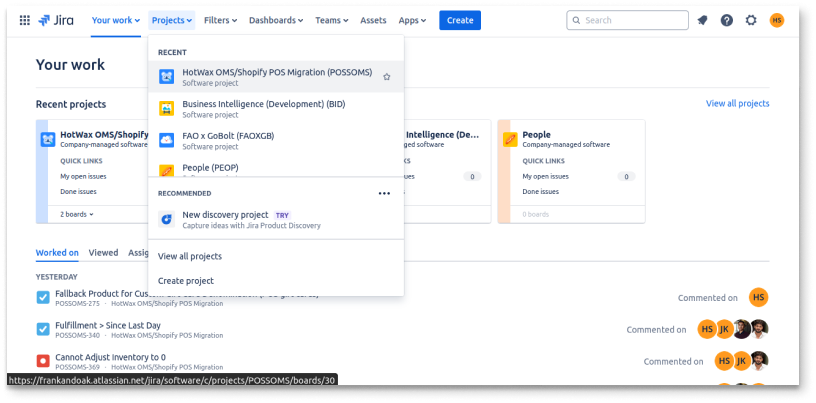
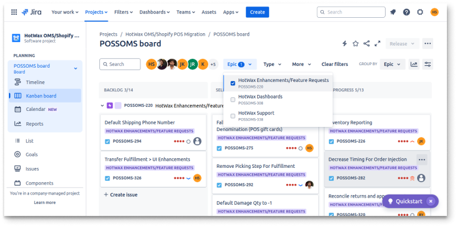

# Feature Requests on Jira

In Hotwax Commerce, client feature requests are logged and tracked in Jira within the `HotWax OMS/Shopify POS Migration` project, ensuring a structured workflow from request to development for continuous platform improvement and client satisfaction.

## Approach:

### Requesting Feature through Jira:

1. Login to Jira using your credentials.
2.  Navigate to `Projects` on the navbar.

    <figure><figcaption></figcaption></figure>
3. Select the project where clients demand features or enhancements (e.g., `HotWax OMS/Shopify POS Migration` project).
4. Use the Kanban board such as the `POSSOMS Board`.
5. Utilize options like search, users, and filters (e.g., epic, type).
6.  Click on the `epic` filter and select the `HotWax Enhancements/Feature Requests` epic.

    <figure><figcaption></figcaption></figure>

### Processing the Request:

1. Pick up the issue from the `Backlog` and move it to `Select for Development`.
2. Create internal tickets in Hotwax Commerce using `ClickUp` and `GitHub`. For more [read here](github-guideline.md).
3. Add the link of the internally created ticket to the corresponding **Jira issue**.
4. Move the issue from `Select for Development` to `In Progress`.

***

This streamlined process ensures that feature requests are tracked, managed, and developed efficiently, integrating both Jira and internal tools like ClickUp and GitHub.
