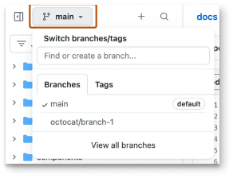
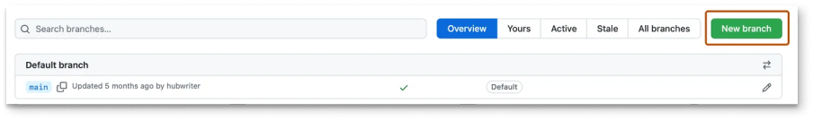
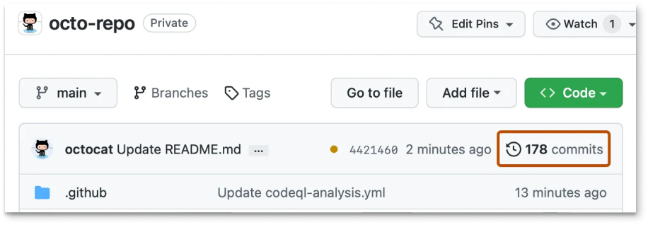
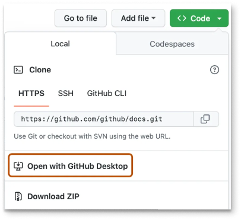
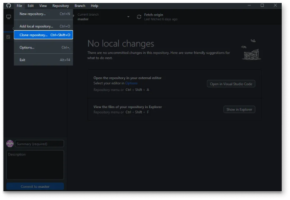
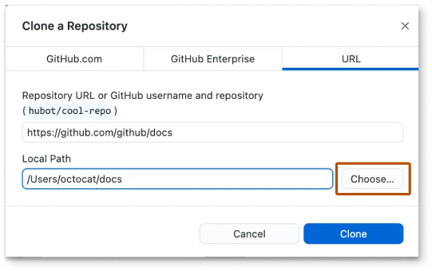
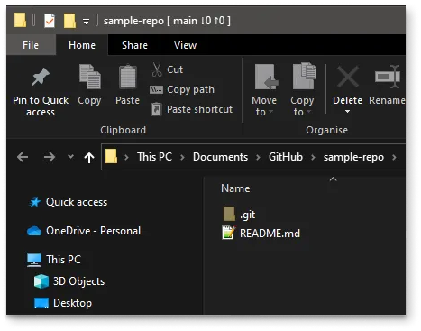
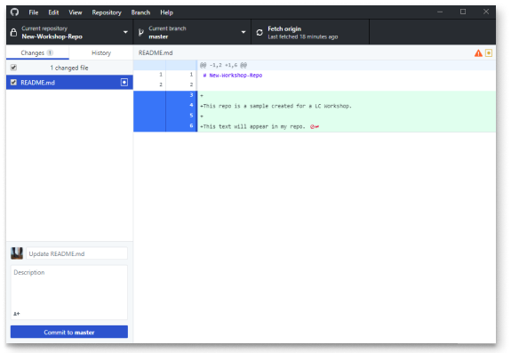

# GitHub Guideline

Proper documentation is essential for any GitHub repository as it provides clear instructions, context, and information about the project.

## Overview

This guide outlines three methods for adding documentation to a GitHub repository: using the GitHub UI, GitHub Desktop, and Git Bash/Terminal. Each method caters to different levels of familiarity with Git and GitHub, ensuring that users can choose the approach that best suits their needs.

### Using GitHub UI

The GitHub UI is a highly accessible and straightforward method for adding documentation. It requires no additional software and allows users to perform tasks from any web browser. This method is ideal for users unfamiliar with Git commands, offering a simple, streamlined process for managing repositories.

#### Steps:

1. **Fork the Repository (if needed):**
   * Go to the repository page on GitHub.
   * Click `Fork` at the top right to create a copy in your account.
2.  **Create a Branch:**

    * Go to your repository.
    * Click on the `Branch: main` dropdown.
    * Type a new branch name and click `Create branch`.

    <figure><figcaption></figcaption></figure>

    <figure><figcaption></figcaption></figure>
3. **Add Your Documentation:**
   * Navigate to the directory where you want to add the file.
   * Click `Add file` > `Create a new file`.
   * Name your file with the `.md` extension and add your content in [markdown format](https://www.markdownguide.org/extended-syntax/).
4.  **Commit Changes:**

    * On the main page of the repository, above the file list, click `Commits`.&#x20;

    <figure><figcaption></figcaption></figure>

    * Choose the option to commit directly to the new branch.&#x20;

    <figure><figcaption></figcaption></figure>

    * Click `Commit new file`.&#x20;

    <figure><figcaption></figcaption></figure>
5. **Open a Pull Request:**

* Go to the `Pull Requests` tab.
* Click `New pull request`.
* Select your new branch as the source branch and your main branch as the destination branch.
* Click `Create pull request`, enter a title and description, and submit the pull request.

<figure><figcaption></figcaption></figure>

### Using GitHub Desktop

GitHub Desktop offers a user-friendly graphical interface that simplifies Git operations, making it particularly accessible for beginners. Its visual representation of changes (diffs) and built-in tools for merging conflicts provide a clear and intuitive workflow, reducing the learning curve associated with Git commands.

#### Steps:

1. **Install GitHub Desktop:**
   * Download and install GitHub Desktop from the [GitHub Desktop website](https://desktop.github.com/).
   * Follow the installation instructions and sign in with your GitHub credentials.
2.  **Clone the Repository:**

    * Open GitHub Desktop.
    * Go to `File` > `Clone Repository`.
    * Select the repository you want to clone and click `Clone`. Also You can directly open GitHub Desktop from Github.

    <figure><figcaption></figcaption></figure>

    <figure><figcaption></figcaption></figure>
3.  **Create a Branch:**

    * Go to the `Current Branch` dropdown at the top.
    * Click on `New Branch`.
    * Enter a name for your new branch and click `Create Branch`.&#x20;

    <figure><figcaption></figcaption></figure>
4.  **Add Your Documentation:**

    * Navigate to the repository directory on your local machine.
    * Create a new Markdown file (.md) and add your content.&#x20;

    <figure><figcaption></figcaption></figure>
5.  **Stage and Commit Changes:**

    * Go back to GitHub Desktop.
    * You should see your new file listed under `Changes`.
    * Write a commit message in the `Summary` field.
    * Click `Commit to <branch_name>`.&#x20;

    <figure><figcaption></figcaption></figure>
6. **Push Changes:**
   * Click `Push Origin` to push your committed changes to the remote repository.
   * Create a pull request through the GitHub web interface.

### Using Git Bash/Terminal

Using Git Bash/Terminal provides precise control over all Git operations, making it ideal for advanced users who need flexibility and efficiency in their workflows. This method is also highly efficient, as it allows experienced users to perform actions quickly without the need to switch contexts or use additional tools.

#### Steps:

1. **Clone the Repository:**
   * You have two methods to get your repository on your local system:
   * **Direct Cloning:**
   * HTTPS: `git clone https://github.com/username/repository.git`
   * Replace `username` and `repository` with your GitHub username and the repository name you want to clone.
   * **Forking the Repository:**
   * Fork the repository to your personal GitHub account.
   * Clone your fork using the method above.
2. **Create a Branch:**
   * Open your Integrated Development Environment (IDE) or terminal.
   * Navigate to your project directory.
   * Create a new branch: `git branch <branch_name>`
   * Switch to the new branch: `git checkout -b <branch_name>`
3. **Add Your Documentation:**
   * Create a new file with a `.md` extension, for example, `README.md` or `documentation.md`.
   * Add your content to the file.
4. **Stage and Commit Changes:**
   * Add all changes to the staging area: `git add .`
   * Commit your changes with a message: `git commit -m "Add documentation"`
5. **Push Changes:**
   * Push your committed changes to the branch on the remote repository: `git push origin <branch_name>`
   * Create a pull request through the GitHub web interface.

For more detailed instructions on using Git Bash/Terminal, refer to [GitHub's official guides](https://docs.github.com/en/repositories/creating-and-managing-repositories/cloning-a-repository).
