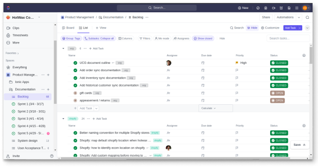
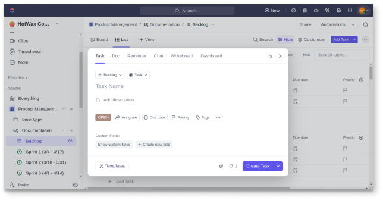
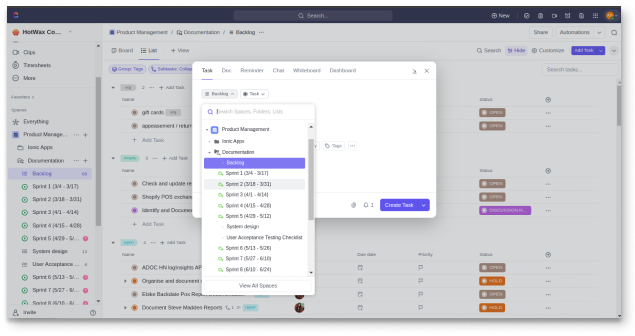
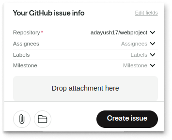

# Issue Report

Hotwax Commerce uses two platforms for bug reporting: GitHub (primarily for front-end issues) and ClickUp (for all other issues). Here’s a detailed guide on how to use each platform:

## GitHub

1. **Log in to your GitHub account.**
2. **Navigate to your repository.**
3. **Go to the "Issues" section.**
4. **Click on the "New issue" button in the top right corner.**

### Issue Template

#### Title:

* Short and accurate.

#### Description:

* Include various elements based on the tag.

**For "Bug" label:**

```markdown
## Note
Include important information.

## Current Behavior
Describe the current behavior here.

## Expected Behavior
Describe the expected behavior here.

## Steps to Reproduce
List the steps to reproduce the issue here.

## Environment Details
Provide details such as:
- Browser: Google Chrome, 126
- OS: Ubuntu 22.04 LTS
- Code Version: 2.23.0

## Additional Information
Add any relevant information like screenshots, videos, jam links, etc.
```

### Additional Settings:

* **Labels:** As per the requirements.

### Label Descriptions:

* **bug:** Indicates an unexpected problem or unintended behavior.
* **documentation:** Indicates a need for improvements or additions to documentation.
* **duplicate:** Indicates similar issues, pull requests, or discussions.
* **enhancement:** Indicates new feature requests.
* **good first issue:** Indicates a good issue for first-time contributors.
* **help wanted:** Indicates that a maintainer wants help on an issue or pull request.
* **invalid:** Indicates that an issue, pull request, or discussion is no longer relevant.
* **question:** Indicates that an issue, pull request, or discussion needs more information.
* **wontfix:** Indicates that work won't continue on an issue, pull request, or discussion.

### Description Structure Based on Label:

**For "Enhancement" label:**

* **Current Behavior:** Describe the current state of the feature.
* **Objective of Proposal or Motivation for Adding/Enhancing the Feature:** Explain the purpose or need for the enhancement.
* **Acceptance Criteria:** Define the criteria for considering the enhancement complete.
* **Impact:** Describe the impact of the enhancement.
* **Additional Information:** Provide any additional information relevant to the enhancement.

### Projects:

* Choose Priority, Size, Milestones, Expected Go Live Date, Severity.

### Milestones:

* Use milestones to track progress on groups of issues or pull requests in a repository.

### Development:

* Link a branch or pull request by selecting a repository.

## ClickUp

ClickUp is generally used for issues other than front-end issues like backend, documentation, etc.

### Steps to Create an Issue in ClickUp:

1. **Log in to ClickUp.**
2. **Navigate to Your Workspace:**
   * Select the workspace (e.g., Hotwax Commerce).
3. **Go to Your Space, Folder, and List:**
   *   Select the relevant space, folder, and list where the task will be added.

       <figure><figcaption></figcaption></figure>
4. **Create a Task:**
   * Click on the “Add Task” button.
5. **Fill in Task Details:**
   * **Title:** Clear and concise title.
   *   **Description:** Detailed description of the task.&#x20;

       <figure><figcaption></figcaption></figure>
6. **Choose the Task Location:**
   *   Specify space, folder, and list (e.g., "Product Management" space, "Documentation" folder, and "Backlog" list).&#x20;

       <figure><figcaption></figcaption></figure>
7. **Select Task Type:**
   *   Define the task type (e.g., task, milestone, bug, report).

       <figure><figcaption></figcaption></figure>
8. **Additional Options:**
   * **Status:** Set the task status as open.
   * **Assignee:** Assign the task to the relevant person.
   * **Due Date:** Set a deadline.
   * **Priority:** Indicate priority (e.g., Low, Medium, High).
   * **Tags:** Add relevant tags.
9. **Create Sub-tasks:**
   * If necessary, create sub-tasks.
10. **Create the Task:**
    * Click on the “Create Task” button to finalize.

## Jam

* Jam can be used for reporting issues directly in various applications like GitHub, Clickup, Jira, GitLab,etc. For more details on using Jam, refer to [Jam's documentation](https://jam.dev/docs/get-started).
* Using clear and structured issue templates significantly improves the quality of bug reports and feature requests, making it easier for the team to address and prioritize them effectively.

### Using Jam for Github:

* **Steps to create issues using Jam:**
  1. Open plugins/extensions in your browser.
  2. Select the option (e.g., capture Screenshot, Record tab, Record Desktop, Instant replay).
  3. Reproduce the issue or bug with a screen recording.
  4.  Authorize the GitHub integration from Jam.&#x20;

      <figure><figcaption></figcaption></figure>
  5. Add details like Issue Title, description, issue info (repository, assignees, labels, milestone).
  6.  Click on the "Create issue" button to be redirected to the issue tab.

      <figure><figcaption></figcaption></figure>

### Using Jam for ClickUp:

* Jam can be integrated with ClickUp for direct issue creation.
* **Steps to integrate Jam with ClickUp:**
  * Authorize the ClickUp integration from Jam.
  * Follow the similar steps as described for GitHub issues using Jam.
