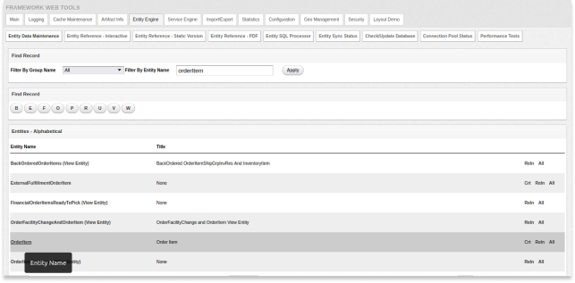
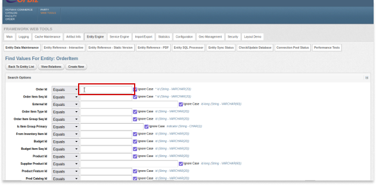
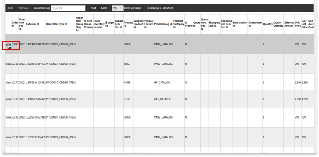
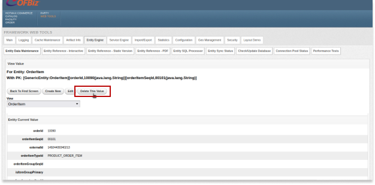

# POS Order Refresh Failure in Hotwax Commerce OMS

POS orders are downloaded as fulfilled in HotWax Commerce from Shopify. However, there are instances when the order is downloaded in OMS before it's marked fulfilled in Shopify. In such cases, retailers have to refresh the order to ensure fulfilled orders are downloaded while the unfulfilled ones get canceled.

However, sometimes the orders are not refreshed due to missing shipping addresses. The error message received when hitting the “Refresh Order” button is "Could not complete the createOrderContactMech process: The following required parameter is missing: [createOrderContactMech.contactMechId]".

In such cases, such orders need to be manually removed, and the updated order needs to be imported again.

Here are the steps to troubleshoot these errors:

## Troubleshooting Steps

### Step 1: Cancel the Order
1. **Log in to OMS**: Use your username and password to log in to Hotwax Commerce OMS.
2. **Navigate to Sales Orders**: Click the hamburger navbar icon if the left slider is not visible. Go to "Sales Orders" under "Order Management" in the left slider.
3. **Identify the Order**: Find the order exhibiting the error. Open the order by clicking on its ID.
4. **Cancel the Order**: On the order page, click the "Cancel" button at the top.

### Step 2: Remove the Order ID from Entities
1. **Access Webtools’ Entity Engine**: Use the link: https://{instance}.hotwax.io/webtools/control/entitymaint.
2. **Remove the Order from Entities**:
   - Open the OrderItem entity and remove the order.
     - Open the OrderItem entity; a form will open.&#x20;

       <figure><figcaption></figcaption></figure>
     - Search for the order using the orderID (enter the orderID in the orderID field of the form).&#x20;

       <figure><figcaption></figcaption></figure>
     - Hit Enter or click on the search button below the form.
     - Click on the view option at the start of the orderID under the search result.&#x20;

       <figure><figcaption></figcaption></figure>
     - Click on the "Delete this value" button at the top of the view under the view value.&#x20;

       <figure><figcaption></figcaption></figure>
     - Repeat the above steps for each order item.
3. **Remove from OrderHeader and OrderIdentification**:
   - Open the OrderHeader entity and remove the same order.
   - Open OrderIdentification and remove the externalId value.

### Step 3: Re-import the Order by ID in OMS
1. **Log in to OMS**: Use your username and password to log in to Hotwax Commerce OMS.
2. **Navigate to Import Section**:
   - Go to MDM > EXIM in the left slider.
   - Navigate to Shopify Jobs and select "Import Shopify Order" under the Order Management tab.
3. **Re-import the Order**:
   - Enter the details of the order, including the Shopify Order ID.
   - Run the job by clicking the "Run" button.
4. **Verify Successful Import**:
   - To verify the order's successful import, go to MDM > EXIM.
   - Navigate to Shopify Jobs and click on "Shopify Order MDM" under the MDM tab.

Following these steps will resolve the 'POS Order Refresh Failure' issue by addressing the root cause—missing shipping details from unfulfilled Shopify orders. This guide provides a structured approach to diagnosing and rectifying the issue, ensuring minimal disruption to your order management process.