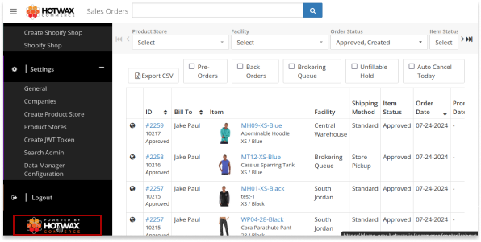
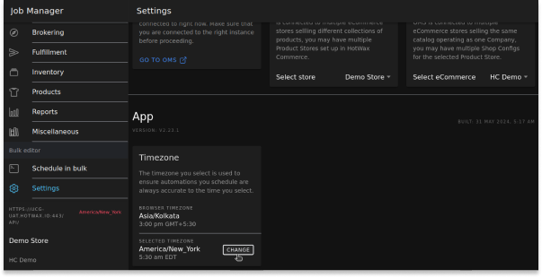
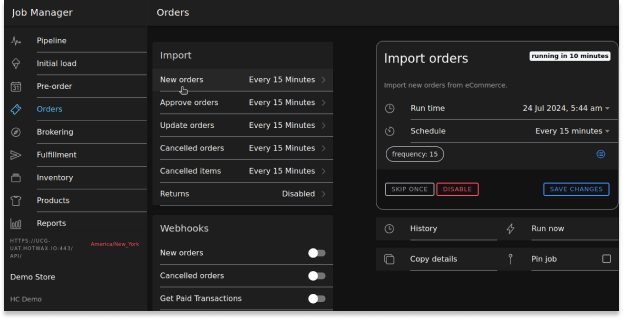

# Troubleshooting Guide: Resolving Time Zone Mismatch

This document aims to resolve the time zone mismatch issue between Shopify and Hotwax Commerce OMS order dates.

If the time zone settings for the instance’s server and scheduled jobs do not match, it can lead to data time discrepancies between Hotwax Commerce and Shopify. For example, let’s say a customer placed an order on Shopify today, but after importing, when you look at the Hotwax Commerce Sales Orders page, the order date appears as yesterday. The reason behind this discrepancy is the mismatched time zone between the Hotwax Commerce instance and the scheduling time zone of the Import Orders job.

## Steps to Diagnose and Resolve the Issue

### Verify the Discrepancies

1. **Check the Time Zones in the Job Sandbox Entity:**
   - Visit: `https://{instance}.hotwax.io/webtools/control/FindGeneric?entityName=JobSandbox`
   - Ensure the `Recurrence time zone` in the Job Sandbox entity matches the instance’s `Server time zone`.

2. **Check the Instance’s Server Time Zone:**
   - Navigate to: Hotwax Commerce `OMS > Dashboard > About`
   
   - Verify the instance’s `Server time zone`.

### Change the Time Zone Setting

1. **Open the Job Manager Application:**
   - From the launchpad, open the Job Manager application in Hotwax Commerce.

2. **Navigate to Settings:**
   - Click on settings within the Job Manager.
   

3. **Locate the Time Zone Settings:**
   - Go to the App section within the settings.
   - Identify the two time zones:
     - Browser Time Zone
     - Selected Time Zone
   - Ensure the `Selected Time Zone` matches the instance’s `Server time zone`. Adjust if necessary.
   

### Adjust the Time Zone for the Job

1. **Change the Selected Time Zone:**
   - Go to `Settings`.
   - Adjust the Selected Time Zone to match the instance's Server time zone (if necessary).
   

2. **Save Changes to the Job (Using JOB_IMP_ORD as an Example):**
   - Navigate to Orders in the left menu.
   
   - Go to New Order under the import section inside Orders.
   
   - Inside the Import Order box, find and click on `SAVE CHANGES` at the bottom right of the same job.
   
   

By following these steps, you can correct the time zone settings and resolve the time mismatch issue between Shopify and Hotwax Commerce OMS. This will ensure that order dates are consistent and accurate across both platforms, enhancing the reliability of your order management system.