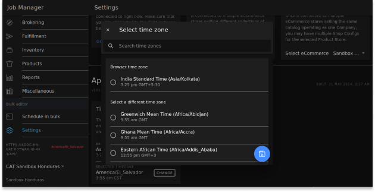
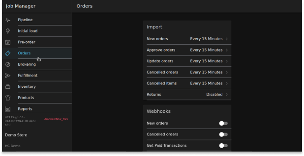

# Mismatch Time Zone

If the time zone settings for the instance’s server and scheduled jobs do not match, it can lead to data time discrepancies between Hotwax Commerce and Shopify. For example, let’s say a customer placed an order on Shopify today, but after importing, when you look at the Hotwax Commerce `Sales Orders` page, the order date appears as yesterday. The reason behind this discrepancy is the mismatched time zone between the Hotwax Commerce instance and the scheduling time zone of the `Import Orders` job.

## Steps to Diagnose and Resolve the Issue

### Verify the Discrepancies

1. **Check the Time Zones in the Job Sandbox Entity:**
   * Visit: `https://{instance}.hotwax.io/webtools/control/FindGeneric?entityName=JobSandbox`
   * Ensure the `Recurrence time zone` in the Job Sandbox entity matches the instance’s `Server time zone`.
2. **Check the Instance’s Server Time Zone:**
   *   Navigate to: Hotwax Commerce `OMS > Dashboard > About`&#x20;

       <figure><figcaption></figcaption></figure>
   *   Verify the instance’s `Server time zone`.&#x20;

       <figure><figcaption></figcaption></figure>

### Adjust the Time Zone for the Job

1. **Open the Job Manager Application:**
   * From the launchpad, open the `Job Manager` application in Hotwax Commerce.
2. **Navigate to Settings:**
   *   Click on `Settings` within the `Job Manager`.&#x20;

       <figure><figcaption></figcaption></figure>
3. **Change the Selected Time Zone(If required):**
   *   Navigate the App section within the settings.&#x20;

       <figure><figcaption></figcaption></figure>
   * Identify the two time zones:
     * Browser Time Zone
     * Selected Time Zone
   *   Adjust the `Selected Time Zone` to match the instance's Server time zone (if necessary).&#x20;

       <figure><figcaption></figcaption></figure>
4. **Save Changes to the Job (Using JOB\_IMP\_ORD as an Example):**
   *   Navigate to `Orders` in the left menu.&#x20;

       <figure><figcaption></figcaption></figure>
   *   Go to `New Order` under the import section inside Orders.&#x20;

       <figure><figcaption></figcaption></figure>
   *   Inside the I`mport Order` box, find and click on `SAVE CHANGES` at the bottom right of the same job.&#x20;

       <figure><figcaption></figcaption></figure>

By following these steps, you can correct the time zone settings and resolve the time mismatch issue between Shopify and Hotwax Commerce. This will ensure that data is consistent and accurate across both platforms, enhancing the reliability of order management system.
