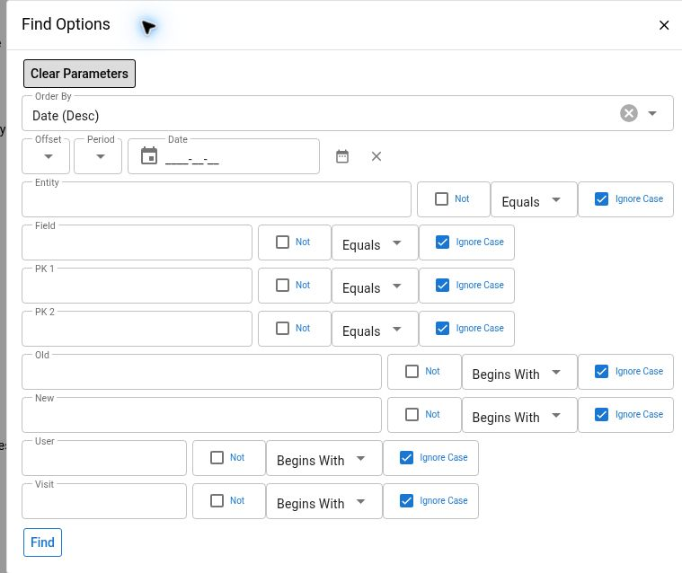
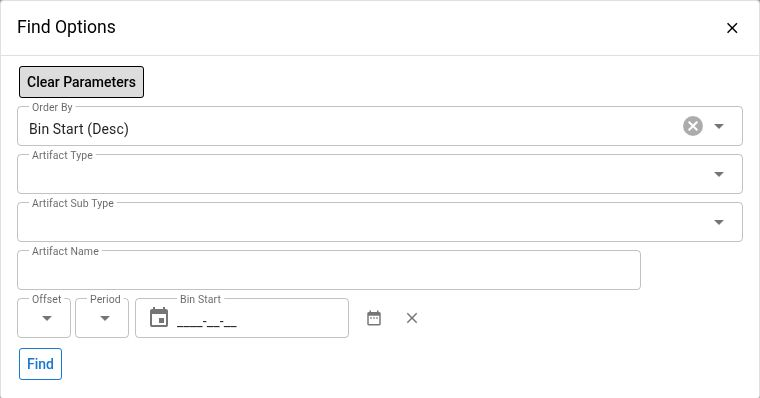

# Audit And Performance Diagnostics

Use **Audit Log** to investigate recorded entity-field changes, **Visits** to inspect a web session and its retained artifact hits, and **Artifact Hit Summary** or **Artifact Hit Bins** to investigate measured execution times. These sources answer different questions; none is a complete record of everything that happened in Maarg.

## Version And Verification

This guide uses the **Maarg v6.4.0** release composition: **moqui-runtime v4.1.0**, **moqui-framework v4.2.0**, and **maarg-util v4.4.0**. The screens below belong to the runtime's System application. Their behavior is **source-verified**. Audit Log and Artifact Bins filter dialogs were observed read-only in a hosted demo on October 3, 2026, displaying framework 4.0.0 and util 4.3.0. No populated audit/visit/hit data, exports, retention change, or performance outcome was exercised. Other UI and execution behavior remain unverified. Menu availability, rendered filter controls, configured collection, retained records, and export behavior must be checked against the authorized deployment.

The source System dashboard has a **Usage** section with **Audit Log**, **Visits**, **Artifact Hit Summary**, and **Artifact Hit Bins** links. The System menu titles for the last two are **Artifact Summary** and **Artifact Bins**. If an entry is absent or access is denied, ask the administrator for the authorized route and role. Do not infer that collection is disabled from a missing menu.


Audit values, visits, and hits can expose customer or employee data, session identifiers, IP addresses, internal URLs, request parameters, and error messages. Keep searches narrow. Do not put real record values, user/session identifiers, IP addresses, or URL parameters into public documentation or screenshots.


## Check Whether The Evidence Is Collected

The **Maarg 6.4.0 production configuration** disables visit/visitor tracking and sets both `persist-bin` and `persist-hit` to false for screen, screen-content, screen-transition, service, and entity artifacts. New Visit, Artifact Hit, or Artifact Bin records should not be assumed to exist under those shipped settings. Existing rows can reflect an earlier configuration rather than current collection.

Ask the operator to confirm the effective configuration before interpreting an empty result or beginning a performance comparison. Use already available infrastructure/application monitoring when the needed data was not collected. Enabling collection changes future behavior, storage, and privacy exposure and requires its own approved change; it cannot recreate missing historical evidence.

These server-statistics settings do not establish whether entity-field **Audit Log** recording is enabled. Audit coverage has separate entity/field and execution-path rules described below.

## Choose The Right Starting Point

| Question | Start With | Important Limit |
| --- | --- | --- |
| Which recorded field value changed, when, and under which user context? | System → **Audit Log** | Only configured, supported audit events are recorded |
| What retained activity is associated with a web session? | System → **Visits**, then its **Visit ID** | Visits and individual hit persistence can be disabled or skipped |
| Which measured artifacts account for the most accumulated time? | **Artifact Hit Summary** | Aggregates retained, persisted bins; the source screen has no date-window filter |
| Did an artifact's measured behavior change around an incident? | **Artifact Hit Bins** | Filters bin start dates, not individual request timestamps |
| What happened in a scheduled or integration operation? | [Service Jobs](service-jobs.md) or [System Messages](system-messages.md) | Background activity may have no web visit |

Before searching, record the environment, installed versions, incident interval and timezone, and the relevant artifact or entity name. Identify the runtime/node when known. Use the narrowest useful date interval and identifier filters, then broaden one condition at a time.

The framework normally formats and parses timestamps using the user's configured timezone. The System dashboard's **Time** uses the JVM's default timezone explicitly. Do not assume either is UTC or that they match. Normalize times before correlating screens, logs, and external monitoring; confirm timezone and daylight-saving boundaries with the operator when needed.

## Investigate Entity Changes With Audit Log

1. Open **System → Audit Log** and open the list's filter/header controls.
2. Set **Date** around the incident. This screen's source supports a date period with time.
3. Enter the technical **Entity** name and **PK 1** for the record. Add **PK 2** when the entity has a second primary-key field. Check the entity definition rather than assuming a business reference is its primary key.
4. Add **Field** when investigating a particular attribute, then select **Find**. Entity, Field, PK 1, and PK 2 default to exact-match searches.
5. Review the results in their default newest-change-first order. Use the earlier rows and surrounding time interval to reconstruct the sequence of recorded field changes.
6. If needed, narrow by **User** or **Visit**, or by **Old** and **New** values. These four filters default to begins-with matching. Use exact matching where available when a full identifier is known.

The source query requires search parameters and requests 50 rows per page. An initial empty table is not an audit result. Check the applied filters and pagination before concluding that no matching rows exist.

*The crop contains filter controls only. No real record values, session identifiers, or audit-result rows are shown.*

### Read An Audit Row

| Column | Meaning |
| --- | --- |
| **Date** | Timestamp captured for the recorded change |
| **Entity / Field** | Technical entity and audited field, rather than a screen title or business action |
| **PK 1 / PK 2** | The first two primary-key values used to identify the affected record |
| **Old / New** | The recorded before/after field representations; an initial value can produce a row with no old value |
| **User / Visit** | User and web-visit context available when the event was recorded; these can be absent for background or other execution contexts |

One business action may change several audited fields and produce several rows. Conversely, a row does not prove the entire business workflow succeeded. Correlate it with the relevant job, message, task, and current record state.

For keys with more than two fields, the audit entity stores additional key information, but **PK Rest** is not exposed by this source screen. Do not treat PK 1 and PK 2 alone as a unique match in that case. Ask an authorized administrator to inspect the complete key through a suitable read-only method.

### Understand Audit Coverage

Audit coverage depends on the entity and field configuration and the path used to make the change. The framework's audit handler supports configured create/update field events; it is not a general ledger of reads, requests, logins, deletions, or every database change.

- Fields configured for update-only auditing do not log their initial assignment when the old value is null.
- Unchanged values do not produce a change row through this handler.
- Execution contexts and data-loading paths can disable entity auditing. Changes made outside the relevant entity APIs may not pass through the handler.
- Values may be truncated, and encrypted fields are stored in encrypted form in the audit record. The table is not a full copy of the record or request.
- Retention, administrative cleanup, permissions, entity extensions, or an incorrect key/timezone can affect what is visible.

No row means **no matching retained audit row was found under the current search and access conditions**. It does not prove that no change occurred, identify who physically operated an account, or establish a complete compliance audit trail.

## Follow A Visit And Its Hits

### Find The Visit

1. Open **System → Visits**.
2. Filter **From Date** and, where known, **Visit ID** or **User ID**. The date is the visit/session start, not the time of every action within it. Widen the start interval if the session began before the incident.
3. Other available filters include **Visitor ID**, **Session ID**, **Server IP**, **Client IP**, **Client Country**, and **Initial Request**. Use these only when necessary and authorized. Text filters on this list default to begins-with matching.
4. Select **Find** and open the relevant **Visit ID**. The default list order is newest From Date first.

**Hit Count** is a count of currently stored `ArtifactHit` records linked to that visit. It is not a page-view count, a business-transaction count, or a promise that all session activity was recorded. A single request can execute several artifacts.

### Inspect Visit Detail

The detail page shows visit/session context, user information when present, **From Date**, **Thru Date**, initial request/referrer, client details, and server identity. A missing Thru Date alone does not prove that the user is still active; its update depends on the session-closing path.

The artifact-hit list is constrained to the selected visit and defaults to oldest start time first. Use **Start Date Time**, **Artifact Type**, **Artifact Name**, **Slow**, or **Error** filters and select **Find**. Type supports selecting multiple artifact categories. Parameter and error-message filters are also defined, but avoid broad searches or copies of sensitive values.

| Hit Field | Interpretation |
| --- | --- |
| **Type / Sub Type / Artifact Name** | The recorded screen, screen content, transition, service, or entity category and technical name; availability depends on collection settings |
| **Time** | Recorded execution time in milliseconds for that artifact, not end-to-end browser latency |
| **Slow** | The runtime's adaptive slow-hit classification, not an application service-level target |
| **Size** | Output size if supplied by the caller; the screen may show **Unknown**, so do not assume a universal unit or missing response |
| **Error / Message** | Error state captured from the execution context's message facade; messages can be truncated and are not a complete stack trace |
| **Server IP / Server Host Name** | Server identity attached to the individual hit, useful when correlating a multi-node investigation |

**Error = N** does not establish business success or absence of an HTTP, downstream, or later asynchronous failure. Check the operation's own status and [Log Files](log-files.md) for the relevant node and time. Do not repeat a business action merely to create a new diagnostic record.

## Compare Artifact Performance

### Use Artifact Hit Summary To Find Candidates

1. Open **Artifact Hit Summary** from System's Usage section, or **Artifact Summary** from its menu.
2. Filter **Artifact Type**, **Artifact Sub Type**, or **Artifact Name**, then select **Find**. The source query requires search parameters and requests 50 rows per page.
3. Inspect or sort **Total**, **Hits**, **Min**, **Max**, and **Last Hit** to choose an artifact for deeper investigation. The default order is type followed by name.
4. Move to **Artifact Hit Bins** and search for the same type, subtype, and name to examine the incident period.

The summary groups stored bins by artifact type, subtype, and name. It does **not** group by server identity, and its source screen offers no incident date filter. Where nodes share the backing store, their bins can contribute to the same row. A summary is therefore not a single-node measurement or a before/after incident comparison.

**Last Hit** is derived from the latest stored bin end timestamp, not the exact time of the last individual request. It may lag current activity or reflect a bin boundary. Do not use it alone to decide that an artifact has stopped running.

### Use Artifact Hit Bins For A Time Window

1. Open **Artifact Hit Bins** or the **Artifact Bins** menu entry.
2. Set **Artifact Type**, **Artifact Sub Type**, and/or **Artifact Name** to match the artifact being investigated.
3. Set **Bin Start** to a date period covering the incident and nearby comparison data, then select **Find**. The source defines a date-period control without an explicit time input. Confirm the rendered options before attempting sub-day boundaries.
4. Review newest bin starts first, the default order, and check further result pages. The source requests 50 rows per page and requires search parameters.
5. Compare the same artifact and subtype across comparable workloads and collection settings. Include bins beginning before the incident if they overlap the period of interest.

Bins are runtime measurement intervals. The framework default is **900 seconds**, but deployed configuration can override it. A bin starts when the artifact is first counted, so do not assume wall-clock-aligned quarter-hour boundaries. Bin Start filtering selects start times rather than performing an exact per-hit time-window calculation.

Bin records store server identity and an end timestamp, but the source Bins screen does not display those fields or provide node filters. If node separation or exact bin end times are necessary, ask for an authorized read-only inspection of the stored bin data. Similar-looking rows may belong to different nodes.

*UI-observed filter controls only. No populated performance result or incident diagnosis is represented.*

### Interpret The Metrics

| Metric | Meaning And Caution |
| --- | --- |
| **Hits** | Count of measured artifact executions represented by the stored bins. Nested artifacts are separate measurements, so do not total different types to count requests |
| **Total** | Accumulated execution-time statistic in milliseconds. High volume can make Total large even when individual executions are quick |
| **Min / Max** | Smallest/largest recorded duration represented by the bin or summary. Max is not a percentile |
| **Avg** | Total divided by Hits. Compare it alongside volume and spread; an average alone can hide infrequent slow executions |
| **Std Dev** | Sample standard deviation calculated from stored timing statistics when enough data is available. A blank is not proof of zero variation |
| **Slow Hits** | Count classified as slow against the runtime's evolving artifact timing baseline. It is not a count of errors or a breach of an agreed response-time target |

The pinned runtime includes warm-up adjustment: when the first duration is more than three times the second, it replaces the first contribution in timing totals and squared totals with the second duration. Counts and observed extrema remain separate. Consequently, Total, Avg, and Std Dev are diagnostic statistics rather than an exact reconstruction of every raw duration.

Slow-hit classification uses a rolling runtime baseline, including a warm-up count and a standard-deviation comparison. A restart resets that in-memory baseline, and it is not recalculated from the historical summary row. Do not impose an invented fixed threshold or treat **Slow Hits = 0** as proof that users experienced acceptable latency. Compare against the application's agreed expectations and independent monitoring.

## Check Collection, Persistence, And Retention

- **Collection is selective.** `persist-bin` and `persist-hit` control each artifact type. Maarg 6.4.0 production sets both off for all five types, overriding the more permissive framework defaults. When bin collection is enabled, qualifying slow non-entity hits can be persisted even if ordinary individual-hit persistence is off; the collector computes that slow-hit classification inside its enabled-bin path. Do not assume this exception produces records with both settings off. Individual entity hits are not persisted by this collector.
- **Visits are web-context records.** Visit/visitor tracking can be disabled, and configured skip conditions can exclude requests. The Maarg production configuration also defines skip conditions for request paths beginning with `/rpc`, `/rest`, and `/status`. These suppress visit creation and screen, content, and transition statistics for matching requests; services called by them can still contribute their own statistics when the relevant collection settings are enabled. Verify the effective deployment configuration rather than assuming all API activity appears here.
- **This is not a documented random sample.** Selective persistence, exclusions, and slow-hit capture can bias the visible hit list. Do not extrapolate a complete traffic count or error rate from it.
- **Fresh data can lag.** Individual hits are queued for deferred persistence. Bins are saved as later hits advance the interval, and remaining bins are written during orderly runtime shutdown. A quiet artifact's current bin may remain in memory; an abrupt stop or persistence failure can leave gaps. Do not restart a runtime to force diagnostic data to appear.
- **Retention is deployment-specific.** Framework seed data defines `clean_ArtifactData_daily` with `daysToKeep=90`, and its service removes old artifact hits and bins. This is a shipped default, not a verified retention guarantee. Check the actual job, parameters, history, and any other storage policies read-only using [Service Jobs](service-jobs.md). This cleanup service does not establish the retention policy for Audit Log or Visits.
- **Scope matters.** Confirm the database/logging backend and node coverage. A result from one environment cannot establish what happened on another. An empty result may reflect filters, timezone, access, excluded collection, pending persistence, retention, or genuinely absent matching activity.

## Keep Exports And Changes Separate

Filtering, sorting, paging, and opening an authorized visit detail are the investigation workflow. The following controls or operations need separate consideration:

| Control Or Operation | Boundary |
| --- | --- |
| **Get Client IP Data** on Visit Detail | Calls an enrichment service, rather than merely opening existing data. In framework v4.2.0 it returns **Geo IP lookup disabled** before its lookup/update code. Do not use it as a diagnostic refresh; another deployment may override it and transmit the client IP or update the visit |
| CSV, XLSX, XML, text, or PDF exports | Create a separate copy of potentially sensitive data. Visits and Summary declare export controls; Bins provides **Get as CSV/XML/PDF** links. The named export transitions remove normal page limits, so verify filter scope and output size before an authorized export. Available formats and successful rendering remain UI/runtime checks |
| Saved searches or display preferences | Persist configuration or preferences; they are separate from a one-off read-only query |
| Collection settings, audit configuration, retention jobs, or cleanup services | Change future evidence or remove history. Obtain the owner's specific approval and follow the change procedure; do not enable, run, pause, or alter them to troubleshoot by inspection |

No enrichment, export, configuration change, cleanup, or other mutating action is required to follow this guide.

## Capture Useful Evidence

Record the environment and versions, incident interval with timezone, screen used, applied filters, sort order, pagination, artifact/entity name, and node scope when known. State whether the evidence is an audited field event, an individual persisted hit, a bin, or an aggregate summary. Include the relevant job/message reference through an approved private support channel when needed.

Use a minimal redacted extract. Remove user/session identifiers, IP addresses, private record values, URL query strings, referrers, parameter strings, and sensitive error content from public material. Automatic password filtering or truncation is not a privacy guarantee. Review exported files separately from screenshots before sharing, and follow the organization's storage and retention policy.

## Source References And Remaining Checks

The assembled production collection settings above come from **hotwax-maarg-docker-config v6.4.0**, `docker/MoquiProductionConf.xml`, copied into the runtime configuration by `docker/prod/Dockerfile`. Runtime configuration merges after component configuration; deployed environment changes still require verification.

The following release-pinned sources establish the behavior above:

- **moqui-runtime v4.1.0**: `base-component/tools/screen/System/dashboard.xml`, `AuditLog.xml`, `Visit.xml`, `Visit/VisitList.xml`, `Visit/VisitDetail.xml`, `ArtifactHitSummary.xml`, and `ArtifactHitBins.xml`; `conf/MoquiProductionConf.xml` and `conf/MoquiDevConf.xml`.
- **moqui-framework v4.2.0**: `framework/entity/EntityEntities.xml` and `ServerEntities.xml`; `framework/src/main/groovy/org/moqui/impl/entity/EntityValueBase.java`; `framework/src/main/groovy/org/moqui/impl/context/ExecutionContextFactoryImpl.groovy`, `ContextJavaUtil.java`, `UserFacadeImpl.groovy`, and `L10nFacadeImpl.java`; `framework/src/main/groovy/org/moqui/impl/webapp/MoquiSessionListener.groovy`.
- **Configuration and retention**: `framework/src/main/resources/MoquiDefaultConf.xml`, `framework/data/MoquiSetupData.xml`, and `framework/service/org/moqui/impl/ServerServices.xml`.

Remaining validation includes the deployed menu and filter layout, timezone behavior, a safe synthetic audit/visit/bin example, multi-node scope, effective collection and retention settings, persistence delay, and each authorized export format. A visible screen or filter alone does not validate populated results, a complete audit history, or a write/export operation.
