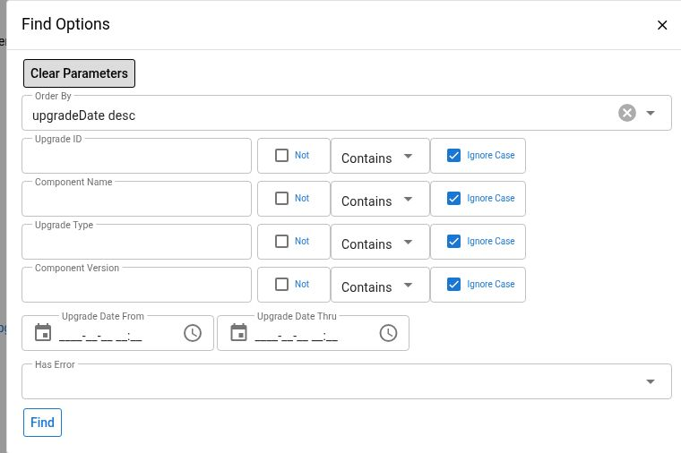

# Component Upgrade Diagnosis

Use this guide when a deployment starts but a component behaves unexpectedly, an upgrade row reports an error, or a **Data Load Failure** System Task appears. Begin with the installed release and existing evidence. Restarting, rerunning all upgrade services, or editing version tracking can repeat data changes or skip work that still needs recovery.

This is a diagnostic runbook. For an approved deployment, obtain the Maarg release-specific procedure from its owner. The existing [deployment documentation](../../deployment/README.md) provides broader OMS context; its jobs and steps are not established here as a Maarg upgrade procedure. An upgrade-history page does not deploy a new version or authorize a rollback.

## Version And Verification Scope

The source baseline is **Maarg 6.4.0**, including **maarg-util 4.4.0**, **moqui-runtime 4.1.0**, and **moqui-framework 4.2.0**. The production composition includes component screen overrides and build patches; repository tags alone do not describe every deployed behavior. Optional plugins, branch builds, and database screen overrides require an environment-specific check.

The **Component Upgrade Step** filter dialog was observed read-only in a hosted demo on October 3, 2026, displaying framework 4.0.0 and util 4.3.0. The screenshot excludes operational comments and configuration details. No startup, deployment, upgrade service, SQL, data load, task change, or recovery action was executed. The error and recovery semantics below are source-verified, not an end-to-end recovery test.

## 1. Establish The Deployment And Incident Window

Record:

- The environment and intended release, deployment time, time zone, and responsible operator
- Installed component name, displayed version, tag/branch, and commit for the affected capability
- Whether the component came from a release checkout or a branch build
- The symptom, expected business behavior, and any System Task or error identifier
- The affected node and whether other nodes were restarted or deployed at the same time

For a strictly read-only version investigation, use the **System > Dashboard** component/version information or administrator-provided release metadata. Ask the administrator for the approved direct upgrade-history route. The **Component Upgrade** screen is hidden from the ordinary main menu in the release source.

**Hotwax Commerce > About** also exposes version fields and an upgrade-history link, but loading its release-pinned screen invokes generation of a Launchpad sign-in token. It is not a strictly passive version lookup. Do not open it solely for read-only evidence when the alternatives above suffice.


About generates a Launchpad sign-in token during page loading and can expose internal connection information and the generated link. Do not copy those links or capture the entire page. Record only the necessary non-secret version facts in the approved incident record. Upgrade comments and log excerpts also require review before sharing.


## 2. Find The Relevant Upgrade Steps

1. Open **Component Upgrade Step** through the authorized upgrade-history route.
2. Select **Find Options**.
3. Filter by **Component Name** and, when known, **Component Version**. Use the installed component identifier rather than an application label.
4. Set **Upgrade Date From/Thru** around the deployment. Check the time zone and include enough time to cover startup and delayed investigation.
5. Use **Has Error = Y** to find flagged steps, then clear it when examining the complete sequence. An unflagged row is not sufficient proof of successful migration.
6. Filter by **Upgrade ID** to correlate rows from one upgrade invocation. Review all result pages and the effective sort.

*UI-observed filters only. No operational comments or populated failure example is included.*

| Column | What It Means |
| --- | --- |
| **Upgrade ID** | Correlation identifier created for an invocation across installed components; it is not the identity of one business transaction |
| **Component Name** | Component whose upgrade data was considered or attempted |
| **Upgrade Type** | The reviewed runner records `XML_DATA` for its release-data step path |
| **Component Version** | Version associated with the recorded step, which can differ from the final installed component version |
| **Upgrade Date** | Time the tracking row was created, to be correlated with startup/deployment logs |
| **Has Error** | Flag set by the runner's error-detection logic; inspect comments and logs as well |
| **Comments** | Loader messages or recorded error context, limited by the runner to the first 1,000 characters |

The screen displays tracking records. It does not inspect every current table, prove an intended file ran, or verify downstream effects. “No upgrade steps found” is a recorded selection outcome, not a business acceptance result.

## 3. Understand What The Upgrade Runner Actually Does

The Maarg-util configuration calls the component-upgrade service after application startup. That hook uses error-ignoring behavior, so a running application is not proof that all component upgrades succeeded. A manual restart can invoke upgrade logic again and is not a read-only troubleshooting action.

### Release Checkout Path

For a versioned component, the runner reads its recorded **lastUpgradedVersion**, inspects version-named upgrade directories, and selects eligible `UpgradeData.xml` files. With an established prior version, selected files are ordered by version before loading.

The runner loads **UpgradeData.xml**. It does not automatically execute a neighboring **UpgradeSql.sql** file or **UpgradeSteps.md** simply because it exists. XML can itself call services with broader effects, so review the release's entire approved upgrade procedure. A completed XML row does not establish that manual SQL or other documented prerequisites were completed.

**First-history caution:** the no-prior-version path changes its starting-version variable while enumerating directories. Do not assume it performs a complete historical backfill or deterministically runs only the current-version folder from the explanatory comment alone. For a new component or missing tracking history, have the deployment owner verify the exact files selected and the required initialization separately. This is a source-identified validation requirement, not a runtime reproduction.

### Branch And UpcomingRelease Path

When the component's version metadata reports a branch other than detached `HEAD`, the wrapper selects **UpcomingRelease** rather than treating the displayed component version as a released tag. That path loads `upgrade/UpcomingRelease/UpgradeData.xml` when present.

In the reviewed implementation, the UpcomingRelease branch does not use the same step-record and version-tracking logic as the versioned path. Missing **Component Upgrade Step** rows therefore do not prove that no startup data load occurred. Check the actual component checkout and correlated startup logs. Do not infer release execution from a version label on a branch build.

### Failure And Tracking Limitations

Several source behaviors make independent verification necessary:

- A flagged step can create a **System Task** with purpose **Data Load Failure** and a name containing the component/version. Its description is further limited to 255 characters.
- Loader failures may be caught and returned as messages. The runner's **Has Error** detection does not make every loader message a failure flag; inspect comments containing error or “Skipping to next file” text even when **Has Error = N**.
- The versioned runner can continue after a failed step. A later successful row does not prove that an earlier failure was repaired.
- The component's **lastUpgradedVersion** tracking value is updated after the versioned attempt loop without conditioning that update on every step succeeding. Treat it as tracking metadata, not a verified success watermark.
- The wrapper's overall “executed successfully” message is not an independently reconciled result for all components and business data.
- File-level database rollback does not necessarily undo separately committed work or external service effects. An entire deployment is not established as atomic by these tracking records.

A second startup or an unscoped rerun can consequently skip a failed version based on tracking, or repeat branch data and independent effects. Establish actual state before selecting a recovery path.

## 4. Correlate The Failure With Tasks, Logs, And Schema

### System Tasks

Open **Hotwax Commerce > Developer > System Tasks** and follow [System Tasks](system-tasks.md). Search the component/version and purpose **Data Load Failure**, including completed/cancelled statuses when reviewing older work.

Use the task as an investigation record. The task ID and upgrade ID are different identifiers; correlate component, version, time, and description rather than assuming they are interchangeable. A task's short description may omit the root cause. A completed task does not prove the failed data load was rerun or repaired.

### Logs And Actual Data

Use [Log Files](log-files.md) to inspect a bounded slice around startup and the affected component. Obtain the full first meaningful error, file/step identity, cause, and relevant transaction messages. Verify the exact affected records through an authorized read, with the deployment owner determining which changes actually committed.

If the receiving service or a later job performed work asynchronously, follow its recorded IDs through [Service Jobs](service-jobs.md), [System Messages](system-messages.md), or [Data Manager Imports](data-manager-imports.md) when that implementation uses them. Do not manufacture a correlation from similar names alone.

### Schema Checks

For a suspected relational-column mismatch, follow [DB Missing Columns](db-missing-columns.md). That tool compares metadata and generates proposed statements without applying them. Review the installed model, datasource, and generated result with the database owner.

A clean missing-column check does not prove data migrations, indexes, constraints, field values, service contracts, or business behavior are correct. Do not apply SQL or use **Check/Update Table**, foreign-key, or indexing controls solely because a diagnostic screen suggests a mismatch.

## 5. Choose And Verify An Approved Recovery

Keep investigation read-only until the owner approves an exact change and its consequences.

1. **Define the failed work.** Identify the component, installed commit, step file/service, tracking state, records affected, and the first causal error.
2. **Establish current state.** Determine completed, rolled-back, partial, still-running, and externally applied work. Confirm that no other node or operator is continuing the same upgrade.
3. **Review the supported repair.** Use the release-specific migration/recovery process. Determine whether the intended action is a data repair, prerequisite/schema change, narrowly targeted replay, deployment correction, or rollback. Do not edit version tracking to force a rerun without an approved and tested plan.
4. **Prepare and rehearse.** Confirm backup/restoration capability, compatible versions, affected keys, concurrency controls, external destinations, and repeat safety. Test the particular failure and recovery in an isolated environment.
5. **Execute the approved scope once.** Preserve the action, operator, time, parameters, result, and correlation IDs. A timeout or missing response requires outcome investigation before retrying.
6. **Verify independently.** Re-read the expected records/schema and required downstream results. Recheck logs and tracking, and run the release's relevant business sanity checks. A changed flag or task status alone is insufficient.
7. **Close tracking with evidence.** Update the System Task only when the verified outcome supports that status. Record what remains unresolved rather than marking a partially repaired migration complete.

Rollback is not simply redeploying an older binary: data and external effects may no longer be compatible. Have the deployment and database owners provide the tested Maarg release-specific recovery plan. The existing [Rollback OMS Version](../../deployment/rollback-release.md) page describes an OMS/Jenkins workflow; do not apply its image, SQL, or deletion steps to Maarg without that separately verified plan.

## Troubleshooting

| Symptom | Next Read-Only Check |
| --- | --- |
| No matching history | Environment, filters/time zone, component checkout, UpcomingRelease path, missing upgrade directory, and startup logs |
| Has Error is N but behavior is wrong | Full comments/logs, expected step selection, committed records, manual prerequisites, and downstream outcomes |
| Recorded version is current but a step failed | Tracking is not a success guarantee; establish actual state before any targeted repair |
| Only a short error is shown | Upgrade comments and task descriptions are truncated; obtain the full log cause privately |
| Retry after restart did not repair the issue | Check tracking/selection and whether the failed work was actually attempted again; do not loop restarts |
| A System Task is complete but data remains wrong | Inspect the recorded recovery and independent result; task lifecycle does not execute repair |
| Missing-column scan is clean | Check non-column schema requirements, data changes, and business validation separately |

Escalate with the minimum necessary version/commit information, environment/node, upgrade ID and time zone, exact step, sanitized first error, System Task ID, actual-state checks, and approved recovery outcome. Keep raw logs, generated sign-in links, credentials, and internal database details out of public evidence.
