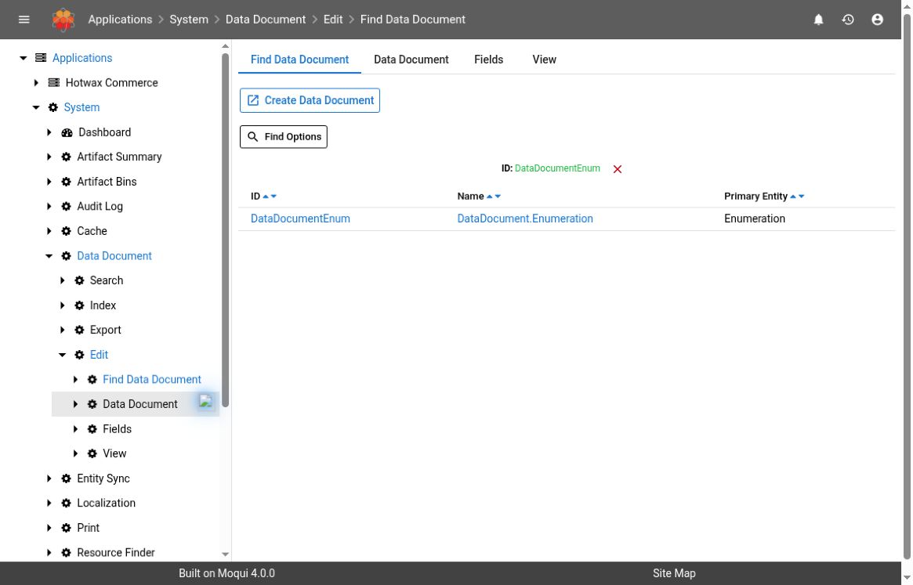
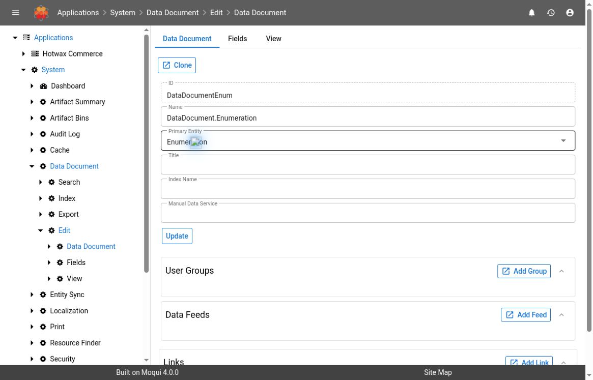
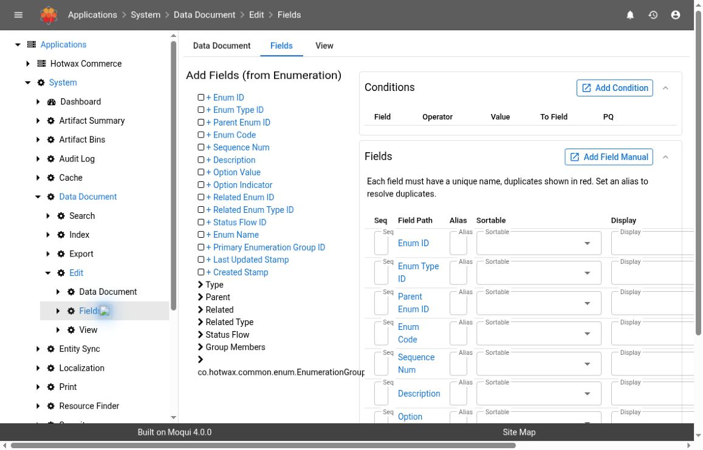

# Data Documents And Data Feeds

A **Data Document** defines a database-derived document: a primary entity, selected fields, relationship paths, and conditions. A **Data Feed** associates one or more definitions with a receiving service. The receiver might index documents or start an integration, so sending a feed can affect an external system.

Use this guide to inspect a definition, validate its output, and find the execution evidence for a feed. For the business-event and webhook architecture, see [Custom webhook mechanism](../../knowledge-base/custom-webhook-mechanism.md).

## Version And Verification Scope

This guide describes **Maarg 6.4.0**, using **runtime 4.1.0**, **framework 4.2.0**, and **maarg-util 4.4.0**. Navigation, fields, and behavior below were checked against those source versions. The catalog, definition settings, Fields, and Index controls were also inspected read-only on a demo displaying framework 4.0.0 and util 4.3.0 on October 3, 2026. The screenshots show demonstration definition metadata, not business-record payloads. No definition changes, View queries, document searches, exports, indexing, or feed/service executions were performed. Execution behavior remains source-verified only; a demo's displayed versions can differ from the release baseline.

Use an account authorized for the relevant System or Tools screens. Menu visibility varies by deployment. Follow the application's menus rather than constructing a URL from the OMS address; these tools can have a separate application mount.


Document fields and output can contain customer data, credentials, or other confidential information. Review the definition and any custom services before generating output. Changes to fields, conditions, feed membership, or receivers can change what is sent downstream. Keep investigation read-only until the specific change or execution is approved.


## Find The Right Screen

Open **System > Data Document**. Its sections are **Search**, **Index**, **Export**, and **Edit**. The System dashboard also has a **Data Documents and Feeds** panel with **Search**, **Export**, **Feed Index**, and **Edit and Report Builder** links.

| Task | Screen | What it works with |
| --- | --- | --- |
| Inspect or edit a definition | **Edit**, then the document ID | Configuration, fields, conditions, user groups, feed associations, and result links |
| Inspect database-derived report rows | A definition's **View** tab | A dynamic relational view built from the definition |
| Generate document JSON | **Download JSON** on View, or **Export** | Documents generated from the database, including configured post-processing |
| Submit a feed indexing job | **Index** | Documents linked to the chosen feed and its receiving service |
| Inspect indexed output | **Search**, then **View Document** | The default Elastic client's search index |

**Search is not a preview of current database rows.** An empty search result does not establish that the source record or definition is missing. This Data Document search path uses the framework's Elastic client; [Solr Search](solr-search.md) and [Search Admin](search-admin.md) are separate tools.

## Inspect A Definition

1. Open **Edit** and use the list filters for **ID**, **Name**, or **Primary Entity**.
2. Open the matching ID or name.
3. Record its **Primary Entity**, **Index Name**, and **Manual Data Service** before inspecting output.
4. Review **User Groups**, **Data Feeds**, and **Links**. Confirm which consumers depend on the definition before proposing changes.
5. Open **Fields** to inspect the field paths, aliases, and conditions. Do not click a field's **+** action during inspection: it creates a field immediately.

*Read-only demo catalog inspection. The filter identifies a demonstration definition; it does not query its generated documents.*

### Definition Settings

| Setting | Meaning and checks |
| --- | --- |
| **ID** | Stable `dataDocumentId`, used as the generated document's `_type`. Use an UpperCamelCase identifier beginning with a capital letter |
| **Name** | Human-readable definition name |
| **Primary Entity** | Root of the query and source of document identity. Include every primary-key field in an identity-bearing export or feed definition |
| **Title** | Per-document display title, which can expand document values |
| **Index Name** | Lowercase search index alias. It is not necessarily the physical index name and does not create an index by itself |
| **Manual Data Service** | Service called for each generated document to add or transform data. It should implement `org.moqui.EntityServices.add#ManualDocumentData` |
| **User Groups** | Associations used by document-aware reporting/access features. They do not replace the application's screen, entity, or service authorization |
| **Data Feeds** | Existing feeds associated through `DataFeedDocument`. **Add Feed** creates an association, not a new feed definition |
| **Links** | Search-result actions with label, URL, URL type, and optional condition. Check the destination and expanded values before using a link |

*Definition configuration only. No Update, Add Group, Add Feed, Add Link, or Clone action was submitted.*

The entity model also supports **Manual Mapping Service** (`manualMappingServiceName`), which customizes the generated Elastic mapping. It is not exposed in the standard definition edit form described here. Likewise, relationship aliases are separate configuration records rather than controls in the standard Fields editor.

### Create Or Clone Under An Approved Change

For a new definition, select **Create Data Document** in Edit, enter **ID**, **Name**, and **Primary Entity**, then select **Create**. This creates configuration; it does not populate fields or validate a downstream contract. Continue with the field and output checks below before adding it to a live feed.

To adapt an existing definition, use **Clone**, provide **New ID**, and review **New Index**, **Copy Conditions**, and **Copy Links**. Both copy options default to false. The clone copies the definition, fields, and relationship aliases; it does not copy user-group or feed associations. If **New Index** is left blank, the original index name remains. Review the copied manual service and index before treating the clone as isolated test configuration.

Changing **Primary Entity** on an existing definition does not redesign its field paths for you. Recheck every path, condition, and consumer if a root change is approved.

## Build Fields And Relationships

On **Fields**, expand the **Add Fields** tree to inspect fields on the primary entity and its declared relationships. Auto-generated reverse relationships are excluded from this tree. The **+** action adds the chosen field. **Add Field Manual** accepts an explicit field path, alias, sortable setting, function, and sequence.

*Read-only field-mapping inspection. The viewport clips the right-hand columns, so Function and row actions are not shown; their behavior below is source-verified.*

A field path has zero or more colon-separated relationship names followed by a field name:

- `fieldName` selects a field directly on the primary entity.
- `RelationshipName:fieldName` follows one declared relationship.
- `RelationshipName:AnotherRelationship:fieldName` follows a longer path.

Use names or short aliases from the deployed entity definitions, not database table names or labels guessed from the business application.

### Keep Output Names And Identity Stable

The output name is **Alias**, or the last part of **Field Path** when no alias is supplied. Each field name must be unique across the definition; the editor highlights duplicate names in red. Give related fields distinct aliases when they share a name. The create/update services normalize human-readable alias text to camel case, so verify the resulting name before giving it to a consumer.

Include the primary entity's complete primary key using its original field names. Framework 4.2.0 checks for those names when combining rows into documents; removing or renaming them can break identity or grouping. For a many-side relationship, include enough child identifiers to distinguish records that otherwise have identical selected values.

The generated JSON does not simply mirror every relationship as an object:

- Fields on the primary entity appear at the top level.
- Fields reached through a **one** relationship are merged into the current object.
- A **many** relationship produces a list of objects. Its key uses `DataDocumentRelAlias.documentAlias` when configured, then the relationship short alias, then its full name.
- Repeated relational rows are combined into documents when the complete primary key is available. The flat View row count can therefore differ from the generated document count.

### Read The Other Field Controls

**Seq** controls field ordering in the definition. **Sortable** is search-mapping metadata; for an Elastic text field it can add a keyword subfield for sorting. **Function** offers `min`, `max`, `sum`, `avg`, `count`, `count-distinct`, `upper`, and `lower`. Aggregates change query semantics and need separate validation from a detail-level feed.

**Display** controls default display metadata for the dynamic view. **Display = N is not a redaction or security control**: a selected field can still be present in generated JSON or a feed. Remove unwanted fields from the definition or use an explicitly reviewed transformation rather than relying on hidden report columns.

After an approved edit, use **Update All**, then reopen the definition to verify the stored aliases and settings. Expression-based fields are also supported by the entity model, require an alias, and execute expressions. Treat them and custom services as developer-reviewed logic rather than ordinary labels.

## Apply Conditions Deliberately

The **Conditions** panel provides **Add Condition**, with **Field**, **Operator**, **Value**, **To Field**, and **PQ**. Field choices come from the definition's aliases.

- **PQ = N** adds a database query condition. **Value** is converted to the selected field's type. **To Field**, when supplied, compares one field alias with another instead of comparing to a literal value.
- **PQ = Y** applies a post-query check to the assembled document. In this release it checks whether the value occurs among the matching nested fields after type conversion. It does not apply the selected comparison operator or **To Field** as a general expression.
- All configured conditions must pass. A condition referencing a missing alias can prevent generation.

Use query conditions when you intend to constrain the underlying join. Use post-query conditions when you intend to retain or reject the assembled document based on a nested value. These can produce different child lists: a query filter may remove joined rows before the document is assembled.

When reviewing an approved change, test a matching record, a nonmatching record, and a record with multiple related rows. Check missing/null values as well as the happy path.

## Validate The Output Before Delivery

### Start With The View Tab

Open a definition's **View** tab and use its column filters to narrow the database-derived rows. The screen offers pagination, saved finds, and CSV/XLSX controls. Check the intended record, field aliases, relationship values, and any query-time functions.

This is a flat dynamic-view query, not the final nested document. It applies query conditions, but does not run the generated-document manual-data service or document-level post-query filtering. A report row alone is insufficient evidence that the final payload is correct.

### Inspect Generated JSON Only Within An Approved Scope

For a small approved sample, open **Download JSON** on View. Review **From Update Stamp**, **Thru Update Stamp**, and **Pretty Print JSON?**, then download only when the intended data scope is authorized. The output filename is the document ID plus `.json`.

**The Download JSON action does not pass the View grid's filters to the generator.** A single visible row does not mean that only that row will be downloaded. The definition's conditions and the download's update-stamp bounds govern generation. If these cannot safely isolate the intended sample, use an approved test dataset or ask the integration owner for a narrower validation procedure.

Check the following in the actual output:

- `_type` is the intended definition ID.
- `_id` identifies the primary record; composite primary-key values use `::` between values.
- `_index`, when present, is the intended lowercase index alias.
- `_timestamp` is the generation timestamp or supplied upper bound, not proof of the source record's last business update.
- Top-level and nested fields have the expected aliases, types, cardinality, and values.
- Conditions exclude the intended records without losing required related rows.
- No unapproved confidential fields are included, including values added by the manual-data service.

Document generation can call the configured **Manual Data Service**. Review its behavior before treating an export as a harmless query. An error in that service can be logged while generation continues with incomplete data, so inspect [Log Files](log-files.md) as well as the payload.

### Understand Update Windows

In the generator, the lower update bound is inclusive and the upper bound is exclusive. The query considers `lastUpdatedStamp` across participating entities, not just the root. Null timestamps are allowed by these conditions, including those from absent optional relationships. A time window can therefore return more records than a strict primary-entity change list.

These documents represent current selected database state, not an immutable event history or complete deletion journal. Read-only database clones may also lag the writer. For incremental delivery, validate the integration's cursor, overlap, deletion, and deduplication strategy rather than assuming a timestamp window supplies them automatically.

## Export Documents

Use **System > Data Document > Export** for one or more definitions. Select **Data Document Ids**, review the update window and **Pretty Print JSON?**, then choose the destination:

| Output | Destination and caution |
| --- | --- |
| **Single File** | One file on the application server at **Path**. The writer refuses to overwrite an existing file |
| **Directory (one file per document)** | One `<dataDocumentId>.json` file per selected definition, containing its generated document instances. Existing files are skipped rather than overwritten |
| **Out to Browser** | JSON in the browser response. Review and protect its contents before saving or sharing |

**Path refers to the server filesystem**, not a folder on your laptop. Have the operator confirm the approved destination and available space. Avoid an unbounded export of a large production definition; generating JSON can consume substantial database and application memory.

**Framework 4.2.0 source limitation:** the Single File and Directory writers append an extra empty object after generated records without a separating comma. Nonempty output from those paths can therefore be invalid JSON. This is source-identified, not an executed export test. Validate syntax before downstream use and have the deployed implementation checked; the browser and Download JSON wrappers use a different closing path. Do not report an export as successful solely because a file was written.

## Inspect Data Feed Configuration

There is **no dedicated Data Feed configuration or history screen in the standard Data Document screen tree**. Its **Data Feeds** panel only lists associations and allows adding/removing an existing feed. Inspect the feed record with the authorized generic entity tools or the component's specific administration screen.

The generic Find page can query immediately when opened. Confirm that viewing the feed configuration entity is authorized and appropriately scoped before following its Find link; do not use it to explore unrelated configuration.

For the generic tools:

1. Open **Tools > Entity > Entities**.
2. Filter the entity list for `moqui.entity.feed.DataFeed` and choose **Find** on that entity.
3. In **Find Options**, filter by **Data Feed Id** and inspect the matching row.
4. Repeat for `moqui.entity.feed.DataFeedDocument` to check every definition associated with that feed.
5. Use **Entity Detail** if you need field or relationship definitions. Do not use **New Value**, **Edit**, or **Delete** during investigation.

| Feed field | Interpretation |
| --- | --- |
| `dataFeedId`, `feedName` | Feed identity and human-readable name |
| `dataFeedTypeEnumId` | Standard values are **Real-time Service Push** (`DTFDTP_RT_PUSH`) and **Manual Pull (through API)** (`DTFDTP_MAN_PULL`) |
| `feedReceiveServiceName` | Receiver for generated documents. The real-time and indexing paths default to `org.moqui.search.SearchServices.index#DataDocuments` when empty |
| `feedDeleteServiceName` | Receiver for primary-record deletion notifications. The real-time path defaults to `org.moqui.search.SearchServices.delete#DataDocument` when empty |
| `indexOnStartEmpty` | When Y, startup can submit indexing if a configured index does not exist. It is not a recurring schedule or a test for an existing index with zero documents |
| `lastFeedStamp` | Cursor used by the latest-documents pull operation. It is not a general last-success timestamp for real-time delivery or indexing |

If feed creation or modification is approved, use the deployment's configuration process or an authorized generic entity edit. Specify the receiver and deletion behavior explicitly, validate the document, then add its association. Simply adding a feed association does not backfill historical records.

### Real-Time Push And Manual Pull

Real-time push reacts to relevant entity changes and dispatches work after the source transaction commits. The framework then regenerates affected documents and calls the configured receiver. A primary-entity deletion uses the deletion receiver; a related-entity deletion can instead cause the affected document to be regenerated.

This mechanism depends on the application's entity change hooks and runtime feed metadata. Do not assume direct SQL changes or a newly added entity in a running definition will produce the same notifications. If configuration changed but events are absent, ask the administrator to check the feed metadata lifecycle rather than repeatedly updating production records as a test.

Manual pull is initiated by a caller, not by selecting a feed type alone. `org.moqui.impl.EntityServices.get#DataFeedLatestDocuments` retrieves documents using `lastFeedStamp` and advances that cursor after retrieval. **It changes configuration state and is not an inspection-only operation**. Retrieval is not proof that a downstream system accepted the documents.

The Moqui Tools REST API also defines feed-document retrieval and indexing operations. Use [REST API Explorer](rest-api-explorer.md) to inspect the deployed resource and parameters rather than guessing a base URL or executing a request to discover its behavior.

## Index And Search With The Correct Scope

### Review An Index Request

Open **Index** and review **Data Feed**, optional **Data Document**, **From Update Stamp**, **Thru Update Stamp**, and **Batch Size**. The default batch size is 1,000. A batch size limits receiver batches; it is not a limit on the total records selected.

The document dropdown includes definitions independently of the feed selection. A chosen document must actually belong to the selected feed. Leaving **Data Document** blank includes every associated definition.


**Index Feed Documents** starts the `IndexDataFeedDocuments` service job and can create or update search data. It invokes the feed's configured receiver, which can also perform integration work. Confirm the receiver, record scope, destination, load, and repeat safety before submitting. This path requires an Elastic client even when a custom receiver is configured.


**Framework 4.2.0 upper-bound limitation:** the indexing service and `get#DataFeedDocuments` declare `thruUpdateStamp` but pass `thruUpdatedStamp` internally. The supplied upper bound may therefore be ignored on these paths. Have the deployed implementation verified before relying on **Thru Update Stamp** as a safety boundary. The JSON export screens pass their upper bound directly to the generator.

After an approved submission, retain the returned **Job ID**. The message **Started Index DataFeed Documents Job** establishes dispatch only. Open **System > Service Jobs > Job Runs**, find that run, and inspect completion, errors, messages, results, and **View Log**. The `documentsIndexed` result is not an independent downstream acceptance count; confirm representative destination documents. Follow [Investigate Service Jobs](service-jobs.md) before considering another run.

### Inspect Indexed Documents

1. Open **Search** and select the expected index alias.
2. Enter a narrow query using a known field alias and test-record value, then select **Search**. The **Search String Reference** link explains the query-string syntax.
3. Confirm the result's document type and ID. Definitions can share an index alias.
4. Select **View Document** to inspect **Flattened Map**, **Document JSON**, and **Document Map**.
5. Compare the indexed values with the current source and expected generated payload. Check related fields as well as the primary identifier.

If no result appears, check the selected alias, source conditions, feed membership, indexing outcome, and Elastic availability. A missing index returns no documents; an absent Elastic client prevents the search. Do not rebuild the index before establishing which stage failed.

## Find Scheduling And Failure Evidence

The standard feed types do not include an active periodic-push implementation or a cron field. The seeded `IndexDataFeedDocuments` job has no recurring cron expression. A periodic integration must have a separately configured service job or external caller; the feed record alone does not prove it is scheduled.

Use [Service Jobs](service-jobs.md) to inspect the actual job name, service, parameters, cron expression, paused state, effective dates, and run history. Do not add a cron expression to the shared indexing job just to make a feed run periodically. Obtain the integration owner's intended schedule, scope, concurrency, and recovery plan first.

| Symptom | Evidence to collect and next check |
| --- | --- |
| Definition fails to render or generate | Missing field aliases, invalid relationship paths, incomplete primary keys, condition errors, and manual-data-service logs |
| View looks correct but JSON differs | Flat rows versus nested assembly; post-query conditions; expression/manual-service output; download scope independent of grid filters |
| Feed never fires | Feed type, document association, relevant changed fields, committed transaction, application change hooks, and runtime feed metadata |
| Source change committed but receiver failed | [Log Files](log-files.md), including `Error calling DataFeed`, `Error running Real-time DataFeed`, or `Worker pool rejected DataFeed run`, correlated with feed, document, and incident time |
| No feed history row exists | Determine the execution path. Real-time feed dispatch is not itself a Service Job run and has no generic per-feed history page here |
| Index job finished but destination is wrong | Receiver identity, associated definitions, actual window, saved run parameters, logs, and targeted destination records |
| Webhook or other queued delivery failed later | Follow the receiver's System Message IDs with [Investigate system messages](system-messages.md); inspect send/consume results and the specific integration contract |
| An old indexed document remains | Check deletion handling and condition changes. Reindexing matching current documents alone is not proof that previously indexed nonmatching documents were removed |

The generic real-time feed implementation logs dispatch and receiver failures; it does not itself establish durable, retryable delivery. A receiver may create **System Messages** or use another queue with its own history and retry policy. The [custom webhook architecture](../../knowledge-base/custom-webhook-mechanism.md) describes that additional layer. Do not assume every Data Feed has those delivery guarantees.

For source-specific operations, use the corresponding recipe. For example, [Shopify product sync](../shopify/product-sync.md) has its own jobs, System Messages, and Data Manager stages; a generic Data Feed replay is not a substitute for that workflow.

## Evidence Checklist

Before escalating or approving recovery, capture:

- Environment, component versions, incident time, and time zone.
- Document ID, primary entity, required aliases/keys, conditions, manual service, and intended index alias.
- Feed ID/type, all associated definitions, receiving/deletion services, and the actual delivery destination.
- Expected versus actual output for an approved record, with confidential values removed from shared evidence.
- Whether the evidence is a database View, generated JSON, indexed document, job result, or downstream acknowledgment.
- Job/run IDs, relevant log excerpts, and downstream message IDs when they exist.
- Whether an update window, cursor, schedule, or configuration changed; note the release-specific limitations above.
- Any changes or replay already performed, their approval, and whether earlier work might still be running.

Close the incident only after the intended destination and business outcome are verified. A saved definition, created file, submitted job, or advanced cursor alone is not proof of successful delivery.
