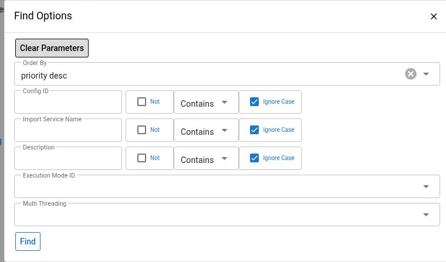

# Data Manager Configuration

Use `MDM > Configs > Find Config` to identify the service that processes an import, review its execution settings, and prepare a CSV or JSON file. Each configuration connects incoming records to a Maarg service. Uploading a file creates work for the import runner, so treat an upload as a request to change business data.

This guide covers Maarg 6.4.0 with `maarg-util` 4.4.0. Menu placement, permissions, configuration records, and service contracts can differ between environments. If MDM is not in your menu, ask the environment administrator for the approved entry point and access.


Field and workflow behavior is verified against the 4.4.0 source. The filter screenshot was inspected on an authorized demonstration instance running `maarg-util` 4.3.0. Configuration creation, editing, template downloads, uploads, and import processing were not executed for this guide; those procedures are source-verified only.


## Before You Start

- Confirm the environment and configuration ID with the owner of the import.
- Use an account authorized for the configuration and the intended operation. Screen access alone is not approval to import data or alter processing behavior.
- Obtain the import service's input contract: required fields, identifier formats, validation rules, expected business changes, and whether repeated submissions can create duplicates.
- For a new or changed configuration, use an approved non-production test with synthetic records before a production import.
- Agree on the expected record count, verification steps, and recovery plan. Keep a protected copy of the original input according to your retention policy.

This Maarg screen exposes service and execution settings. The separate [OFBiz Data Manager job guide](../ofbiz/data-manager/README.md) describes an OMS/SFTP workflow with different fields and job setup; do not assume those instructions apply to this screen.

## Find And Review A Configuration

1. Open `MDM > Configs > Find Config`.
2. Open `Find Options` and enter the available criteria.
3. Select `Find`.
4. Select the configuration's `Config Id` to open `Data Manager Config`.
5. Confirm the description and import service before using any action.

The screenshot shows only the configuration filter dialog. It does not demonstrate a configuration change or an import.

| Filter or ordering control | Use |
| --- | --- |
| `Config Id` | Find the identifier agreed with the import owner |
| `Import Service Name` | Find configurations by their service name |
| `Description` | Find a configuration by its descriptive text |
| `Execution Mode Id` | Select an available execution mode; leave empty to avoid this restriction |
| `Multi Threading` | Select `Y` or `N`; leave empty to include both and unset values |
| `Priority` ordering | Sort the results; the initial order is descending priority |

The list includes configurations whose import service is unset or contains `#`, the Maarg service-name separator. A configuration with a different service-name format can be absent even after you clear the search filters. Adding `#` to a name does not make an invalid service valid.

The detail page also shows `Last Updated Stamp`, the calculated `Thread Pool`, and a `Data Manager Logs` section for that configuration. Use the log ID to open an individual run. For cross-configuration monitoring and additional filters, use [Data Manager Imports](data-manager-imports.md).

## Understand The Configuration Fields

| Field | Meaning and operational effect |
| --- | --- |
| `Config Id` | Unique configuration identifier. It is entered when adding a configuration and is not editable in the Edit dialog |
| `Import Service Name` | Full name of the installed Maarg service that receives each input record. Confirm the name and contract with the service owner |
| `Description` | Human-readable purpose, also used to name downloaded templates when present |
| `Execution Mode Id` | Controls how the runner dispatches files for this configuration. The baseline options are `Queue`, `Async`, and `Sync` |
| `Multi Threading` | `Y` enables splitting a file into chunks for parallel processing. An unset value is displayed as `N` |
| `Priority` | Integer used to order pending configurations and select their pool. In this baseline, values greater than 6 use `Priority`; other values use `Normal`. An unset value uses a runner fallback of 5 |
| `Thread Pool` | Read-only result of the priority rule, not a separately editable setting |

### Execution Mode And Concurrency

The 4.4.0 runner treats `Queue`, including an unset execution mode, as sequential file processing for a configuration. It skips that configuration when it already has queued or running logs, and processes selected pending files in creation order.

Both non-Queue options enter the runner's pool-based dispatch path in this baseline. In particular, selecting `Sync` does not make the Upload File request wait for the import to finish. Do not infer transactional behavior or response timing from that label.

`Multi Threading` is a separate choice. A Queue configuration can still process chunks of one file concurrently when this flag is `Y`. Keep concurrency disabled unless the service owner has confirmed that records can be processed safely in parallel. Dependencies between records, updates to the same business object, and downstream side effects can make parallel execution unsafe.

Changing priority or mode affects operational scheduling. Raising a priority is not a general remedy for a backlog, and the screen does not provide a recurring job schedule or an import dry-run option.

## Add Or Edit A Configuration

**Source-verified procedure.** Perform this only as an approved configuration change.

### Add

1. Select `Add` on `Find Config`.
2. Enter a unique `Config Id`, the approved `Import Service Name`, and a clear `Description`.
3. Set the approved `Execution Mode Id`, `Multi Threading`, and integer `Priority`.
4. Review the fields and select `Save`.
5. Find the new configuration and open it. Verify the saved service, execution mode, threading flag, priority, and calculated thread pool.

Expected result: a configuration record exists with the reviewed settings. Saving a configuration does not prove that the referenced service exists or that its input will succeed. Verify the service contract separately before an upload.

### Edit

1. Open the intended configuration and review its recent logs, including pending, queued, and running work.
2. Coordinate the change with the import owner. Avoid changing service or concurrency settings while work is active or waiting unless the impact has been explicitly assessed.
3. Select `Edit` and change only the approved fields.
4. Select `Save`.
5. Reload the details and verify the values and `Last Updated Stamp`.

Expected result: the existing configuration contains the new values. This does not undo previously imported records or reprocess earlier files.

## Prepare A File From The Service Template

**Source-verified procedure.** The template icons are in the `Data Manager Logs` toolbar on the configuration detail page.

1. Confirm the import service is the one intended for the data.
2. Use `Download sample CSV template` or `Download sample JSON template`.
3. Review the downloaded structure against the current service contract before adding data.

The CSV template contains a header row derived from the service's input parameter names. Camel-case boundaries become lowercase hyphenated names; for example, `productStoreId` becomes `product-store-id`. The internal `_recordNumber` input is omitted. The template contains no data records.

The JSON download contains an array holding service parameter metadata. It is a structural reference, not a ready-to-import business record. Replace metadata with actual values and validate the resulting array of record objects against the service contract. Do not upload an unchanged template.

For both formats:

- Retain the approved field names and supply the required values; not every field in a service definition must be a business-data column.
- Use UTF-8 CSV with a header row, or valid JSON with an array of record objects at the root.
- Check the record count and identifiers before submission. Preserve identifiers such as leading-zero codes when editing in spreadsheet software.
- Use a small, representative non-production sample when validating a new service or file shape.
- Keep credentials and unrelated customer information out of the file.

If template generation reports that the service was not found, stop and verify the full service name and installed component version. If it reports no parameters, ask the service owner whether this service is suitable for record-based import.

## Upload An Approved Import File

**Source-verified procedure.** An upload stores the file, creates an import log in `Pending`, and makes it eligible for automatic processing. There is no separate review or start button in this workflow.


The import service can change live business records and trigger other activity. Confirm the file, configuration, target environment, and approval before selecting `Add`. A failed, cancelled, or interrupted import can have partially applied changes; uploading the file again can repeat them.


1. Open the approved configuration.
2. Select `Upload File`.
3. Choose the reviewed `.csv` or `.json` file in `Content File`.
4. If `Multi Threading` is `Y`, review the optional `Group By` field with the service owner.
5. Select `Add` once.
6. Locate the newly created log in `Data Manager Logs`. Record its log ID, file name, creation time, configuration, and displayed status.
7. Follow [Data Manager Imports](data-manager-imports.md) to verify execution and the business result.

Expected result: a new import log and uploaded-file content record exist. It may already have moved beyond Pending when the page refreshes. An upload acknowledgement is not confirmation that all records were processed successfully.

### Group By

`Group By` appears only for configurations whose `Multi Threading` flag is `Y`. The supplied value is saved as an import parameter and names the CSV header or JSON field used to group records into chunks.

Use the exact name present in the file. CSV grouping checks the raw header, so a header such as `product-store-id` must not be replaced with `productStoreId` in this field merely because the service uses camel case. Missing or unmatched grouping fields can fall back to size-based splitting. Do not rely on grouping without validating the input and the service's ordering requirements.

Grouping records does not guarantee ordering between groups, make the import atomic, or prevent the same input from being submitted twice.

## Troubleshooting

| Symptom | Next check |
| --- | --- |
| Configuration is missing | Clear the filters, confirm the environment and ID, and check whether the import service name meets the list's Maarg-service filter |
| Saved service cannot produce a template | Verify that the full service name exists in the installed version and has the expected input parameters |
| Import is Pending or Queued | Review the MDM Runner and other work for the configuration. Queue mode can wait behind earlier files; do not upload again to force execution |
| Upload response is unclear | Search recent imports by configuration and creation time before resubmitting. Check whether the original upload already created a log |
| Group By is absent | Check whether `Multi Threading` is `Y`. Do not enable concurrency only to expose the field |
| Thread Pool differs from expectations | Check the saved priority and this version's greater-than-6 routing rule |
| Import finishes but business changes are incomplete | Review failed-record count, error content, the full log, and expected downstream effects. Some configuration behavior is outside these visible fields; involve the service owner |
| A page or action is unavailable | Verify the deployed versions and have the administrator review access to the screen and underlying services |

For operational evidence and recovery checks, continue with [Data Manager Imports](data-manager-imports.md).
