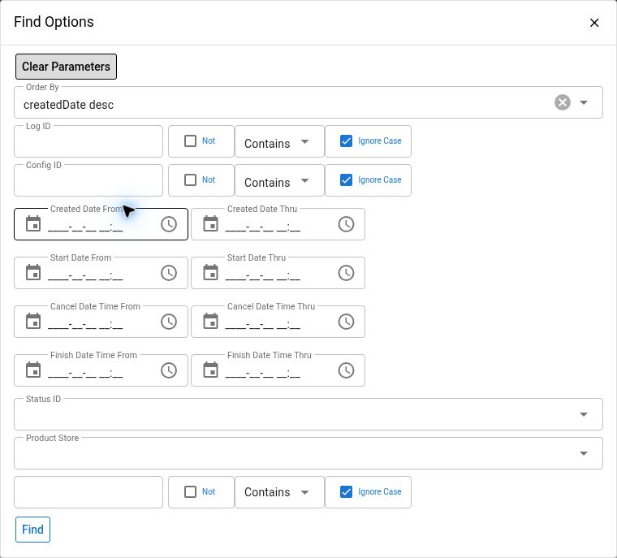

# Data Manager Imports

Use `MDM > Imports > Find Import` to locate an import and understand what happened to it. Start with the log ID and configuration, then compare the status, exact record counts, error files, and business outcome. A `Finished` import can still contain failed records.

This guide covers Maarg 6.4.0 with `maarg-util` 4.4.0. Menu placement and access depend on the deployment. It complements [Data Manager Configuration](data-manager-configuration.md), which covers configuration settings, templates, and uploads.


Behavior is verified against the 4.4.0 source. The import filter screenshot was inspected on an authorized demonstration instance running `maarg-util` 4.3.0. No import records or logs were opened, and no uploads, cancellations, deletions, or recovery workflows were executed for this guide. Those workflows are source-verified only.


## Before You Start

- Confirm the environment, configuration, expected file, and business process with the import owner.
- Use an account authorized to inspect the relevant imports and content. Additional access may be required for administrative actions.
- Have the approximate upload time and its time zone, log ID if known, expected record count, and expected business changes available.
- Keep investigations read-only until a specific recovery action is approved.


Uploaded files, error files, parameters, and logs may contain customer data, identifiers, internal paths, or service details. Download only when needed, retain them in approved storage, and redact them before sharing. Do not use production content in screenshots or documentation.


## Find An Import

1. Open `MDM > Imports > Find Import`.
2. Open `Find Options`.
3. Search by `Log Id` when available. Otherwise combine `Config Id` with a creation-time range.
4. Add status, store, or instance filters only when they help distinguish the intended run.
5. Select `Find`, then select the matching log ID.

The screenshot shows only the import filter dialog. No operational import records are shown.

The list is restricted to import-type logs and initially sorts newest creation time first. It is not a combined import/export history.

| Filter or control | Use |
| --- | --- |
| `Log Id` | Find a specific execution record |
| `Config Id` | Limit results to the configuration used for the upload |
| `Created Date` | Narrow by log creation time, useful when the upload time is known |
| `Start Date` | Narrow by processing start time; pending work may not have one |
| `Cancel Date Time` and `Finish Date Time` | Search the corresponding stored timestamps |
| `Status Id` | Select a configured Data Manager Log status; clear it to inspect other outcomes |
| `Product Store Id` | Select a product store when one is recorded on the log |
| `Run By Instance Id` | Isolate work assigned to a server node |
| Record-count ordering and page size | Bring larger or failed runs into view and adjust the number of displayed results |

Use the configuration link to open its settings in a separate tab. When a row has a parent log ID, investigate that relationship before considering another submission.

## Read The MDM Runner Dashboard

The `MDM Runner` panel is a snapshot of the server node handling the page request. Match its `Instance ID` to the import's `Run By Instance Id`; the panel is not a cluster-wide total.

| Dashboard value | Interpretation |
| --- | --- |
| `Priority Pool` and `Normal Pool` | Separate worker pools selected by configuration priority |
| Threads `Active`, `Cur`, `Max` | Active thread count, current pool size, and configured maximum. Active equals Max is highlighted as a warning |
| Queue `Cur`, `Rem` | Number of queued tasks and remaining queue capacity. Zero remaining capacity is highlighted; queued tasks exceeding remaining capacity are also highlighted |
| `Last Executed` | Last recorded runner execution time, displayed with the user's time zone |
| `Instance ID` | Identifier of the current server node |
| Last Purge `At` | Last recorded purge time on this runner |
| `Total Purged` | Runner counter since server startup, not an all-time audit total |

The pool queue counts tasks and can include chunks of an import; do not equate it with the number of files in the list. Saturation is a reason to assess workload and wait times, not proof of a failed import.

Blank pool values or `-` timestamps can mean that runner information is not available on this node. In the baseline, the runner has a startup delay and a configurable interval, and it can be disabled by configuration. Ask the operator to verify initialization, node identity, and runtime settings before diagnosing the runner as stopped. Do not restart the service as a first troubleshooting step.

## Inspect The Import Record

The `Data Manager Log` page brings together the execution record, parameters, and content files.

1. Confirm `Log Id`, `Config Id`, and any `Parent Log Id`.
2. Review creation, start, finish or cancellation timestamps and execution time.
3. Record `Run By Instance Id` and `Run Thread` for correlation with application logs.
4. Review `Created By Job Id` and `System Message Id` when populated. They provide context about the producer of the import; they do not prove that upstream or downstream work succeeded.
5. Compare `Total Record Count` and `Failed Record Count` with the expected input.
6. Review `Parameters`, then the relevant entries under `Content Files`.

The list abbreviates large record counts; hover text and the detail page expose the exact values. Counts may be populated at completion rather than continuously. A zero or blank count during processing is not sufficient evidence that no records have changed.

`Total Record Count` is the count processed/read by the loader, including failed records. For a cancelled run it may cover only the processed portion. Do not treat it as an independently verified count of every record in the original file or as a count of committed business changes.

### Parameters

Use the list's parameter `View` action or the detail page's `Parameters` section to inspect saved name/value pairs. Examples include an approved `groupBy` value or inputs supplied by the process that created the import.

The parameter dialog reports `No parameters found.` when no separate parameter records exist. This alone does not make the import invalid; the input file can supply its data.

### Status History

Select the status/history control on the detail page to review recorded status changes, newest first. The history shows the new status, change time, and recorded user. It is based on audit entries for the log's status field. `No status history found.` means no matching audit entries were returned; it is not evidence that the import never ran.

### Content Files

The list shows the newest uploaded-file and error-file content entry for each log. The detail page lists all associated content entries, newest first, including their type, file name, storage location, size, and date.

- `Uploaded file` is the input associated with the import.
- `Error file` contains record-level error output when one was generated. CSV output includes error-message information; JSON output can include `_ERROR_MESSAGE_`.
- `Log file` is diagnostic execution output.

Use the download control only for the evidence you need. An error file is diagnostic material, not automatically a valid recovery input. Compare it with the original records, correct the underlying cause, and rebuild an approved input using the current service contract. Do not blindly re-upload it.

## Interpret Statuses With The Evidence

| Status | Meaning and next check |
| --- | --- |
| `Pending` | Available for the runner to pick up. Check configuration, earlier work, and runner availability before treating it as stalled |
| `Queued` | Dispatched or reserved for processing. It may be waiting for earlier files or worker capacity |
| `Running` | Processing has started. Correlate timestamps, node, thread, and log output |
| `Finished` | Processing reached its normal finish path. Check failed-record count, errors, expected count, and business results before calling it successful |
| `Failed` | Processing encountered a failure path. Read the diagnostic log; previously processed records may already have committed |
| `Crashed` | Work was identified as interrupted during startup recovery. Look for a newer child log before taking any recovery action |
| `Cancel Requested` | A running import has been asked to stop. It is still active until processing observes the request and terminates |
| `Cancelled` | The import was cancelled before processing or stopped after some processing. This does not roll back earlier changes |

Record-level service failures can be collected while processing continues, and the run can finish with a nonzero failed count. Each record is submitted through its own service transaction in the baseline; a file is not an all-or-nothing transaction. Counts and statuses must be reconciled with the actual business records.

## Read The Execution Log

1. Use the row's log-file icon or `View Log` on the detail page.
2. Review the first useful error in context and correlate it with the affected records and service.
3. If available, select `Download full log file` when the displayed tail is insufficient.

The inline viewer reads the per-import log on the current node. It displays at most the latest 2,000 lines and also applies a byte limit, so it may show less of the history than expected. Error, warning, information, and debug lines receive visual emphasis. A truncation notice means earlier output is not visible.

`Log file not available for log ...` can result from a different execution node, retention, missing storage, or a file that has not been created. It does not establish success or failure. Check the record's content entries and executing instance with the operator. A content record or download icon also does not guarantee that the underlying file is still present.

## Investigate A Failure Or Delay

1. **Preserve the identity of the run.** Record the environment, log ID, configuration, file name, timestamps and time zone, status, exact counts, node, and any parent ID.
2. **Check for related work.** Look for another import of the same file or a newer child log. Verify whether an upstream job or system message already produced another attempt.
3. **Locate the failure stage.** Pending or Queued points first to dispatch and capacity checks. Running with no visible progress requires node and log checks. Finished with failures requires record-level validation. Failed requires the exception context.
4. **Compare input and service.** Verify required fields, identifier formats, referenced records, and the configuration's current service. Review parameters and grouping where relevant.
5. **Reconcile partial effects.** Determine which business records changed, which did not, and whether external calls or downstream activity occurred. Do this before deciding the scope of any replacement input.
6. **Choose a bounded recovery.** Obtain the owner's approval for the corrected records and target environment, validate a representative sample, and confirm that replay is safe. Retain the original log ID as context for the recovery record.
7. **Verify the outcome.** Check the new run's terminal status, exact counts, error content, and expected business state. A second upload or a cleared error message is not the completion criterion.

These screens do not expose a general Retry or Reprocess action. Do not emulate one by editing database statuses, restarting the server, or repeatedly uploading the same file.

## Cancel An Import When Approved

**Source-verified procedure.** Cancellation controls are in the configuration detail page's `Data Manager Logs` section.

1. Open the configuration and locate the exact log ID.
2. Refresh and verify its current status.
3. For `Pending` or `Queued`, select `Cancel` and confirm the dialog. The action requests the Cancelled status and records a cancellation time.
4. For `Running`, select `Request Cancel` and confirm the dialog. The action records `Cancel Requested`; the screen shows that stopping is pending.
5. Continue checking the log and business effects until its outcome is clear. Escalate if cancellation remains requested without progress.

The runner cooperatively checks cancellation rather than terminating an in-flight service call. In this baseline the CSV and JSON loaders check at 10,000-record boundaries; chunks can be active concurrently. A short import or one near completion may finish before it observes the request. Do not promise immediate stopping, and do not use deletion as a substitute for cancellation.

## Account For Automatic Crash Recovery

**Source-verified background behavior.** On startup, an enabled runner waits for its configured initialization delay. It then examines logs that were Running or Queued for the same instance ID. It marks those original logs Crashed and creates new Pending child logs linked through `Parent Log Id`, copying their import parameters and uploaded-file references.

Before a manual recovery, find those child records and verify whether they are Pending, Queued, Running, or already complete. The relationship is visible on a child's details and in the lists. A parent marked Crashed does not mean that processing will remain stopped.

The recovery path can process the input again, so prior side effects and duplicate protection matter. Restarting a node or uploading another copy is not a safe default response to a stalled-looking import. Have the operator and service owner agree on one recovery path.

## Retain Evidence Before Cleanup

**Source-verified destructive behavior.** The configuration log list has a delete control. Its service removes the log, parameter records, and content records, and can delete their underlying files. It is not an undo-import action and does not reverse business data changes.

Do not delete active work, a Cancel Requested import, or evidence needed to investigate an incident. Review parent/child relationships and retention requirements before an approved cleanup. The service has limited checks for content referenced by other active logs; those checks are not a guarantee that every related record or diagnostic need is protected.

Automatic retention also applies. In this baseline the runner selects older terminal-state logs for its own instance, based on creation date; the default age is 30 days and is configurable. Preserve required evidence under your organization's policy rather than relying on the history being permanent. The dashboard's purge counter is operational information, not confirmation that every associated file was successfully deleted.

## Troubleshooting

| Symptom | Next check |
| --- | --- |
| Known import is missing | Clear restrictive date/status/store/instance filters, verify the environment, and ask whether retention or approved cleanup removed it |
| Pending despite available-looking capacity | Confirm the runner node and initialization, configuration mode, and earlier queued/running work for that configuration |
| Finished with failed records | Inspect error content and the full log, reconcile partial updates, and prepare only the approved recovery scope |
| Failed with zero displayed records | Do not assume nothing changed. Counts may not have been finalized; verify logs and business records |
| No error-file icon | Failure may have occurred before record-level error output was generated. Read the diagnostic log and content list |
| Missing completion time in the list | Open details and status history. The list renders finish time for Finished and cancellation time for Cancelled/Crashed; other terminal statuses can have a blank completion display |
| Cancel Requested persists | Check the executing node and active service work. Cancellation is cooperative and may wait for a check boundary |
| Crashed parent and a new Pending log | Investigate automatic startup recovery before any manual replay |
| Download fails | Confirm that the content still exists in the configured storage and that you have access; an old metadata record is not proof of a retained file |

When escalating, send the log/configuration IDs, versions, timestamps with time zone, counts, executing instance, parent/child IDs, and a redacted error summary through an approved channel. Include the expected business outcome and the checks already performed. Share raw input or logs only when authorized and necessary.
