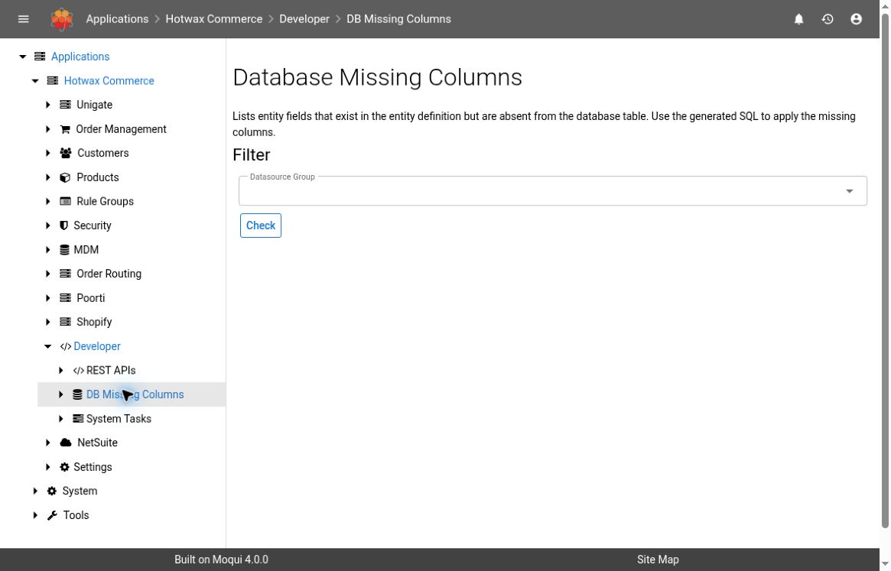
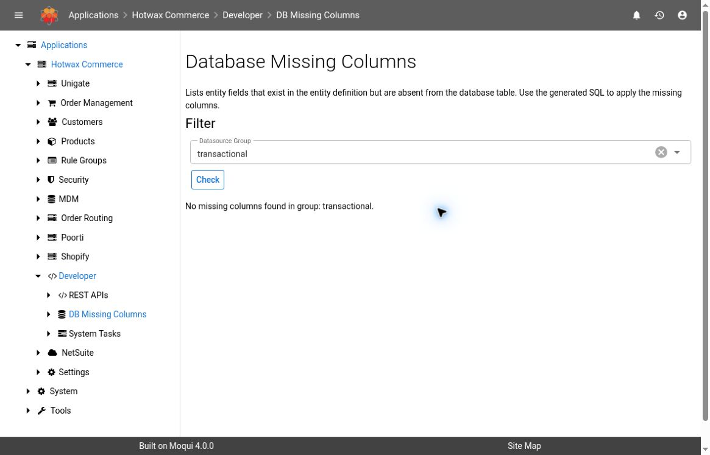

# DB Missing Columns

Use `DB Missing Columns` to compare entity fields with the columns in existing database tables. The screen reports missing columns and prepares SQL statements for review.

This guide covers the screen in Maarg 6.4.0 with `maarg-util` 4.4.0. Confirm your environment's version before following the steps.


The screen reads database metadata and generates SQL. It does not apply the generated statements. Running them is a separate database change that requires your team's approved migration process, review, and recovery plan.



The workflow is checked against the tagged source above. Screenshots show an authorized demonstration instance running `maarg-util` 4.3.0 (`ef99b1c7`), whose screen source matches 4.4.0. Navigation and a successful scan of the selected datasource group were verified. The missing-column result and SQL-copy flow remain source-verified only.


## Before You Start

- Use an authorized account in the intended environment.
- Identify the datasource group you need to check.
- Confirm that the installed component versions match the upgrade or issue you are investigating.
- Use a separate demonstration environment and synthetic schema details for documentation screenshots.

## Run A Check

1. Open `Hotwax Commerce > Developer > DB Missing Columns`.
2. In `Datasource Group`, select the group to check. Leaving the selection empty checks the configured datasource groups.
3. Select `Check`.
4. Review the result.

Opening the page does not run the scan. The scan starts when you select `Check`.

### No Missing Columns

If the scan finds no missing columns, the page displays `No missing columns found`. When a group is selected, the message also identifies that group.

This result applies to the columns checked in existing tables. It does not confirm that every database object, migration, or configuration is correct.

### Missing Columns Found

The `Missing Columns` section shows one row per missing field for which the tool can generate SQL.

| Column | What It Shows |
| --- | --- |
| `Entity` | The entity definition containing the field |
| `Table` | The database table associated with the entity |
| `Field` | The field name in the entity definition |
| `Column` | The expected database column name |
| `Field Type` | The field type in the entity definition |
| `SQL Type` | The database-specific SQL type |
| `ALTER TABLE SQL` | The generated statement for adding the missing column |

The `All SQL Statements` section collects the statements from the result list. Select `Copy to Clipboard` to copy them for review.

## Review The Result Before Making Changes

1. Confirm that the results belong to the intended environment and datasource group.
2. Compare the missing fields with the component's approved upgrade instructions.
3. Ask the responsible developer or database administrator to review the generated SQL, dependencies, and deployment sequence.
4. Apply any approved migration through your normal change process.
5. After the change, run `Check` again in the same environment and datasource group.

Do not paste generated statements into a production SQL tool as an undocumented workaround. Adding a column can affect locks, application behavior, and the order in which upgrades must run.

## Understand The Check's Limits

- The tool compares entity fields against columns in existing tables.
- View entities and tables absent from the database are skipped.
- A field may be omitted from the results if its SQL statement cannot be generated; review application logs when the result is unexpected.
- The check does not compare the types or constraints of columns that already exist.
- The output is a point-in-time result. Recheck after a component upgrade or approved schema change.

## Troubleshooting

| Symptom | Check |
| --- | --- |
| An expected datasource group is unavailable | Confirm the environment's datasource configuration with its administrator. |
| The result is empty but the application still reports a schema error | Confirm the group and component version, then investigate missing tables, existing-column types, constraints, and application logs. |
| The same missing column appears after a migration | Verify which environment, database, and schema received the approved change, then repeat the check. |
| A blank-group scan reports a group with no DataSource | Choose a configured datasource group explicitly and check that group. Ask the administrator to review the unavailable group; a successful scoped scan does not establish that all groups passed. |
| The page fails while checking | Review the application error and database connectivity through approved access. Avoid repeated scans until the failure is understood. |
| The page is unavailable | Confirm the installed version and ask the environment administrator to review your access. |

For background on entities, see the [Maarg Glossary](glossary.md).
