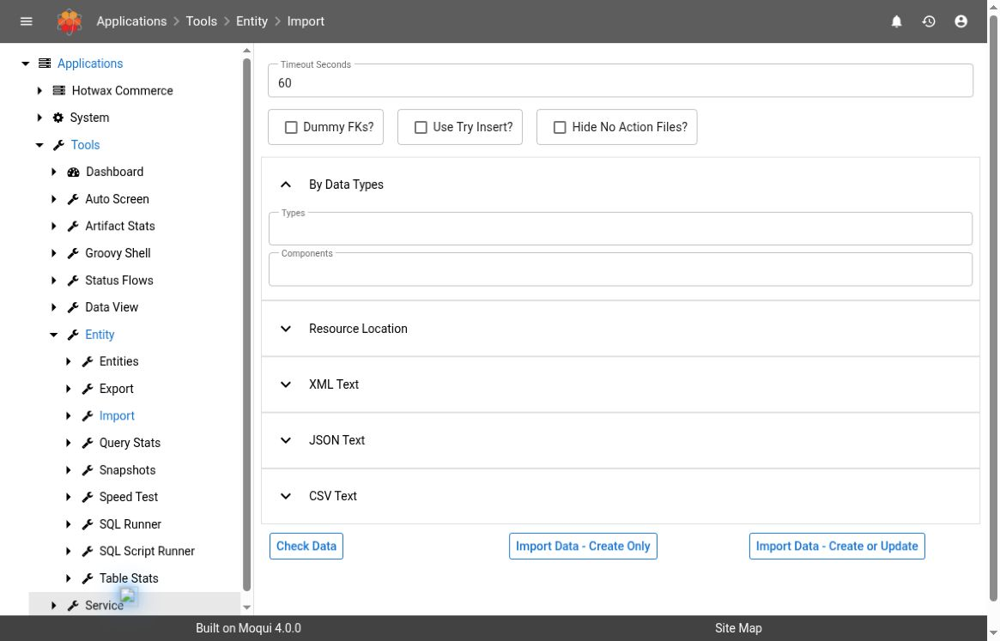
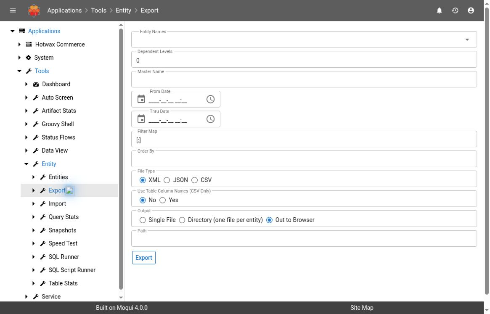
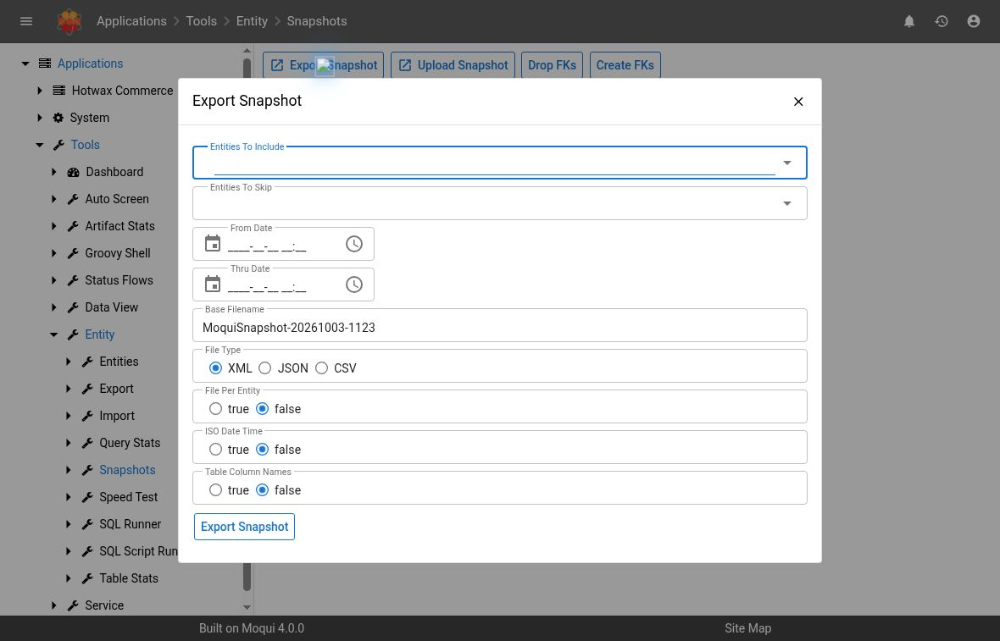

# Raw Entity Import, Export, And Snapshots

Use the **Tools > Entity** screens to compare or move framework entity data. These are low-level administrative tools. An input can identify entities, relationships, or services; an output can contain operational and security data.

This workflow is separate from **MDM**. Raw **Import** does not use a Data Manager configuration, upload template, or MDM import-log lifecycle. For configured business-file processing, use [Data Manager Configuration](data-manager-configuration.md) and [Data Manager Imports](data-manager-imports.md).

## Version, Navigation, And Verification

The source baseline is **Maarg 6.4.0**, using **moqui-runtime 4.1.0**, **moqui-framework 4.2.0**, and **maarg-util 4.4.0**. The raw screens are supplied by the runtime and use the framework's entity loader/writer. The source check also includes the release build's applied Maarg-util patches, including the CreatedStamp comparison changes.

Open the authorized **Tools** application, then **Entity > Import**, **Entity > Export**, or **Entity > Snapshots**. Deployment menus and mounts can differ; do not construct these addresses from an OMS screen URL. If a screen is absent or denied, ask the administrator to confirm the installed version and your intended access.


This guide is source-verified. The Import and Export forms, empty Snapshots list, and Export Snapshot dialog were observed read-only in the hosted demo on October 3, 2026, displaying framework 4.0.0 and util 4.3.0. Its framework/runtime commit prefixes matched the inspected source-tag commits, but the demo was not a release-composition acceptance test. No check, import, export, snapshot upload/download, snapshot import, deletion, or foreign-key operation was executed for this guide. The procedures below describe the release source, not an end-to-end tested recovery example.


## Before You Start

1. Confirm the environment, database, installed components, and affected application owner. In a multi-node deployment, identify the node and whether its runtime files are shared.
2. Write down the exact entity names, primary keys or bounded selection, expected changes, and intended recipient/storage location. Include the incident time and time zone when investigating an existing operation.
3. Review the complete input or proposed export scope. Include nested records and any service entries, not just the first row or top-level entity.
4. Use complete, explicit primary keys for comparisons and repeatable loads. Verify referenced records and schema compatibility before submitting anything.
5. Obtain approval for the particular data transfer or change, including downstream effects, maintenance timing, and a tested recovery method. A broad snapshot is not automatically an adequate backup.


These tools do not provide a redacted support export. Files, check results, service parameters, and logs can contain personal data, credentials, or security configuration. Use approved protected storage and the minimum entity/record scope. Do not upload production data into another environment or publish it in tickets, screenshots, or documentation without specific approval and appropriate redaction.


## 1. Prepare And Inspect A Raw Import

Opening **Import** and reviewing its controls does not load a file. Keep investigation at this stage until the source and scope are understood. This screen accepts text or a server-readable resource location; it is not an MDM file-upload form.

*UI-observed preparation screen only. No input was entered and no check or import was submitted.*

### Choose One Input Source

| Input | Meaning and preparation |
| --- | --- |
| **By Data Types: Types, Components** | Comma-separated data types and component names. The loader discovers installed component/configuration data files. With no component restriction, discovery can span all components; with no type restriction, multiple data types can be included. Do not use this as a narrow record filter. |
| **Resource Location** | A resource the server can read, not a path on your laptop. The loader recognizes `.xml`, `.json`, `.csv`, and ZIP archives containing these formats. Use an administrator-confirmed location. |
| **XML Text** | Entity data within an `entity-facade-xml` root, using installed entity names and fields. Nested related records are supported by the normal map-loading path. |
| **JSON Text** | An object or array of objects identifying the target with `_entity`; nested entity maps are supported. An optional `_dataType` supplies type metadata. This is a framework data format, not an arbitrary JSON document. |
| **CSV Text** | First row identifies the entity or service and optional data type; second row contains field/parameter names; subsequent rows contain values. An ordinary spreadsheet with only a header and data rows is not sufficient. |

The screen chooses only one source, in this order: **Types/Components**, **Location**, **CSV Text**, **JSON Text**, then **XML Text**. Clear unused inputs before checking or loading; selecting a different accordion panel does not change this precedence.

Additional input cautions:

- Data-type discovery can include files with no detectable type. Ask the operator to inspect the discovered file list; a type name alone is not proof of a bounded scope.
- CSV uses comma separation, `"` quoting, backslash escaping, and `#` comments in the baseline. Empty CSV fields become null values. XML empty attributes also become null values. Confirm whether clearing a field is intended.
- A ZIP is processed as data files, not as an application/database backup. Unsupported entries are ignored. An archive extension does not establish valid or safe contents.
- When the JVM property `instance_purpose` is exactly `production`, the baseline blocks recognized network locations such as HTTP(S) and FTP(S). Do not change environment settings or use another location scheme to evade that restriction.
- The loader can accept service entries as well as entity records. Review them as executable operations with their own effects and permissions. Prefer reviewed entity-only input for this procedure.

### Understand The Import Controls

| Control | Source behavior and boundary |
| --- | --- |
| **Timeout Seconds** | The screen defaults to 60 seconds for loading transactions. This is not a preview limit, a row limit, or a whole-operation cancellation guarantee. |
| **Dummy FKs?** | In applicable value-loading paths, creates missing referenced records with primary keys only to satisfy foreign keys. Those placeholder records may be incomplete business data. Leave off unless an approved plan supplies their full data. |
| **Use Try Insert?** | In applicable value-loading paths, attempts create first and then update after an insert failure. A datasource's `never-try-insert` setting can override it. This is not “insert only” and is not universally applied across formats. |
| **Hide No Action Files?** | Reduces file-level messages. It does not remove records from the scope, suppress errors safely, or change what is loaded. Keep off while investigating. |
| **Check Data** | Parses and compares against current entity records instead of using the load handler. It does not execute service entries. See the important limits below. |
| **Import Data - Create Only** | Creates records not found by primary key and leaves matching records unchanged. The create-only handler skips incomplete keys and service calls, but CSV may generate a single-field key before this handler is reached. |
| **Import Data - Create or Update** | Creates or updates records and can execute service entries in the input. It can trigger ordinary entity rules, audit processing, and data-feed behavior; the raw form does not expose snapshot-style disabling switches. |

Leave **Dummy FKs** and **Use Try Insert** off for the normal reviewed workflow. They are not harmless performance switches: XML switches from the nested-map path to a value path when either is enabled, while JSON entity input uses the map/store path. Do not assume a nested XML load or a JSON load behaves identically after toggling them.

The raw screen enables the loader's sensitive-entity restriction. This is not a substitute for reviewing the payload, its services, its nested scope, or the user's permissions. Resolve a denied operation with the administrator rather than switching to another tool to bypass it.

### Use Check Data As A Limited Comparison

For a read-only investigation, first review the input outside the loading action and confirm that every record has a complete explicit primary key. Use a small, ordinary entity-only input with known references. If a CSV lacks its single-field key, stop: even **Check Data** allocates a sequenced key before comparison, which can advance a sequence bank and write sequence metadata. It is not a safe no-write preview for that input.

When a bounded comparison is authorized:

1. Enter only the intended source, keeping the original reviewed content unchanged.
2. Select **Check Data**. This does not select either import action.
3. Review **Entity**, **Primary Key**, **Not Found**, **Pk Complete**, **Field**, **Check/File Value**, **Db Value**, and **Location**. Inspect every page and record any errors or skipped files.
4. Resolve incomplete keys, unexpected entities, and unexpected differences before planning a write.
5. Preserve sanitized evidence; do not select the result list's update action during inspection.

The comparison has material limits:

- It compares supplied **non-null** values and skips `lastUpdatedStamp` and `createdStamp`. A blank diff does not prove that an import would make no changes, especially when an empty/null input would clear data.
- It does not execute service entries or predict their results, entity-rule effects, external requests, or later constraint failures.
- The check section constructs a separate loader; it does not apply the form's loading timeout, Dummy FKs, or Try Insert settings. It is not a rehearsal of all loading behavior.
- It compares against the database at check time. Another process can change records before an import or selected-row update.

**The diff list contains a real write action:** **Update Fields to Check/File Value and Create Missing Records** stores the selected fields or creates selected missing records. This is not another check. It does not perform an optimistic comparison against the previously displayed database value. Incomplete-key creation can generate new records. Obtain separate approval for the exact selected changes, recheck current values, and never use it to “accept” an unexplained diff.

### Execute Only An Approved Bounded Load

1. Confirm the final source, keys, mode, options, expected row changes, downstream effects, and recovery plan with the owner. Rehearse nontrivial or nested data changes in an isolated compatible environment first.
2. Recheck current data and ensure there is no overlapping load. Use **Create Only** only when adding missing records is the approved intent; otherwise explicitly approve the update scope.
3. Select the approved import button once and review its confirmation. A slow response is not permission to resubmit.
4. Capture all returned messages and errors before leaving the screen. The raw screen stores load messages in the session for the next render; it is not a durable MDM execution log.
5. Inspect the actual records by their approved primary keys and verify the exact values, references, expected new-record count, and downstream business result. Compare affected records before and after, including intended null/empty values.

“Loaded N records” is a parser/load count, not proof that N new records committed. Counts can include skipped create-only entries or service entries, and JSON counts top-level maps rather than all nested records. Check messages and actual state.

File-based loading uses transaction boundaries per location; a ZIP is handled within its location's transaction. Errors can be caught and processing can continue to later locations, so a component/type load can partially succeed. A failure inside a file can roll back its database transaction without undoing independently committed work or external service effects. Do not claim all-or-nothing recovery across the entire request.

## 2. Plan And Verify An Entity Export

An export queries data and writes a file or browser response. It is a data disclosure and may be expensive even though it does not intentionally update the selected business records. The source transition requires update authorization; access to view entity data alone does not necessarily authorize export.

### Define The Scope Before Selecting Export

| Field | Meaning |
| --- | --- |
| **Entity Names** | One or more entities; the screen's selector excludes view entities. No selection produces an error rather than exporting everything. |
| **Dependent Levels** | Defaults to `0`. For XML/JSON, positive levels include related dependent data and can greatly expand the output. These related queries do not inherit the root record's Filter Map or date bounds. |
| **Master Name** | Uses a matching entity master definition, for example an installed `default` definition. For entities without that master, falls back to the ordinary record/dependent behavior. It is not a field-redaction profile. |
| **From Date / Thru Date** | Filters `lastUpdatedStamp`: From is inclusive and Thru is exclusive. This is not a business-event date or deletion history. Entities without `lastUpdatedStamp` are not constrained by these dates. Record the time zone. |
| **Filter Map** | A framework map expression, default `[:]`, passed to entity queries. Use only reviewed field/value conditions valid for every selected entity. Do not paste an untrusted expression or rely on an unknown field to bound the export. |
| **Order By** | Controls query ordering. It is not a row limit. |
| **File Type** | XML, JSON, or CSV; XML is the screen default. CSV is flat entity data and does not serialize nested master/dependent records. |
| **Use Table Column Names (CSV Only)** | Replaces logical entity/field names with database table/column names. Leave **No** for an intended raw-loader round trip unless compatibility has been explicitly established. The CSV loader expects registered entity/service and logical field names. |
| **Output / Path** | **Out to Browser** downloads data; **Single File** and **Directory (one file per entity)** write to the server filesystem. Path is not a destination on your computer. |

There is no row-count or page-size limit on this form. A default empty Filter Map exports all matching records for the selected entities. Confirm scope with authorized inspection before running a large query; sorting does not make an unbounded export safe.

*UI-observed form defaults. No entity was selected and no export or download was executed.*

### Output And Format Limits

- Browser CSV for multiple entities produces a ZIP with per-entity files. A server **Single File** CSV with multiple entities is rejected. Use an approved per-entity output instead.
- CSV contains its entity/type/primary-key metadata row followed by the field header and rows. It is not just a report-style header. Preserve this structure for compatible loading.
- XML/JSON entity maps omit null values; XML also omits empty-string values. Reimporting such an export is not a reliable way to clear values that are now populated in the destination.
- In this baseline, the JSON writer emits a comma after each record. Validate the produced file with the intended consumer before assuming strict JSON interoperability; no external-consumer round trip was tested for this guide.
- Existing single-file/ZIP destinations are rejected instead of overwritten. Directory export skips existing entity files with an error and can leave a mixture of older and newer files. Choose a fresh approved destination.
- Export failures can leave empty, incomplete, or partially written files. File existence, file size, or an HTTP download alone is not evidence of a complete export.

### Approved Export Procedure

1. Confirm the entity selection, root filters, date semantics, dependent/master scope, format, destination, recipients, and retention with the data owner. Keep dependents at `0` unless their larger scope is intended.
2. Prefer a small explicit scope. For server output, have the operator confirm the writable destination and capacity. Avoid placing private data in a public web directory.
3. Select **Export** once. Preserve any messages and errors; do not infer success only from a downloaded filename.
4. Inspect the resulting file or archive in approved storage: confirm it opens, expected entities/keys exist, counts and time scope are plausible, and no unintended sensitive fields or related records are included. Validate parsing with the intended consumer.
5. Compare with the original selection and retain the sanitized evidence. Transfer the output only to the approved recipient/destination.

The writer iterates entity queries; these tools do not establish a tested, database-wide point-in-time backup. If concurrent writes matter, ask the database/application owner for a coordinated capture strategy.

## 3. Inspect And Manage Entity Data Snapshots

**Snapshots** packages entity data into ZIP files in the serving runtime's `db/snapshot` directory. It is not a database-engine snapshot and does not capture application binaries, resource files, deployment settings, or a complete recovery environment.

### Inspect Existing Files Without Applying Them

The **Current Snapshot Files** list shows nonempty `.zip` files, their filesystem modification time, and size in MiB. These are local filesystem facts, not verified completion or creation-by-export records. A file can be an upload or a partial export; an export can still be writing while a nonempty file appears.

Record the filename, node, modification time, and size. For a known export/import, find its job run in [Service Jobs](service-jobs.md) using the recorded job ID and the job names **ExportEntityDataSnapshot** or **ImportEntityDataSnapshot**. Inspect completion, results, messages, errors, and correlated logs. A queued job ID or “Started” message is not a completed snapshot.

**Download** transfers the whole file. Download only when authorized and only to approved storage. In a multi-node deployment, confirm that the exporting/importing job and the listing screen see the same directory; an absent file on one node does not establish that another node never created it.

### Export Snapshot

The dialog supplies **Entities To Include**, **Entities To Skip**, the same `lastUpdatedStamp` date bounds, **Base Filename**, **File Type**, **File Per Entity**, **ISO Date Time**, and **Table Column Names**.

- Set an explicit inclusion list. The service includes **all non-view entities when the inclusion list is empty**, then removes skipped entities. This happens even when the skip list is also empty; do not rely on the narrower wording of the inclusion tooltip.
- Use a unique, simple base filename without directories or path separators. The output is a `.zip` in the runtime snapshot directory, and an existing filename is rejected.
- The screen defaults to XML and **File Per Entity = false**; the service's declared default for File Per Entity is true. Record the submitted form value rather than assuming service defaults describe the UI.
- CSV forces one file per entity. **ISO Date Time** and **Table Column Names** apply to CSV. ISO Date Time changes date/time serialization; it does not change the selection window. Table/column naming has the same round-trip limitation described above.
- Snapshots do not expose the raw Export screen's Filter Map, dependent-level, or master controls. A selected entity includes all its rows that match any applicable date bounds.

After approval of that scope and storage, submit **Export Snapshot** once, capture the job ID, and follow the job through completion. Verify the archive's contents and expected records before calling it usable. A successful wrapper result alone does not establish backup completeness or restorability.

*The dialog was opened and closed without submission. Blank inclusion is shown to explain the scope risk; it is not a recommended export selection.*

### Upload Snapshot

**Upload Snapshot** copies a file into the runtime snapshot directory. It does not import records. The baseline requires a safe filename ending in lowercase `.zip` and rejects a name already present; it does not validate the archive's entity contents during upload.

Before an approved upload, inspect the archive in protected storage, record its provenance and checksum, confirm compatibility and intended entities, and review any service entries. The loader supports XML, JSON, and CSV entries even though the upload error text mentions XML. Do not treat extension acceptance as a malware, schema, content, or restoration check.

### Import Snapshot Is An Apply Operation

**Import** opens a dialog for the selected ZIP; **Import Snapshot** starts a background job. It does not rewind the database, remove records absent from the archive, recreate a complete deployment, or undo external activity. Normal entity entries use create/update behavior; service entries can have broader effects.

| Import setting | Default in the screen/service | Consequence |
| --- | --- | --- |
| **Dummy Fks** | `false` | See raw import placeholder-record cautions. |
| **Use Try Insert** | `false` | See raw import format/path and fallback-update cautions. |
| **Disable Entity Eca** | `true` | Disables entity ECA rules during the import. Application effects normally produced by those rules may be absent. |
| **Disable Audit Log** | `true` | Disables entity audit logging during the import. Preserve approved before/after evidence separately. |
| **Disable Fk Create** | `true` | Disables automatic entity foreign-key creation during the import. It does not drop or disable database constraints already present. |
| **Disable Data Feed** | `true` | Disables entity data-feed processing during the import. Search documents or downstream consumers may need a separately approved reconciliation. |
| **Transaction Timeout** | `3600` seconds | Loader transaction timeout, not a promise of total runtime or automatic full rollback. |

These are loader flags for the import context, not persistent global configuration changes. The snapshot service also clears the entity sequence-bank cache after the load call. That does not verify record consistency or downstream recovery.

For an approved application of a snapshot:

1. Confirm the exact archive/checksum, destination environment, entities and service entries, compatible schema, expected creates/updates, null-value limits, and chosen flags.
2. Establish a tested backup/recovery plan and maintenance window. Decide how to handle concurrent writers, scheduled jobs, existing foreign keys, audit evidence, and downstream feed/search reconciliation. Rehearse restoration in an isolated environment before relying on the file for recovery.
3. Confirm the job node can read the selected file and that no previous import is still active. Submit **Import Snapshot** once and capture its job ID.
4. Follow the job to a terminal result using [Service Jobs](service-jobs.md). Read errors and logs, including “Skipping to next file” messages, rather than relying on the reported record count.
5. Verify actual target records and relationships, records that should remain untouched, sequence behavior, constraints, and the expected application result. Complete any separately approved downstream reconciliation. A finished job is not a completed recovery until these checks pass.

### Delete And Foreign-Key Controls

**Delete** removes the selected ZIP file after confirmation. It does not reverse a prior import, cancel an export still writing the file, or remove business records. Confirm the retention/recovery requirement, job inactivity, exact filename/node, and an independently verified retained copy before approving deletion. The screen provides no restore-from-trash workflow.

**Drop FKs** and **Create FKs** are database-schema operations. They target known foreign keys/missing foreign keys for existing tables, not just the entities or archive selected for an import. **Drop FKs** removes constraints; it does not repair data. **Create FKs** does not prove all data is valid and can fail when inconsistent records exist. Do not use either as routine import troubleshooting. Escalate to the database owner for an explicitly scoped maintenance and verification plan.

## Troubleshooting And Escalation

| Symptom | Safe next step |
| --- | --- |
| “No parameters specified” or an unexpected input is used | Check source precedence and clear unused fields. Do not retry an import until you know whether any work occurred. |
| Unknown entity/field, invalid format, or incomplete key | Compare the input with installed definitions and the required format. Repair the reviewed input offline; do not invent keys or create dummy references as a shortcut. |
| Empty Check Data diff despite an intended clear | Inspect null/empty inputs, `lastUpdatedStamp`, and `createdStamp` separately; they are outside the comparison's complete coverage. |
| Foreign-key failure | Identify the missing/invalid relationship and planned load order. Keep constraints in place while diagnosing. |
| “File already exists” | Inspect the existing file's provenance and completeness. Choose a new approved name instead of deleting recovery evidence to make a retry succeed. |
| “Skipping to next file,” timeout, or an unexpected count | Preserve the first error and file/job details; establish which data committed and whether work is still running before planning a bounded repair. |
| Snapshot missing from the list | Check the job result, node/shared-storage scope, filename, and whether the file is empty. Do not start another job based only on the list. |
| Downloaded archive exists but cannot be parsed | Treat it as incomplete/unusable pending inspection. Check job errors and file integrity before any upload/import. |
| Records changed but downstream state did not | Check snapshot disabling flags, then inspect related [system messages](system-messages.md), jobs, and applicable feed/search processing. Obtain approval before replaying or rebuilding anything. |

Escalate with environment/component versions, node, operation and time zone, sanitized entity/key scope, reviewed input identity or checksum, selected flags, job ID when present, first meaningful error, committed-state checks, and any downstream effects. Record who approved each write or transfer. Preserve complete evidence in approved storage; share only the minimum redacted excerpt.

## Source Reference And Remaining Validation

Release-pinned source used for this guide:

- **moqui-runtime 4.1.0:** `base-component/tools/screen/Tools/Entity/DataImport.xml`, `DataExport.xml`, and `DataSnapshot.xml` for form controls, transitions, input precedence, file handling, and snapshot job invocation.
- **moqui-framework 4.2.0:** `framework/service/org/moqui/impl/EntityServices.xml` and `framework/data/MoquiSetupData.xml` for snapshot services and job definitions.
- **moqui-framework 4.2.0:** `framework/src/main/groovy/org/moqui/impl/entity/EntityDataLoaderImpl.groovy`, `EntityDataWriterImpl.groovy`, `EntityValueBase.java`, and `EntityFacadeImpl.groovy` for parsing, comparison, mutation, serialization, and sequence behavior; `framework/src/main/groovy/org/moqui/impl/context/TransactionFacadeImpl.groovy` for transaction isolation; `framework/src/main/java/org/moqui/util/WebUtilities.java` for filename/location guards. The release build also applies **maarg-util 4.4.0** `patches/CreatedStamp.patch`, which adds `createdStamp` to fields skipped during database comparison.

Still pending: representative sanitized check results; authorized XML/JSON/CSV round trips; partial-failure and duplicate-submission handling; nested records and import-option combinations; snapshot job completion on the actual node/storage topology; and an isolated, fully verified recovery exercise. No permission, throughput, cancellation, archive-integrity, or recovery guarantee should be inferred from source inspection alone.
