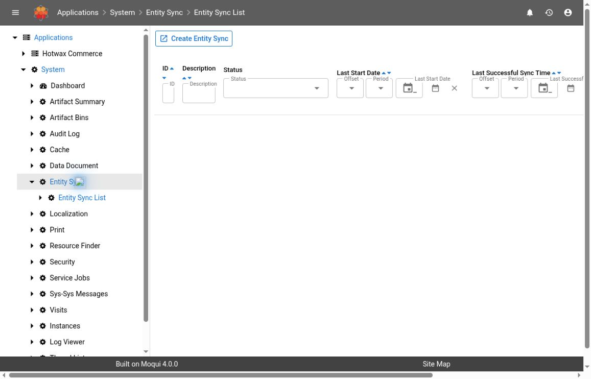

# Investigate Entity Synchronization

Use **Entity Sync** when a configured transfer of entity data between Maarg/Moqui systems is delayed, incomplete, or reporting an error. Establish the direction, included entities, last attempt, and receiving-system state before considering another transfer.

Entity synchronization is separate from a provider-specific Shopify or NetSuite integration, an MDM import, and a Data Document feed. A product-sync problem does not establish that Entity Sync is involved. Start with the integration's configured job/service and follow its actual records.

## Version, Access, And Evidence

**Source baseline:** Maarg **6.4.0**, runtime **4.1.0**, and framework **4.2.0**. The list, detail, history, entity definitions, synchronization services, and seeded scheduler configuration were inspected at those tags.

**UI observation:** The **System > Entity Sync > Entity Sync List** route and empty list filters were observed read-only in a hosted demo on October 3, 2026, displaying framework 4.0.0 and util 4.3.0. No populated sync configuration/history, transfer, reset, destination result, or recovery was exercised. The demo's displayed versions and deployment composition differ from the release baseline.

Use authorized access to the sending and receiving environments, or work with their respective owners. The configuration detail includes credential fields; it is not suitable for an unreviewed screenshot or a public support attachment. Never copy its password or a credential-bearing destination URL into notes or messages.

*The demo viewport shows the first list columns. Additional destination/direction filters are available horizontally; an empty list is not evidence of a successful transfer.*

## 1. Find The Existing Synchronization

1. Open **System > Entity Sync > Entity Sync List**.
2. Search by the known **ID** or **Description**. Check **Status**, **Last Start Date**, and **Last Successful Sync Time** filters if an expected record is absent.
3. Confirm **For Pull** and the approved destination with the environment owner. The list can also filter by **Target Server Url**; do not paste credentials into that filter.
4. Record the sync ID, current status, last-start time, last-successful time, and time zone in the incident record.
5. Do not select **Create Entity Sync** to replace a missing result. Confirm the environment, filters, installed configuration, and the actual mechanism used by the integration first.

Direction is relative to the environment holding this configuration:

| For Pull | Source Of Entity Data | Where Data Is Stored |
| --- | --- | --- |
| **Y** | Remote system | Local system |
| **N** | Local system | Remote system |

The reviewed implementation obtains and stores XML entity data through service calls, using JSON-RPC for the remote side. A field named **Target Path** is present in the configuration, but the reviewed synchronization runner does not implement a file-transfer step with that field. Do not assume it represents an active SFTP or file-delivery destination.

## 2. Review Configuration Without Saving

If your role permits viewing the credential-bearing detail screen, open the sync ID in a private session. Leave all fields unchanged and do not capture the entire page. Otherwise ask the environment administrator for the following non-secret facts.

| Setting | Meaning And Check |
| --- | --- |
| **Status**, **Last Start**, **Last Successful Time** | Current tracking state, most recent start, and stored synchronization watermark. These are not a complete record-by-record reconciliation. |
| **Sync Split** | Time-window increment in milliseconds. The data service declares a default of 1,000 ms. It is not a wall-clock execution timeout. |
| **Records** | Threshold used while collecting time splits; the data service declares 1,000. A full split is retrieved, so it is not a maximum batch size. |
| **Delay Buffer** | Age buffer in milliseconds before records are considered. The data service declares 300,000 ms (five minutes), intended to leave room for transactions in progress. |
| **For Pull** | Direction of the transfer, interpreted relative to this configuration's environment. |
| **Target Server Url** | Remote endpoint. Verify the intended receiving/source environment without sharing secret query parameters. |
| **Username**, **Password** | Credentials used by remote calls. Have the owner validate them through approved secret-handling procedures; never expose them in evidence. |
| **Artifact Groups** | Rules selecting entity definitions, filters, and dependent records. Review the effective **Entities to Include** list as well as the configured groups. |

A first transfer with no successful watermark can collect the entire eligible history up to its age cutoff in one initial interval. **Records** does not make this a small initial backfill. Estimate the volume and destination impact in an isolated, approved test before enabling a new configuration.

### Release-Specific Selection And Watermark Cautions


The framework 4.2.0 source has selection, dependent-scope, and time-window inconsistencies. Treat the effective entity/filter list and stored watermark as investigation evidence, not verified safety boundaries for a new transfer or replay. Have the deployed implementation and a synthetic, isolated transfer checked before relying on either.


- **Filter propagation:** the data-collection loop reads an unqualified `includeFilterList` rather than the current entity entry's `includeFilterList`. The include-list builder displaying a filter does not establish that collection applies that entity's filter. Do not authorize a transfer solely on the displayed filter; verify the actual selected keys and payload scope.
- **Dependent scope:** the include-list builder emits `Y`/`N` strings, while the collection loop tests the entry's value as a truth condition. Boolean normalization of those list entries is not established by the reviewed call path, and a nonempty `N` string can be truthy. Verify the actual exported relationship scope in isolation; do not treat **Dependents = N** as a proven exclusion boundary on this release.
- **Window advancement:** after each processed split, the loop advances its next end time. It returns **Inclusive Thru Time** from that advanced value, which can be later than the last queried interval. The successful wrapper then stores that value as its watermark. Verify boundary records and gaps independently rather than inferring complete coverage from an increasing **Last Successful Time**.

These are source-identified limitations, not results of an executed transfer test. Do not attempt to compensate by changing production filters, timestamps, or watermarks during diagnosis. Capture the affected definition and revision privately and escalate to the integration owner for a reviewed correction and recovery plan.

### Understand Inclusion Rules

The release's include-list builder considers entity artifacts only. An artifact group can contain unrelated screen/service artifacts that do not become synchronized data.

- **Include** contributes matching entity names and any associated filter definitions.
- **Exclude** removes the entire matching entity from the ordinary include set; its filter is not a row-level exclusion.
- **Always Include** is applied after exclusions and can add the entity back.
- Name-pattern rules can match many non-view entities. Inspect the effective list instead of judging scope from the artifact-group description.
- **Dependents** is intended to include related data and can expand the exported scope beyond the selected root records.
- Filter definitions are expressions processed by the implementation, not an instruction to paste arbitrary code into a configuration.

Treat changes to artifact groups, filters, direction, or destination as changes to the data-sharing scope. Confirm the permitted records, fields, recipients, and relationship expansion before saving or executing anything.

## 3. Establish What Starts The Transfer

The list/detail screens provide configuration and history; they do not establish that a scheduler is active.

The framework seed defines a **Run All EntitySync** job named `run_EntitySyncAll_frequent` with a 15-minute cron expression and **Paused = Y**. This is a seed definition, not a promise that the job exists, is enabled, or has that schedule in your environment. Inspect the actual job and run history using [Service Jobs](service-jobs.md).

Important execution boundaries:

- The all-sync service selects records whose status is not **Running**, then dispatches individual syncs asynchronously.
- The individual runner avoids a **Running** record started within the previous 24 hours. This is a re-entry guard, not a timeout that kills the earlier transfer.
- The individual runner can dispatch another asynchronous attempt while its stored watermark remains behind the delay buffer. A single initiating job is not necessarily one data batch.
- The all-sync selection excludes **Running** records regardless of their age. Therefore the detail screen's 24-hour retry message is not proof that the all-sync job will recover a stale Running record by itself.

Do not unpause the job, invoke either runner, or create another schedule as a diagnostic test. Those actions can transfer and store real data.

## 4. Inspect History And Correlate Both Ends

1. From the selected sync, open **History**.
2. Set the **Start Date** and **Finish Date** windows around the incident. Clear unrelated status/range filters if an expected attempt is missing.
3. Compare the failing or delayed attempt with the preceding successful one. Record **Status**, **Exclusive From Time**, **Inclusive Thru Time**, **Records Stored**, **Running Time Millis**, and **Error Message**.
4. Correlate the sync ID and attempt times with the initiating service-job run and approved logs on both systems. Keep full error details private if they contain endpoint or data values.
5. Ask the receiving-system owner to check the exact expected keys and values using a fresh authorized read. Validate a representative sample and meaningful totals for the agreed scope, including related records where applicable.

| Evidence | Interpretation |
| --- | --- |
| **Not Started** | Tracking state indicates no active completed attempt; it is not proof that a scheduler is configured. |
| **Running** | The tracking record was marked Running. Establish whether execution is actually active before resetting it. |
| **Complete** | The wrapper recorded no error message and updated its watermark. Confirm scope, boundary records, and receiving-system data separately. |
| **Other Error** | The wrapper recorded an error message. Diagnose that error and existing destination effects before retrying. |
| Zero **Records Stored** | May be a no-change interval or a scope/configuration problem. Compare expected changes, filters, and the window. |
| Increasing successful time but missing expected data | Investigate selection, related-record expansion, time boundaries, source timestamps, and actual destination state. Do not treat the watermark alone as proof of coverage. |
| Missing finish/history entry | The outcome is unknown. Check active execution, exceptions, and remote completion before resubmitting. |

The receive-side service loads entity XML. It declares dummy foreign-key creation enabled by default and sensitive-entity restrictions. These safeguards do not make the destination write harmless or prove that its records are complete. A reported stored count is a processing result, not a business-level reconciliation or a count of distinct customer transactions.

The reviewed path sends changed record data. Although removal-related entities/fields exist in the model, that alone does not establish deletion propagation, conflict resolution, or a bidirectional mirror. Verify any such requirement in the deployed implementation before relying on it.

## 5. Handle A Stale Running State Safely

The detail screen exposes **Reset From Running**. This updates the synchronization's status to **Not Started**. It does not terminate a worker, undo destination changes, repair a failed record, or prove that a transfer stopped.

Before an approved reset or replay:

1. Have both environment owners determine whether the previous local and remote work has ended.
2. Preserve the current tracking state, history, error, approved configuration, and destination findings.
3. Diagnose the cause and determine whether any records already arrived. A lost response can leave the caller uncertain even when a destination processed work.
4. Define the exact sync/window/record scope to retry, expected repeated effects, and a recovery plan. Review selection and time-boundary behavior in an isolated environment first.
5. Obtain the required approval for the reset and any subsequent transfer separately from permission to investigate.
6. After the approved action, track subsequent attempts through completion and verify the actual destination state. Do not repeatedly reset a record that returns to Running.

If the original worker may still be active, resetting its tracking status can allow overlapping work. Age alone is insufficient evidence to proceed.

## Evidence To Include In An Escalation

- Sending and receiving environment labels and the sync ID
- Installed component/framework revisions and transfer direction
- Non-secret approved entity/filter/dependent scope and expected volume
- Actual scheduler state and correlated job/run identifiers
- Attempt times with time zones, stored watermarks, history counts, and sanitized errors
- Which exact destination records and boundaries were checked, and what remains unknown
- Whether any reset/retry occurred and who approved its scope

Use [Log Files](log-files.md) for a bounded runtime-log investigation, [System Messages](system-messages.md) if the integration creates separate messages, and [Data Manager Imports](data-manager-imports.md) if it produces MDM work. These are evidence paths only when the specific implementation uses them.
