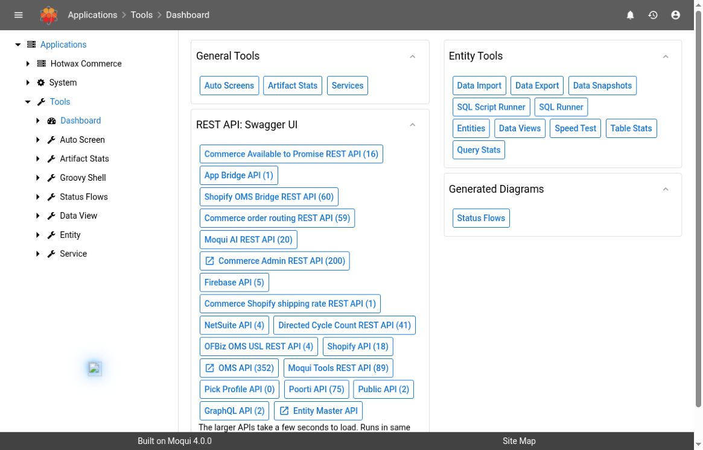

# Get Started With Maarg Support Tools

Use this guide before investigating a Maarg incident or opening unfamiliar backend tools. The first goal is to establish **which environment, installed version, and record** you are inspecting. A familiar screen or successful login does not establish that you are in the right environment or authorized to change its data.

## Open The Correct Environment

1. Obtain the Maarg address and the permitted environment from your administrator or incident record. Keep production, user acceptance testing (UAT), and demonstration environments clearly separated.
2. Check the hostname before signing in. Use your assigned account and the organization's approved sign-in method. Do not paste passwords or access tokens into a support ticket.
3. After sign-in, confirm that the expected application menu is visible. If access is denied or a menu is missing, record the exact message and ask the administrator to check the account and screen permissions.
4. Confirm the affected store, shop, integration, or business process before searching records. Similar names and identifiers can exist in multiple environments.
5. If your session expires, sign in again and reopen the record using its identifier. Recheck filters and environment before continuing. Do not resubmit an interrupted write merely because the browser returned to the login screen.

Never resolve an access denial by changing identity, constructing an alternate tool URL, or moving the same investigation to a more privileged tool without authorization.

## Understand The Application Menu

In the observed demo, **Applications** contains **Hotwax Commerce**, **System**, and **Tools**. These are separate navigation areas. Open the menu item rather than appending a guessed path to the current address.

| Investigation | Navigation Area | Start Here |
| --- | --- | --- |
| Imports, routing, search, or integration operations | Hotwax Commerce | [Data Manager Imports](data-manager-imports.md), [Routing Run Diagnostics](order-routing-runs.md), [Search Admin](search-admin.md) |
| Scheduled jobs and integration messages | System | [Service Jobs](service-jobs.md), [System Messages](system-messages.md) |
| Entity definitions, fields, and records | Tools > Entity > Entities | [Entity Inspection](entity-inspection.md) |
| Direct database queries | Tools > Entity | [SQL Tools](sql-tools.md) |
| Installed service contracts and execution tools | Tools > Service | [Service Definitions And Execution](service-tools.md) |
| HTTP API contracts | Hotwax Commerce > Developer | [REST API Explorer](rest-api-explorer.md) |

The Tools dashboard groups links to entity and service utilities. Several neighboring controls execute code, change data, or modify schema. Being able to see a link is not an instruction to use it.

*UI observed in the hosted demo on October 3, 2026. The dashboard establishes navigation only; no execution or mutation controls were used.*

The exact menu depends on installed components, permissions, and the selected rendering mode. These role-oriented routes are starting points for investigation, not a proposed access-control policy. Support users generally start with the relevant run or message record; developers inspect definitions and contracts; administrators assess environment health and approved changes.

## Identify The Installed Version

Open **Hotwax Commerce > About** when your account is permitted to view it. Inspect only the information needed for the issue:

- **Maarg Information** identifies the instance and deployment branch/commit when available.
- **System Information** includes the displayed framework version and runtime time zone.
- **Component Information** lists component names, displayed versions, tag/branch information, and commit identifiers. It also reports framework and runtime revision information when available.

Record the relevant component and commit alongside the deployment release. Do not infer the Maarg release from the footer alone. A component's displayed version can remain unchanged while its commit has changed; a branch name such as `main` is not an immutable release identifier. An `unknown` version is an evidence gap, not proof that the component is absent.

If the screen and the deployment record disagree, ask the environment operator to reconcile the installed commits with the release manifest before applying release-specific instructions. Do not upgrade the instance to make it match a guide.


The About page can also contain internal connection details, operational identifiers, and generated sign-in links. Do not share a full-page capture, copy a generated launch link, or publish the page's raw content. Transcribe only the necessary non-secret version fields into the approved incident record.


### Documentation Baseline And Demo Evidence

These guides use the **Maarg 6.4.0 release composition**, whose production build pins **moqui-runtime 4.1.0**, **moqui-framework 4.2.0**, and **maarg-util 4.4.0**. This is the source baseline for behavior, not a claim about every deployed environment. The production build also applies maarg-util's **CreatedStamp**, **EntityCrypto**, and **JwtToken** patches, and loaded components can replace or extend runtime screens. Check the assembled release configuration and applied patches as well as repository tags.

The October 3 demo displayed framework **4.0.0** and util **4.3.0**. Its reported framework/runtime commit prefixes matched the inspected framework 4.2.0 and runtime 4.1.0 tag commits, while other component/version labels differed. This illustrates why the displayed version, commit, and deployment composition should be recorded separately. The screenshots are UI observations of that demo, not release-matched acceptance tests.

Each guide distinguishes:

- **Source-verified:** behavior checked in release-pinned definitions and implementation
- **UI-observed:** named controls or records actually viewed in the demo
- **Runtime-verified:** a specific operation and resulting state actually exercised; an observed button or blank form does not meet this standard

Approved mutations, failure recovery, performance testing, and end-to-end downstream outcomes need separate validation in an appropriate environment.

## Begin With One Record And A Time Window

1. Write down the symptom and expected business outcome in one sentence.
2. Collect the relevant order, product, job run, message, import, or routing identifier. Use the identifier for that tool; different subsystems can assign different IDs to related work.
3. Record the incident time and time zone. Compare source-system, UI, and log timestamps deliberately rather than assuming all display UTC.
4. Open the specific workflow guide and narrow filters before interpreting results. A default time window, hidden status filter, or current page can hide older or additional work.
5. Follow the available correlation IDs to the next stage. A finished job or accepted request alone does not establish that the intended business result arrived downstream.
6. Preserve the evidence and stop before a recovery action if its scope, prior outcome, or permission is uncertain.

## Build A Useful Escalation Record

Include:

- Environment label and approved application address, without secret query parameters
- Relevant installed component version and commit, plus the guide/release used
- Expected versus actual behavior, affected process, and smallest relevant record scope
- Time window and time zone, current filters, and exact non-secret error text
- Correlated run/message/import IDs and which downstream state was checked
- Actions already attempted and whether their outcomes are confirmed or unknown
- A tightly scoped, reviewed screenshot when it adds evidence

Keep customer data, payloads, internal connection details, and credentials out of public documentation. Use the organization's approved private support channel for necessary operational evidence, and share only what its recipients are authorized to see.

## When To Stop And Escalate

| Situation | Next Step |
| --- | --- |
| Wrong or uncertain environment | Confirm the target with its owner before continuing |
| Missing menu or denied operation | Record the denial and request the required authorized access; do not bypass it |
| Guide and UI differ | Compare installed components, commit, permissions, and rendering mode |
| Empty list | Check filters, environment, identifiers, time zone, and retention before declaring data missing |
| Existing operation may still be running | Establish its current state before any replay or duplicate submission |
| Recovery could change data or send external requests | Obtain the required scoped approval and use the workflow's verification procedure |

Return to the [Maarg overview](README.md) for all runbooks, or review the [Documentation Coverage](coverage-checklist.md) checklist for remaining gaps and verification limits.
