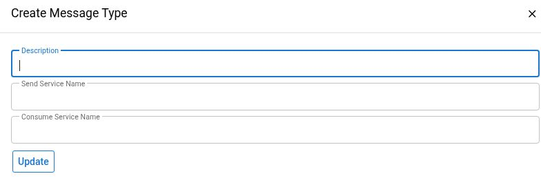

# Message Types And Remotes

A **System Message Type** identifies the message contract and processing services. A **System Message Remote** identifies a connection or external-system configuration, including transport and authentication settings. Both can be shared by many messages and jobs.

Use this guide when a message appears to use the wrong service, destination, authentication method, or mapping. For the status/error/history of one execution, use [System Messages](system-messages.md). Do not change shared configuration as a way to test whether a failed message will recover.

## Version, Access, And Verification

This guide uses the assembled **Maarg 6.4.0** release: runtime **4.1.0**, framework **4.2.0**, and maarg-util **4.4.0**, including component service overrides and production build/configuration. The generic Type and Remote screens are supplied by the runtime; Maarg and integration components can replace individual processing services. Verify the active service in the deployed composition before applying transport-specific assumptions.

The procedures are source-verified. On October 3, 2026, the blank **Create Message Type** form was observed on the authorized demonstration instance, whose displayed framework/util versions were **4.0.0 / 4.3.0**. It was opened and closed without entering values or selecting **Update**. No type, remote, mapping, credential, queue, message, job, or downstream system was changed or executed for this guide. Remote details were not opened because they can expose secrets. The screenshot does not validate configuration changes or release-specific processing outcomes.

**Navigation:** In **System > Sys-Sys Messages**, use **Types** or **Remotes**. The System dashboard also exposes **Message Types** and **Message Remotes** shortcuts. These are separate from a provider's dedicated connection/setup screen.


A Remote detail page can display passwords, shared secrets, and private-key material in editable fields. Do not open or capture it merely to obtain documentation evidence. Use administrator-provided non-secret configuration facts when possible. Never copy credentials, full authenticated URLs, or raw configuration exports into a ticket or public guide.


## 1. Start With The Affected Message And Contract

1. Record the environment, incident time/time zone, message ID, **Message Type**, and **Message Remote** from the existing incident evidence.
2. Identify whether this is production, UAT, or a demonstration connection. A remote's description or **Usage Code** is not an independent environment-isolation control.
3. Establish the intended business operation, payload contract, sending/receiving systems, and accountable integration owner.
4. Compare the failed attempt with a known-good attempt under the same intended configuration. Keep payload values and endpoint details in the approved private channel.
5. Check whether other queued messages, retry jobs, or integrations share the same type or remote before proposing any edit.

Processing services load the type and remote configuration when they act on a message. Changing a shared remote or service name can affect messages that are already queued or due for retry, not just messages created after the change. A configuration edit does not pause those workers.

## 2. Inspect A Message Type

Open **Types** and identify the relevant **Type ID**, **Description**, **Send Service Name**, and **Consume Service Name**. The list supplies text-filter controls for the latter three fields. Check the complete ID before opening the detail; similar descriptions can represent different integrations.

The detail form displays the Type ID and lets an authorized operator edit **Description**, **Produce Service Name**, **Send Service Name**, **Receive Service Name**, and **Consume Service Name**. Leave them unchanged during investigation.

| Setting | Meaning And Boundary |
| --- | --- |
| **Produce Service Name** | Describes the producer, but the generic automatic message processor does not call it merely because it is populated. Find the actual producer job, event, or caller |
| **Send Service Name** | Type-level sender used by the standard produced-message flow unless the selected remote supplies an override |
| **Receive Service Name** | Custom receiver used by the relevant incoming/transport path. The generic incoming receiver saves the message directly when no custom receiver is configured |
| **Consume Service Name** | Service used to process a received message. Sending/receiving a message is not the same as completing this business operation |

The standard send/consume contracts pass a **systemMessageId**, rather than an arbitrary set of form fields. Send implementations can return a remote message identifier. Have the integration developer verify the actual input/output contract and installed implementation; the existence of a service name does not establish that it is the correct receiver or safe to run.

Other type metadata exists in the model, including content type, acknowledgement handling, and transport-specific paths/file-response behavior. The standard detail form does not expose every such field. Use the component's supported configuration process or an approved administrator inspection rather than assuming the visible form is the entire contract.

### Create And Update Are Real Configuration Changes

**Create Message Type** opens a form for Description, Send Service Name, and Consume Service Name. In the source, its submission button is labeled **Update**, but the transition **creates** a type record. Do not use that button to experiment with a guessed service. After an approved creation, verify the resulting Type ID and complete configuration before connecting producers or enabling processing.

The existing type's **Update** action changes its stored definition. It does not validate the business payload, destination's contract, service permissions, repeat safety, or downstream success.

*Demonstration UI: empty form only. The Update button was not selected.*

## 3. Review The Remote Without Exposing Secrets

The **Remotes** list shows **Remote ID**, **Description**, **Send Url**, and **Username**, with text filters for the latter fields. Even the list can expose private destination or identity information. Do not capture populated rows for public documentation.

For an authorized investigation, obtain the following non-secret facts from the connection owner, or inspect only permitted fields in a private session:

| Setting | What To Confirm |
| --- | --- |
| **Message Remote ID / Description** | The exact shared configuration used by the affected message and other integrations |
| **Send Url / Receive Url** | Intended destination/source and environment; actual use depends on the transport service. Redact secret query parameters and private infrastructure details from shared evidence |
| **Send Service Name** | A remote-level override. In the standard produced-message flow, a nonempty value takes precedence over the type's sender |
| **Message Type** | Optional association on the remote. Do not treat it as a universal allow-list or proof that no other type can reference this remote |
| **Message Auth / Message Send Auth** | Authentication metadata. Confirm which field the installed sender/receiver actually reads |
| **Username and secret/key fields** | Presence, intended identity, scope, owner, expiry/rotation state, and matching remote-side setup, without copying the values |
| **Internal / Remote IDs and App Codes** | Business/interchange identifiers used by applicable EDI or connector logic, not necessarily network addresses or login names |
| **Remote Charset, attributes, delimiters, paths** | Provider/transport-specific behavior; confirm compatibility with the actual connector rather than applying all options to every transport |
| **Pre Auth Message Remote ID** | Associated pre-authentication configuration, when the implementation uses it. Review the linked trust and data-sharing scope separately |

**Create Message Remote** includes identity, description, destination, sender, username, and password fields and creates a stored configuration on submission. It is not a connection test. Creating or changing authentication material, remote access, or destination permissions requires the authorized owner and approved secure credential process; this documentation does not ask an operator to paste secrets into chat or public evidence.

### Authentication Is Transport-Specific

Do not infer authentication behavior solely from a field's title:

- The framework's standard REST sender reads **Message Auth**. A blank value takes the login/basic-auth path; it does not mean “no authentication.”
- That standard sender implements login/basic auth, supported HMAC variants, and an explicit no-auth mode. Authentication choices must match the receiver's verified contract; do not weaken authentication to suppress an error.
- Although **Message Send Auth** and separate send-secret fields exist in the model, the standard REST sender does not automatically use them as universal overrides. Custom transports may use different fields.
- The JSON-RPC sender and SFTP/provider-specific senders have their own credential and endpoint requirements. A successful test of one does not validate another.

Validate configuration through the selected service's implementation and the receiving system's approved contract. A field labeled Password or Private Key must be handled as sensitive even when storage encryption is enabled; encryption at rest does not guarantee that a detail screen or export hides the value.

## 4. Inspect Remote Enumeration Mappings

A Remote detail has **Remote Enum Map** entries associating an internal **Enum Id** with a remote **Value**. Use the consuming connector's mapping contract to interpret them.

- Confirm which internal enumeration and remote value the specific operation uses.
- Check spelling, case, meaning, and whether the consumer expects a one-to-one reverse mapping.
- The record key allows one value per enumeration within that remote, but does not independently guarantee that every remote value is unique.
- Adding or changing a mapping does not rewrite old payloads or prove that an already-sent message was corrected. The effect depends on when the producer/consumer reads the mapping.

**Create Enum Map**, row **Update**, and the delete/trash action modify shared configuration. Review all affected message types and pending processing before an approved change. Do not remove an unexplained mapping merely because it appears unused in one filtered message list.

## 5. Check The Actual Processing Schedule

A Type/Remote record does not itself prove a job is enabled. Locate the actual producer, sender, and consumer jobs or event/caller with [Service Jobs](service-jobs.md).

For each relevant job, inspect its service, selected type/remote scope, schedule, paused state, effective dates, retry parameters, and recent run results. Retry timing and batch scope belong to the executing service/job; they are not established by a Type detail form.

The default release contains Maarg-util overrides of the generic queue and batch-processing services. Provider components may supply additional behavior. Do not carry OFBiz JobSandbox instructions or an unrelated connector's retry values into these jobs. Use the installed service and saved run parameters as evidence.

Queuing or producing a test message can immediately trigger real processing. A manual send, consume, status reset, or acknowledgement is an integration action, not a harmless connection check. Follow the recovery boundary in [System Messages](system-messages.md).

## Approved Configuration Change And Validation

The following gates apply to a separately approved change:

1. **Define scope.** Identify the environment, exact Type/Remote IDs, fields to change, recipients/destinations, relevant jobs, queued messages, and expected business result.
2. **Review the contract.** Verify installed service definitions, authentication and permissions, payload requirements, enum mappings, and destination behavior. Preserve a protected record of the approved non-secret configuration and recovery plan.
3. **Coordinate processing.** Have the owner decide whether a maintenance window or approved pause is necessary. Do not assume the UI prevents concurrent workers from reading an edited configuration.
4. **Use secure credential handling.** The authorized owner enters or rotates secrets through the approved mechanism. Keep values out of screenshots, logs, chat, and ordinary documentation.
5. **Save only the approved changes.** Reopen the configuration privately and confirm the stored non-secret fields. A saved form is configuration evidence, not integration acceptance.
6. **Test in isolation.** Use a synthetic payload and controlled receiving endpoint approved for the test. Define expected status transitions, receiving acknowledgement, record effects, timeout/failure behavior, and repeat safety before execution.
7. **Follow the result end to end.** Verify the individual message, errors/history, remote identifier, receiving system, and resulting business state. A transport-level 2xx response or **Sent** state alone does not prove the downstream operation completed.
8. **Resolve uncertainty before replay.** If a connection times out or a response is lost, establish whether the destination already processed the request. Retry only the approved scope after that check.

## Troubleshooting

| Symptom | Next Read-Only Check |
| --- | --- |
| Unexpected sender or destination | Message's exact type/remote IDs, remote sender override, current shared configuration, and changes since the attempt |
| “No sendServiceName” or “No consumeServiceName” | Correct type, applicable remote override, installed service definition, and intended operation; do not create a guessed replacement |
| Authentication failure | Selected transport, actual auth field it uses, credential owner/scope/expiry, endpoint environment, receiver-side policy, and sanitized error |
| Message marked Sent but business result missing | Transport acknowledgement versus receiver/consumer completion, remote identifiers, downstream queue, and business validation |
| Incoming payload stored but not processed | Consume Service Name, actual consumer job/caller, errors/history, and saved scope |
| Wrong enum value | Connector's mapping direction, current remote map, reverse-value ambiguity, and whether the payload was generated before the change |
| Configuration changed but retries still fail | Saved values, active implementation, sender/consumer scope, cached/runtime configuration behavior, prior effects, and actual destination state |
| No recent messages | Producer/event schedule, affected environment, filters and time zone; a configured type/remote alone does not generate traffic |

For provider-specific settings, use the relevant recipe, such as [Shopify product sync](../shopify/product-sync.md) or [Unigate email integration](../unigate/email-integration.md). Their fields and recovery procedures apply to those integrations; they do not establish the generic behavior of every message transport.

Escalate with the environment, release/commit, Type/Remote and message IDs, intended operation/destination, actual sender/consumer, time zone, sanitized errors, and verified downstream outcome. Share secret-free configuration differences rather than full screenshots or exports.
