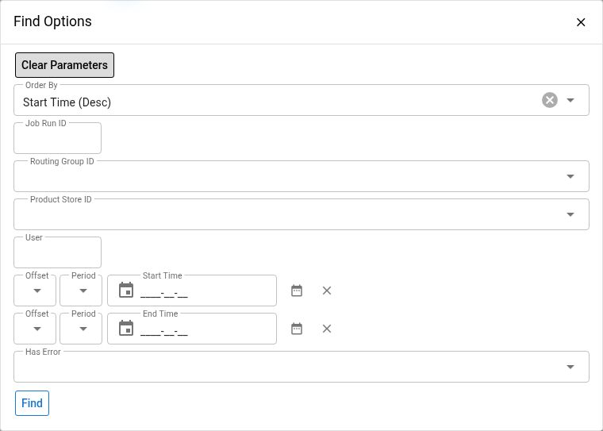

# Order Routing Run Diagnostics

Use Maarg's order-routing history to answer three questions: did the group job execute, which routings were attempted, and what happened inside the batch? Start with the execution records before considering a configuration change or another run.

This guide covers Maarg 6.4.0 with Order Routing 2.4.0. The navigation, fields, and behavior described here are checked against that version's screen and service definitions. They do not establish that a particular environment has executed a successful routing run. Installed versions, permissions, and available records can differ.

## Before You Start

- Confirm the environment and product store. Use an account authorized to inspect its routing history.
- Collect the approximate incident time and time zone, routing group, and any known job run, batch, routing run, or order identifier.
- Keep investigation read-only: use filters, record links, and logs. Configuration pages contain editable fields even when you only intend to inspect them.


`Run now` starts operational routing; it is not a diagnostic preview. Another execution can affect orders and inventory and can close an earlier unfinished routing record. Do not rerun a group, release a job lock, change routing or rule statuses, edit filters, change schedules, or create, clone, or delete configurations just to investigate. Obtain approval for the specific recovery action and verify its order and inventory impact first.


The screenshot shows the hosted demonstration filter dialog only. The runtime uses an older component baseline than the released source described here; no routing records, logs, or execution outcomes were inspected for this guide.

## Understand The Records

| Record | What It Represents | Identifier To Record |
| --- | --- | --- |
| Routing group | A configuration that organizes routings for a product store and can be associated with a scheduled service job | `Routing Group Id` |
| Group run | A scheduler job execution associated with the group's job; useful for start/end times and scheduler messages | `Job Run Id` |
| Batch | The processing record that groups the individual routing runs created during a group execution | `Routing Batch Id`, shown as `Batch` in Batch Runs |
| Routing run | One execution of an individual routing configuration within a batch | `Routing Run Id`, plus its `Order Routing Id` and `Routing Batch Id` |
| Routing rule | A configured decision within a routing, with inventory conditions and actions; it is not a separate row in Routing Runs | `Routing Rule Id` |

A scheduler job can exit before a batch is created, for example when brokering is disabled or no active routing configuration is available. A job run therefore does not guarantee a batch exists. A batch can contain multiple routing runs. Do not treat job run IDs, batch IDs, and routing run IDs as interchangeable.

Group Runs associates scheduler history through the group's job name; Batch Runs and Routing Runs provide the routing-specific records. Correlate scheduler and batch records using the group, product store, and execution window. Do not assume their identifiers match.

## Open The Diagnostic Screens

Open the Maarg OMS area, then `Order Routing`. The initial page is `Routing Groups`. The section also provides `Routing Group Runs`, `Batch Runs`, and `Routing Runs`.

For installations whose OMS area is mounted at `/qapps/Oms`, these are the screen paths on your own Maarg host:

| Screen | Path |
| --- | --- |
| Routing Groups | `/qapps/Oms/OrderRouting/OrderRoutingGroups/OrderRoutingGroupList` |
| Routing Group Runs | `/qapps/Oms/OrderRouting/OrderRoutingGroupRuns/OrderRoutingGroupRunList` |
| Batch Runs | `/qapps/Oms/OrderRouting/OrderRoutingBatchRuns/OrderRoutingBatchRunList` |
| Routing Runs | `/qapps/Oms/OrderRouting/OrderRoutingRuns/OrderRoutingRunList` |

Use your environment's navigation if its base path differs. A missing screen may reflect the installed component or access permissions; ask the administrator to check rather than changing permissions yourself.

## 1. Identify The Group And Schedule

1. In `Routing Groups`, use `Find Options` to select the product store and narrow by group ID or group name, then select `Find`.
2. Review `Frequency`, `Next Execution Time`, and `Paused`. A group without an associated service job displays `Not scheduled` in the paused column.
3. Select the group ID to open its details.
4. In `Order Routing Group Schedule`, inspect the job name, cron expression, effective dates, paused value, next execution time, and `Last Run`. An `Active Job` value is displayed when the job's run-lock record has a job run ID.
5. Use `Group Runs` to inspect scheduler history for that group. This link is available when its service job exists. Use `Routing Runs` in the `Routings` section for routing-specific history.

The schedule's next execution time is calculated using the signed-in user's time zone. Record the time zone used when comparing the schedule with an incident or an external log. An active-job indicator or a missing end time is evidence to investigate, not permission to release a lock or launch another run.

The group page also lists its routings and their status and sequence. Use the `Runs` link on a particular routing row to narrow history to that routing. Leave `Update`, `Run now`, `Add Schedule`, and configuration controls untouched during diagnosis.

## 2. Check Scheduler History In Group Runs

Group Runs starts with the newest start times first. Open `Find Options`, select the group and product store, and constrain the start-time window. Add `Job Run Id`, `User`, or `Has Error` only when needed, then select `Find`.

| Field | How To Use It |
| --- | --- |
| `Job Run Id` | Opens the corresponding system job-run detail page, subject to access |
| `Routing Group Id` and `Product Store Id` | Confirm the intended configuration and store |
| `User` | The account associated with the job run |
| `Start Time` and `End Time` | Identify the scheduler execution window |
| `Execution Time` | Calculated only when both start and end times are present |
| `Has Error` | The scheduler record's error indicator |
| `Message` | Displays errors when present; otherwise displays messages |

Read the message before assuming a scheduled job actually brokered items. If no batch corresponds to the execution window, look for an early exit or validation failure. Check the current group/store association and routing availability without changing them.

If the expected job run is absent, broaden the date window and remove unnecessary filters. Then compare the schedule, paused value, effective dates, and job name. Escalate an unexplained missing execution with these details instead of using `Run now` as a test.

## 3. Follow A Batch To Its Routing Runs

In `Batch Runs`, filter by the product store, group, and start-date window. You can also filter by `Batch`, `Job Name`, or `User`. The newest batches appear first.

Each row shows the batch ID, group, product store, associated job name, creator, start and end dates, execution time, attempted-item count, and brokered-item count. Execution time is shown only when both timestamps are available.

- Select the `Batch` ID to open Routing Runs filtered to that batch.
- Select the group link to inspect the group's current configuration.
- Select `View Log` when available to open the batch log. The link appears when a log location is recorded; it does not guarantee the file still exists.

Batch counts aggregate the counts returned by its individual routings. They are not a distinct-order count, and the same still-eligible items may be attempted by more than one routing. Do not use a batch total as a count of unique customer orders.

The job name and group details shown alongside historical records are associated with the current group configuration. Inspecting a configuration page does not reconstruct exactly what it contained at the time of an older run.

## 4. Read Individual Routing Results

Routing Runs starts with the newest start dates first. Its filters include routing run ID, batch ID, group, routing, product store, `Has Error`, and start/end dates. Confirm any group or routing filter carried forward by the link you used to open the page.

| Field | Interpretation |
| --- | --- |
| `Routing Run Id` | The individual execution record to cite in an investigation |
| `Routing Batch Id` | Links back to the batch list for that batch |
| `Order Routing Id` | Links to the current routing configuration |
| `Has Error` | Indicates errors retained when the routing-run result was recorded |
| `Routing Result` | A short outcome or error summary; this version limits the recorded text to 255 characters |
| `Order Item Count` | The attempted-item count reported by the routing |
| `Brokered Item Count` | The brokered-item count reported by the routing's actions |
| `Start Date`, `End Date`, `Execution Time` | The run's timing; duration is available only with both dates |


`Has Error = N` does not prove every item was successfully assigned. Some rule or action errors are written to the log and cleared so processing can continue. Likewise, an end date proves that the record was closed, not that all desired business outcomes occurred. Review counts, the batch log, and the affected order's actual outcome together.


If attempted items are zero, inspect the routing's current status and `Order Filters`; determine whether the intended orders were eligible at execution time. If attempted items are present but fewer items were brokered, inspect the rule sequence, `Inventory Filters`, assignment type, and `Actions`, then use the batch log to identify the relevant result. These are investigation leads, not proof that a rule is wrong.

To inspect configuration, follow the routing link and then the rule ID in `Rules`. These pages expose update, add, and removal actions. Read the values without submitting them. Refer to the team's approved routing-design documentation before proposing a change.

## 5. Inspect The Batch Log

1. Open `Batch Runs` and select `View Log` for the relevant batch.
2. Start with `Level: All Levels` and no search text so surrounding messages remain visible.
3. Use `Lines` to choose the recent log window: last 200, 500, 1,000, 2,000, or 5,000 lines. The default is 500.
4. Select a level or enter a keyword in `Search`, then select `View`. Search is case-insensitive.
5. Use `Refresh` to reload the same window and filters while investigating an execution that may still be progressing.

The viewer searches only a bounded recent portion of the log, not the entire file. Level and keyword filters are applied after that portion is read. Increasing `Lines`, clearing filters, or reviewing an authorized full download can reveal messages absent from the current view. Filters operate line by line, so they can hide stack-trace continuation lines and context.

`Download` retrieves the full available batch log, rather than the currently filtered display. Download only to an approved location and share only the necessary, reviewed excerpt.


Logs can contain order identifiers, customer or operational data, server paths, and error details. Review and redact them before adding screenshots or excerpts to a ticket or public document. Do not publish a raw batch log or an unreviewed download.


Two missing-log messages mean different things:

- `No log file associated with this batch.` means the batch has no recorded log location.
- `Log file not found` means a location is recorded but the file cannot be found by the viewer.

Neither message establishes whether routing succeeded. Preserve the batch ID, timestamps, and exact symptom, then ask the environment owner to check log availability and retention. Do not rerun the batch just to generate a log.

## Troubleshooting Checklist

| Symptom | Read-Only Next Check |
| --- | --- |
| Group run exists, but no batch appears | Match group, store, and time window; inspect the job-run message for an early exit, disabled brokering, or missing active routing configuration |
| Batch exists, but a particular routing is absent | Check the batch filter and the routing's status and sequence; current configuration may differ from the configuration at execution time |
| `Has Error = Y` | Read the short result, then the batch log and scheduler details; capture the first relevant failure and surrounding context |
| `Has Error = N`, but expected items were not brokered | Compare attempted and brokered counts, review warnings and actions in the log, and verify the affected order's state |
| End time is missing | Check current job activity and whether logs are advancing; an unfinished record can also remain after interruption |
| Result text appears incomplete | Use the batch log because Routing Result is limited to 255 characters |
| Log search finds nothing | Clear level/search filters and widen the recent-line window; the displayed search is not a full-file search |
| Old records or logs are missing | Confirm filters and ask the environment owner about retention; absence alone does not prove an execution never occurred |

## Record A Useful Handoff

Before requesting a recovery action, capture:

- Environment, installed version, product store, and incident time zone
- Group ID and job name
- Job run ID, batch ID, and affected routing run IDs, kept distinct
- Start/end times, error indicators, and attempted/brokered counts
- The expected outcome and the observed outcome
- A minimal redacted log excerpt, including surrounding context
- The filters used and checks already completed

End the investigation with an evidence-backed next step: a scheduler issue, eligibility question, rule/action issue, missing log, or a specific recovery proposal for approval. A rerun or configuration change should follow that decision, not replace the diagnosis.

For platform terminology, see the [Maarg Glossary](glossary.md).
