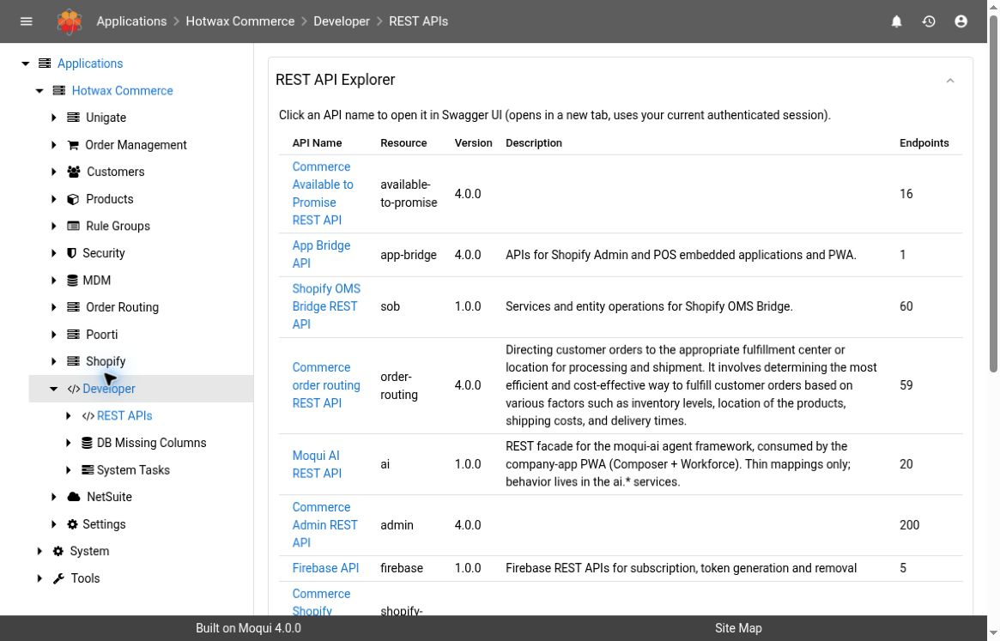

# REST API Explorer

Use **Developer → REST APIs** to find the REST resources available in the running Maarg instance and inspect their generated API documentation.

## Version And Access

The behavior described here is based on **Maarg v6.4.0**, with **maarg-util v4.4.0**. The screenshot was captured on the hosted demo running **maarg-util v4.3.0**. Installed components, resource versions, and permissions can differ between environments.

Sign in with an account authorized to use the Developer screens. Opening an API description does not grant permission to call every operation in it.

## Find An API

1. Open **Developer → REST APIs**.
2. Find the relevant row in **REST API Explorer**.
3. Check the **Resource** and **Version**, rather than relying only on the display name.
4. Select the **API Name** to open Swagger UI in a new tab. It uses your current authenticated session.

*Demo screenshot: maarg-util v4.3.0. The resource list is generated from the running instance and is not a fixed release-wide inventory.*

| Column | How to use it |
| --- | --- |
| API Name | Display name and link to the generated Swagger UI |
| Resource | Resource name used to identify the API definition |
| Version | Version advertised by that resource; a blank value means none was supplied |
| Description | Resource description, when supplied |
| Endpoints | The resource's reported child-method count; this is not a count of operations your account is authorized to execute |

## Inspect The Contract Before Making A Request

In Swagger UI, inspect the operation's HTTP method, route, input parameters, request body, and documented responses. Confirm the instance and resource version match the integration you are investigating.

For a support investigation, record the resource, operation, relevant business identifier, expected outcome, actual response, and timestamp. Remove authentication headers, tokens, personal information, and confidential payload fields from shared examples.


Swagger UI is connected to the live instance. **Try it out / Execute** can call real services. A write operation can create, update, cancel, or otherwise change business data. Use an approved test environment and an agreed test record when execution is necessary. Reading the API definition is sufficient for this guide; no API operation was executed for the screenshots.


## Troubleshooting

| Symptom | Check |
| --- | --- |
| Expected resource is missing | Confirm the required component is installed and the instance is on the expected release. The explorer reads registered resources from the running application |
| Version or fields differ from another instance | Compare the instance and component versions. A newer screenshot or another environment's API contract may not apply |
| Swagger UI does not open | Check whether the browser blocked the new tab, then verify your session is still active |
| API description loads but a request is denied | Check operation-specific permissions and authentication. Access to the explorer is not evidence of service access |
| No description or version appears | These fields are optional in the resource metadata; do not infer a default version |

## Related Guides

- [System Tasks](system-tasks.md) for operational issue tracking and investigation progress
- [Log Files](log-files.md) for a bounded runtime log investigation
- [Maarg overview](README.md) for other developer and support workflows
