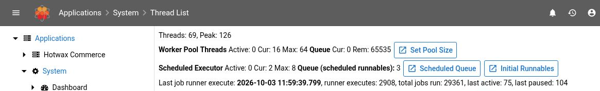
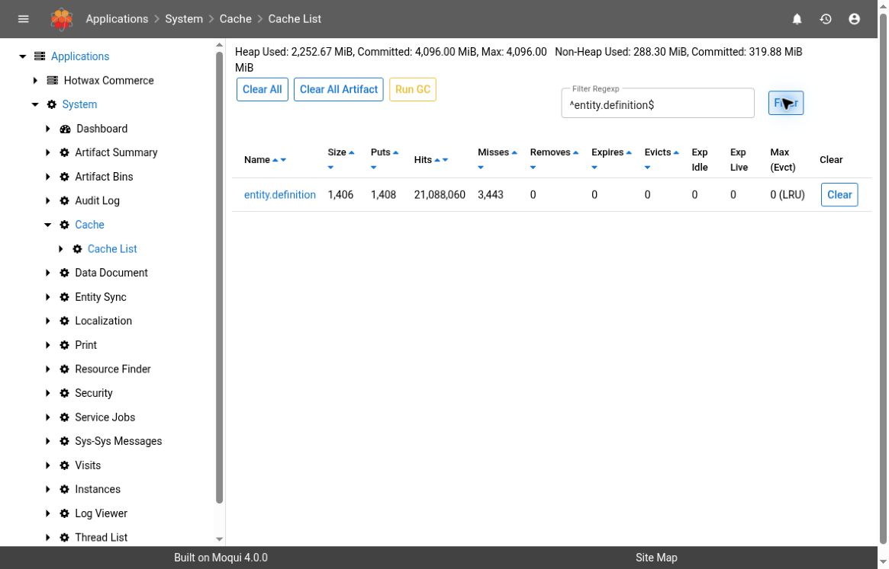

# Runtime Health Diagnostics

Use **System**, **Instances**, **Thread List**, and **Cache** to investigate slow requests, delayed background work, or a suspected runtime problem. These screens provide point-in-time evidence. They do not replace infrastructure monitoring or prove that an order, import, or integration completed successfully.

## Version And Access

This guide is source-verified against the **Maarg 6.4.0** composition: **runtime 4.1.0**, **framework 4.2.0**, and the **maarg-util 4.4.0** System dashboard extension. The Thread List pool/scheduler summary and a filtered Cache List were observed read-only in a hosted demo on October 3, 2026, displaying framework 4.0.0 and util 4.3.0. Instances, cache elements, stack details, and recovery controls were not exercised; their behavior remains source-verified. Labels, available controls, and permissions can differ in the deployed environment. No runtime recovery action was tested for this guide.

Open **System** from the application's menu. Its default page is the dashboard. From there, use **Thread List**, **Cache Mgmt**, or **Instance Mgmt**; the System menu names the latter sections **Cache** and **Instances**. Do not construct these routes from an OMS page address.

Before investigating:

- Confirm the environment, affected process, incident time and time zone, and the last known successful operation.
- Identify the application node serving the request. A load-balanced address can send successive requests to different nodes. Ask the operator how to obtain comparable observations from the same node.
- Record the deployed component versions and Java runtime start time. A restart or version difference can explain changed counters or behavior.
- Use an account authorized for these administrative screens. Keep evidence in an approved support channel.


**Observation Has Limits.** The dashboard, thread list, and cache summary are the starting points for a read-only investigation. The Instances screens actively probe configured systems and may save a discovered container identifier. Opening cache elements also changes cache access statistics and can expire entries. Read the cautions below before opening those views. Do not use recovery or settings controls while collecting evidence.


## 1. Check The System Dashboard

1. Read **Maarg Information** to confirm the intended environment and displayed branch or tag. Compare the framework, runtime, and component versions with the release being investigated.
2. In **System Information**, record **Time**, **Start**, and **Uptime**. **Time** uses the JVM's default time zone; formatted **Start** and other timestamps can use the user's configured time zone. Preserve each applicable zone and normalize them before correlating observations.
3. Capture the relevant resource values and worker-pool counts, then compare another observation from the same node under a known workload. Do not repeatedly reload a busy system just to obtain more samples.
4. Correlate the observation with the affected [service job](service-jobs.md), [system message](system-messages.md), or [runtime log slice](log-files.md).

### Interpret Resources And Pools

| Field | What It Measures | What It Does Not Establish |
| --- | --- | --- |
| **Heap Memory: Used / Committed / Max** | Java Virtual Machine (JVM) heap usage, memory committed to the JVM, and its reported maximum, in MiB. **Heap** percentage is Used divided by Max | It is not total machine memory. One high reading does not diagnose a memory leak |
| **Non-Heap Memory** | JVM non-heap Used and Committed memory | It does not account for every source of process or host memory use |
| **System: Load** | The operating system's one-minute load average. The displayed percentage divides that average by the processors available to the JVM | It is not a measured CPU utilization percentage and can exceed 100%. An unavailable or negative value is not a healthy reading |
| **Disk (runtime)** | Space on the filesystem containing the runtime directory. Percentage uses total minus free space; **Usable** is reported separately | It does not measure every mounted volume or a remote database's disk. Usable and free space need not be identical |
| **GC** | Accumulated garbage-collection count and time reported by the JVM | It is not a current pause duration or a request-latency measurement |
| **Threads** | Current JVM thread count and recorded peak | It is not the number of requests or jobs completing successfully |
| **Worker Pool / Service Job Pool: Threads** | **Active** workers, **Cur** pool size, and configured **Max** size for each pool | Active workers alone do not show progress, and these are separate pools |
| **Queue: Cur / Rem** | Work waiting in that pool's queue and its remaining queue capacity | A nonempty queue is not itself failure. A full queue or sustained growth needs correlation with latency, logs, and worker activity |

The load-average definition and availability are platform-dependent; see the [Java operating-system monitoring reference](https://docs.oracle.com/en/java/javase/21/docs/api/java.management/java/lang/management/OperatingSystemMXBean.html#getSystemLoadAverage()). Compare trends with the environment's agreed operating limits. The screen's colors are display rules, not deployment-specific health thresholds or an incident diagnosis.

The data-source list identifies configured resources; it is not an end-to-end database health check. Elastic server information comes from requests to configured search clients. An **ERROR** or missing result warrants checking connectivity and logs, but a displayed server version does not prove that an index is current or queries are succeeding.

### Read Running Job Overview Carefully

The maarg-util extension adds **Running Job Overview**. It lists scheduled-job lock references, not every active execution. Its long-running and restart messages compare a lock timestamp with a fixed age or the start time of the server displaying the dashboard. They do not prove that the execution is dead, particularly when another node may own it.

Follow the job or run link and use [Service Jobs](service-jobs.md#a-scheduled-run-lock-appears-stale). Do not select the **X** release control as a health check. Releasing a lock can permit overlapping work without stopping the original execution.

## 2. Understand The Instances View

**System > Instances** opens **Application Instances**. It lists registered application-instance records, rather than automatically discovering every node behind the address used to access Maarg.


**Instances Is An Active Check.** Loading the list checks each displayed record's configured instance host, database, and application status endpoint. Opening an instance detail runs checks again. The Docker check can update the instance record with a discovered UUID when one is missing. If the investigation requires strictly non-mutating access, obtain existing evidence from the environment administrator instead of opening these screens. Custom host/database check services can differ; confirm their behavior with the operator.


When these checks are authorized:

1. Locate the intended **Instance ID** and **Instance Name**. Confirm the record's scope with the operator; do not publish the host or database inventory.
2. Read the individual **Status** indicators and any accompanying check error. Do not rely on icon color alone.
3. Select **Instance ID** only if the detail evidence is needed. Inspect **Instance Detail**, **Moqui Server Detail**, or **Instance Log** selectively, and close the dialog without submitting any update.
4. Correlate the check with the affected node's logs and infrastructure monitoring. Record whether the check was unavailable, failed, or returned a negative result.

| Indicator | What The Check Supports | Important Limit |
| --- | --- | --- |
| **Database Exists / DB User Exists** | The configured database check reported the expected database/user records | Missing configuration, insufficient access, or failed connectivity can prevent the check. These indicators do not prove that the application can execute its required queries |
| **Instance Exists / Instance Running** | The configured instance-host check found the instance and reported it running | A running container does not prove that Maarg finished startup or that the affected workflow is healthy |
| **Moqui Server Running** | The configured hostname's status request returned a usable status map | Failure can reflect routing, access, endpoint, or startup problems. If the hostname is load-balanced, the response alone does not identify the intended container |
| **L / H / D** | Load, heap, and disk values from that returned status map | These are observations from the responding server, not a combined view of all nodes |

An empty list can mean that no application instances are registered here. It does not establish that no Maarg server is running. A blank metric is not zero usage. Check configuration and probe messages before concluding that a resource is absent or stopped.

## 3. Inspect Thread Activity

1. Open **System > Thread List**, or select **Thread List** on the dashboard.
2. Read the thread count, peak, any **Deadlocked Threads** message, and the **Worker Pool** summary.
3. Inspect **Scheduled Executor** and the last service job runner execution when investigating delayed background work. **Scheduled Queue** shows queued runnables and their Done/Cancelled flags; **Initial Runnables** shows configured runnable classes and periods.
4. Sort the list by **Name**, **ID**, **State**, or **CPU Time** as needed. Open **Stack** for a relevant thread and capture only the necessary frames.
5. If the issue persists, compare a later observation from the same JVM using both thread ID and name. A single stack shows where a thread was observed, not how long it has remained there.

*Point-in-time UI observation only. No pool-size, queue, or interrupt action was submitted; counts are not operating thresholds.*

### Interpret Thread Evidence

- **RUNNABLE** is a JVM state, not proof of useful progress. **WAITING** and **TIMED_WAITING** are common for idle workers. **BLOCKED** means waiting to enter a synchronized monitor; check the related stack and lock owner before diagnosing contention. See [Java thread states](https://docs.oracle.com/en/java/javase/21/docs/api/java.base/java/lang/Thread.State.html).
- **CPU Time** is accumulated thread CPU time displayed in seconds, not current CPU percentage. Timing can be unavailable when JVM measurement is unsupported or disabled. In runtime 4.1.0, the **User Time** field renders the same CPU-time value; do not use it as an independent user-mode measurement.
- The source also defines selectable **Lock**, **Lock Owner**, **Lock Owner ID**, **Blocked Total**, and **Waited Total** columns. Blocked/waited totals depend on contention monitoring; unavailable values are not evidence of no contention.
- A **Deadlocked Threads** result is a reason to escalate with thread IDs and stacks. No result does not rule out slow external calls, pool exhaustion, or application-level waits. This JVM interface reports platform threads and does not cover virtual threads. See [Java thread monitoring](https://docs.oracle.com/en/java/javase/21/docs/api/java.management/java/lang/management/ThreadMXBean.html).
- A recent job-runner execution shows scheduler activity on this server, not completion of a particular job. **No Service Job Runner active** can be intentional on a node where scheduled jobs are disabled. Confirm its assigned role before calling it a failure.

Scheduled-queue contents are a snapshot of waiting tasks, not execution history. A runnable can be executing when it is absent from the queue. Do not use **Re-Queue Initial** because a count or queue entry looks unexpected.

## 4. Inspect Cache Statistics

Open **System > Cache**, or select **Cache Mgmt** on the dashboard. Start with the summary rather than opening cached values.

1. Record the displayed heap usage and the observation time.
2. Use **Filter Regexp** and **Filter** to narrow cache names. The filter is a case-insensitive regular expression match within the name; punctuation can affect the match. Clear it if an expected cache is missing.
3. Sort by cache name, size, or a counter and compare observations from the same runtime. Keep the cache name, filter, and time with the evidence.

| Column | Interpretation |
| --- | --- |
| **Size** | Number of stored entries, not memory in bytes. Expired entries can remain counted until an access or cleanup checks them |
| **Puts / Hits / Misses** | Accumulated operations for that cache's statistics lifetime. They are not per-second rates or business success/failure counts |
| **Removes / Expires / Evicts** | Different removal causes. In the standard MCache implementation, **Clear** does not increase Removes or reset these counters |
| **Exp Idle / Exp Live** | Reported access-based and creation-based expiry durations. Normal XML cache configuration uses seconds; these fields are not a countdown for an individual entry. Zero represents no duration for that policy |
| **Max (Evct)** | Configured entry limit and displayed eviction label, not a memory limit. Zero means no entry-count limit in MCache; enforcement is periodic, so Size may temporarily exceed a configured limit |

This baseline builds detailed rows for initialized **MCache** caches known to the runtime serving the page. Other providers can be omitted, and an unused configured cache may not be initialized yet. The view is not a complete inventory of every distributed cache or cluster node.

Misses can be expected during startup, after invalidation, or for new keys. Eviction and expiry can be normal policy behavior. Use workload context and changes over time rather than an invented acceptable hit rate. A high hit count does not establish that cached data is correct or fresh.

*The cache summary was filtered without opening entries, clearing caches, or requesting garbage collection. The displayed counters do not establish a business outcome.*

### Inspect Elements Only When Needed

Selecting a cache name opens its elements, with **Key**, **Value**, **Hits**, **Created**, **Last Update**, and **Last Access**. Displayed values are truncated to 200 characters; this is not a complete export or a dependable record of the underlying database value.


**Element Inspection Affects The Cache.** The standard implementation scans entries before pagination, removes expired entries, and increments hit/access statistics and last-access times for retained entries. Even viewing one page can affect idle expiry and statistics across the cache. Use the summary first and avoid repeated element inspection during a timing-sensitive investigation. Keys and values can contain private business data or secrets; do not copy them into a public ticket or screenshot.


## Recovery And Settings Controls Require Separate Approval

These controls change runtime behavior. They are outside the diagnostic steps above, even if your account can see them or the screen presents no confirmation:

| Control | Why It Needs A Separate Recovery Plan |
| --- | --- |
| **Interrupt** | Calls Java thread interruption by thread name. It is not a guaranteed stop, rollback, or safe job cancellation. The source can target every live thread with that name |
| **Kill / Force Stop**, if supplied by a deployment-specific tool | These controls are not in the baseline Thread List. Treat them as potentially disruptive termination, requiring the environment owner's procedure |
| **Set Pool Size**, **Re-Queue Initial** | Change worker capacity or reschedule initial runnables. They can alter load and execution behavior rather than diagnose the original delay |
| **Clear**, **Clear All**, **Clear All Artifact** | Invalidate cached entries; subsequent work may reload data or rebuild artifacts. **Clear All Artifact** also warms caches. Determine exact cache/provider scope and expected load first |
| **Expiry Or Cache-Limit Changes** | Affect data freshness, memory use, and reload frequency. **Exp Idle / Exp Live** are display fields in this baseline, not an expiry editor; configuration changes belong to the approved deployment procedure |
| **Run GC** | Requests Java garbage collection and may pause other running threads. It is not a memory-leak test or a substitute for diagnosis |
| **Provision / Create DB / Init / Start / Stop / Remove**, instance settings and environment/volume/link updates | Change infrastructure or instance configuration. Volume changes and reinitialization can risk data loss |
| **Re-Init Elastic**, running-job **X** release | Reinitialize search clients or release a job lock. Neither is a passive connectivity check |

Before any approved action, preserve the evidence, identify the exact target and node, establish whether work is still running, and agree on impact, verification, and recovery steps. Afterward, verify the affected business operation and downstream result. A quieter dashboard or lower counter alone is not recovery.

## Escalation Checklist

Provide the smallest useful evidence set:

- Environment/release, component versions, affected process, incident window and time zone
- An operator-approved node identifier, JVM start time, and observation timestamps
- Relevant resource and pool readings, including both values and labels; distinguish one sample from a sustained pattern
- Applicable job/run or message IDs, instance-check outcome, thread ID/name and selected stack frames, or cache name and summary counters
- A minimal redacted log excerpt, last known successful operation, and checks already performed
- Whether any screen with observation side effects was opened, and whether a recovery or settings change was approved and performed

Do not share full **Request Details**, instance inspection JSON, environment variables, cache values, connection strings, database-host inventories, or unreviewed screenshots. Request Details can include headers and parameters; instance data and logs can expose credentials or private infrastructure. Crop and redact before sharing.

Escalate promptly when the screen reports deadlocked threads, the same-node observations show persistent resource pressure or queues with stalled work, checks cannot establish availability, or the affected business process remains blocked. The environment owner should correlate these findings with infrastructure monitoring and deployment history before choosing a recovery action.
