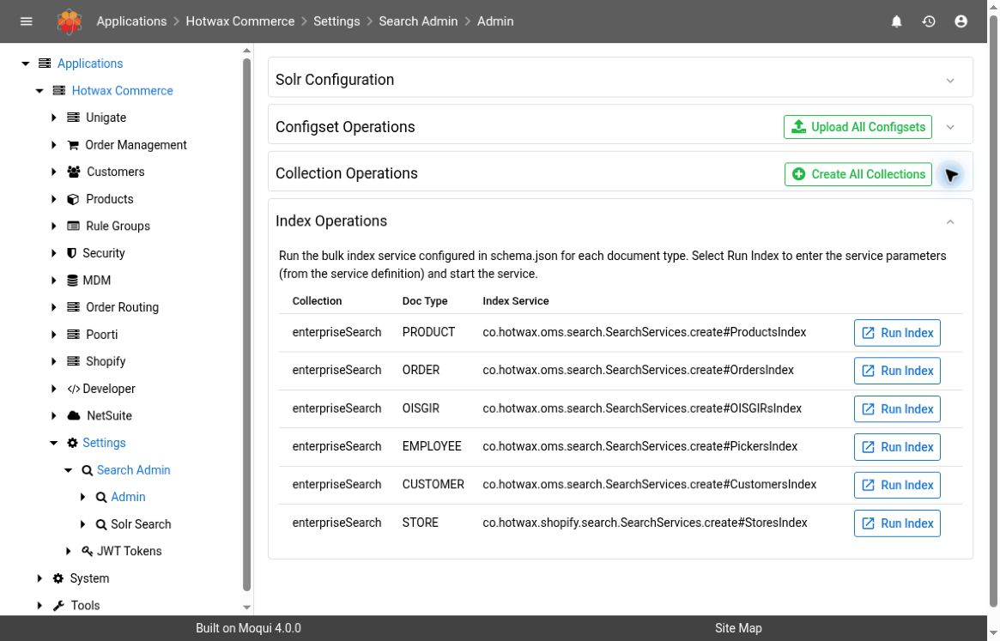
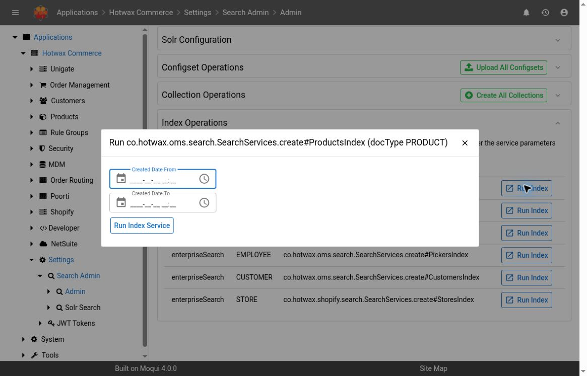

# Search Admin

Use **Settings → Search Admin → Admin** to inspect Solr configuration, collection health, schema differences, and the index services registered for the installed components. Start with inspection before making a schema or indexing change.

## Version And Access

This guide describes **Maarg v6.4.0**, with **maarg-util v4.4.0**. Screenshots were captured on the hosted demo running **maarg-util v4.3.0**. Collection names, document types, services, permissions, and available actions vary by deployment and release.

**SEARCH_ADMIN** affects which shared collections and configsets are listed. Configset management controls are displayed for SEARCH_ADMIN users or when the instance purpose is `dev`. These display rules do not establish operation-level authorization. The presence of a control is not a substitute for authorization to change a production search service.

## Inspect The Current State

1. Open **Settings → Search Admin → Admin**.
2. Check the **Solr Configuration** summary to confirm the intended instance and Solr version. Do not include its host or other internal connection details in public screenshots.
3. If the **Solr is not available** banner appears, record the connection error and investigate availability before trying collection or configset operations.
4. Review **Configset Operations** and **Collection Operations**.
5. Select **View Fields** for the affected collection to compare the application schema with the live Solr schema.

### Read Collection Status

| Field or state | Meaning |
| --- | --- |
| Active | The collection exists in Solr; this alone does not establish that its documents are current |
| Documents / Index Size | The reported collection statistics; use a targeted query to validate the particular document involved in an incident |
| App Fields | Application-defined fields found in the live schema, excluding underscore-prefixed names; missing application fields are not included in this count |
| Unique Key | The schema field used to identify a document |
| Upload configset first | The collection cannot be created through this action until its required configset is uploaded |
| Create collection first | The configured index service cannot be started from this row until the collection exists |
| Solr unavailable | Availability must be restored before the affected operation can proceed |

Configsets define reusable Solr configuration. The **Collections** count reflects visible configured collections, not a complete Solr-wide dependency inventory. A zero count alone is not sufficient evidence that deletion is safe.

## Diagnose Schema Differences

**View Fields** is the inspection step. It reports four distinct categories:

- **Schema fields:** fields declared by the application schema
- **Missing from Solr:** declared fields absent from the live schema
- **Mismatched:** fields present in both schemas whose attributes differ
- **Additional in Solr:** fields present live but not declared in the application schema

The comparison does not validate dynamic-field patterns or copy-field rules. Attribute mismatches are checked only for `type`, `indexed`, `stored`, `multiValued`, and `required` when declared by the application; underscore-prefixed fields are excluded from mismatch and additional-field lists.

The mismatch table identifies the field, attribute, application value, and live value. Inspect those details before deciding on a remedy. An additional field is not automatically obsolete or safe to delete.

If Solr is unavailable or the collection does not exist, the screen shows application definitions only. That is not a successful comparison against live Solr.

## Understand The Change Controls


The following controls change a live search service. Use them only under an approved deployment or recovery procedure, with the affected collection, expected impact, and verification steps agreed in advance. No schema, collection, configset, or index changes were executed for this guide.


| Control | Effect and important limit |
| --- | --- |
| Upload / Upload All Configsets | Uploads configuration and overwrites existing configsets |
| Delete configset | Removes a configset; it must not be in use by a collection |
| Create Collection / Create All Collections | Creates configured collections; the all-collections action skips collections that already exist |
| Add Missing Fields | Adds absent declared fields and copy-field rules; existing fields are skipped. It does not repair differing attributes on existing fields |
| Replace Mismatched Fields | Replaces live definitions for fields whose attributes differ from the application schema. Available behavior should be checked against the deployed release |
| Delete collection | Permanently removes the collection, its documents, and associated metadata. The screen warns this cannot be undone |
| Run Index Service | Starts the selected configured bulk index service in the background |

After an approved schema change, reread the messages and reopen **View Fields**. A submitted action or a green message does not establish that all original differences are resolved; check the resulting comparison and any errors.

## Inspect An Indexing Operation

The **Index Operations** table identifies the **Collection**, **Doc Type**, and **Index Service** configured in the installed schema. These rows are generated from configuration rather than a fixed list maintained in this guide.

*Demo screenshot: maarg-util v4.3.0. The Solr Configuration panel is collapsed to avoid exposing connection details.*

1. Find the affected collection and document type.
2. Select **Run Index** to inspect its parameter dialog.
3. Check the service name in the dialog title and review the parameters. Fields are generated from that service's definition; parameters for one document type should not be assumed to apply to another.
4. Close the dialog when only investigating. Submit **Run Index Service** only when the specific indexing operation is approved.

*Demo screenshot: the PRODUCT service exposes Created Date From and Created Date To. The dialog was opened and closed without starting the service.*

Only services configured as an index service in the schema are accepted by this screen. A success message saying the service **started in the background** confirms dispatch, not successful completion. Verify the service's resulting logs and targeted documents with [Solr Search](solr-search.md). Avoid starting repeated full indexing jobs while an earlier run may still be active.

## Troubleshooting

| Symptom | Investigation |
| --- | --- |
| Collection is Active but a business record is absent | Use a targeted Solr query and check the source record, document type, indexing scope, and service outcome |
| Add Missing Fields leaves a mismatch | Review the mismatch category. Adding absent fields and replacing differing attributes are separate operations |
| Configset controls are absent | Check the deployed release, SEARCH_ADMIN permission, and instance purpose with the administrator |
| Run Index is unavailable | Check Solr availability and whether the collection exists |
| Expected index-service row is missing | Check whether the deployed schema declares an index service for that document type and whether the relevant component is installed |
| Service start message appears but data is unchanged | Inspect the background service outcome and selected parameters; the start message does not report completion |

## Related Guides

- [Solr Search](solr-search.md) for read-only document investigation
- [Log Files](log-files.md) for runtime errors
- [DB Missing Columns](db-missing-columns.md) for relational database checks, which are separate from the Solr schema comparison
