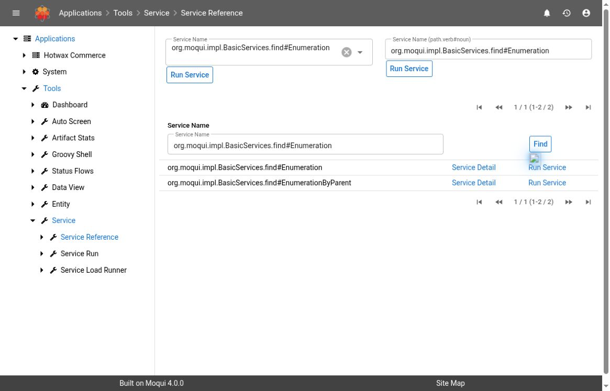
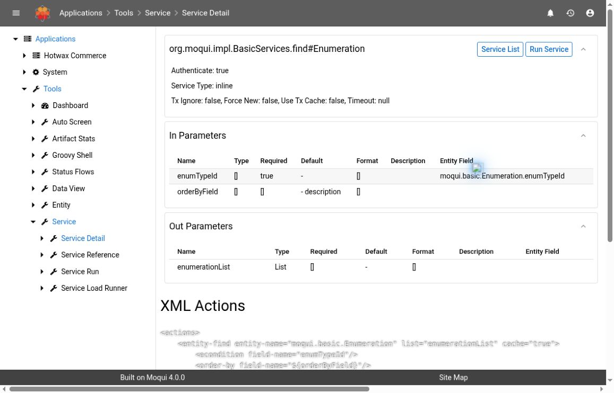

# Inspect Service Definitions And Execution

Use the service tools to identify the operation behind a screen, integration, or job and understand its inputs, outputs, and implementation. Start with **Service Reference** and **Service Detail**. You do not need to run a service to inspect its contract.

**Service Run** invokes real application behavior. **Service Load Runner** repeatedly invokes services for performance testing. Neither is a dry-run tool, and a name containing “find,” “get,” “check,” or “test” does not establish that an operation is safe to execute.

## Version And Access

**Source-verified baseline:** Maarg **6.4.0**, runtime **4.1.0**, framework **4.2.0**, and util **4.4.0**. The behavior below was checked against the release's service-tool screens and framework implementation. The service catalog filter and a standard framework service contract were observed read-only in the hosted demo on October 3, 2026, displaying framework 4.0.0 and util 4.3.0. See [Getting Started](getting-started.md#documentation-baseline-and-demo-evidence) for displayed-version versus commit differences. Menu placement, rendering, and available services must still be checked in each installed environment. No service or load test was executed for this guide.

The observed demo and runtime define **Tools > Service > Service Reference**, with **Service Run** and **Service Load Runner** in the same section. Use the installed application's menus or an administrator-provided link. Do not construct a tools URL by extending an OMS screen address: the tools application can have a separate mount.

Before investigating:

- Confirm the environment, installed component versions, affected process, and incident time with its time zone.
- Obtain the exact service name from an existing job, error, screen definition, or integration configuration. Preserve its spelling, path, verb, and noun.
- Use an account authorized to view developer tools. Visibility of a definition does not grant permission to execute the service, access every referenced record, or approve a business change.
- Keep implementation details and real parameter values in an approved support channel. Definitions, defaults, source displays, results, and logs may contain confidential information or credentials. Share only sanitized excerpts relevant to the incident.

## 1. Find The Definition Without Running It

1. Open **Service Reference**.
2. Enter a distinctive part of the service name in the list's **Service Name** filter and select **Find**. The filter is a case-insensitive substring search.
3. Confirm the full name, then select that row's **Service Detail** link.
4. Read the description and metadata before following any execution link.

The selection forms above the list and each row's **Run Service** link lead to the runner. They are not the read-only detail view. The runner's **Select Service** action prepares its parameter form; the parameter form's **Run Service** submission performs the call. For a definition investigation, stay with **Service Detail**.

**Service Reference is a catalog, not a list of callers.** It discovers configured service files and service definitions in installed component service directories. It is not a fixed release-wide inventory, an authorization report, or an exhaustive listing of implicit entity operations. If a name is missing, recheck the filter, exact name, environment, component installation, and whether the operation is implicit before concluding that it cannot exist. Do not try guessed names in the runner to discover what works.

*The catalog uses a substring filter, so this search returns Enumeration and EnumerationByParent. No Run Service action was used.*

## 2. Read The Input And Output Contract

The top of **Service Detail** shows the service name and description, **Authenticate**, **Service Type**, any implementation **Location** and **Method**, and transaction settings.

| Detail | How To Use It |
| --- | --- |
| **Authenticate** | Describes the service's authentication mode. It is not a summary of every screen, service, and entity permission that can apply during a call. |
| **Service Type**, **Location**, **Method** | Identify the implementation mechanism and, where supplied, its script or Java entry point. An `interface` service describes a contract and cannot itself be run. |
| **Tx Ignore** | Indicates whether the service avoids starting a transaction through its normal service transaction handling. It does not make the service read-only. |
| **Force New**, **Use Tx Cache** | Describe transaction and transaction-cache behavior. Neither is a preview or automatic undo option. |
| **Timeout** | A configured transaction timeout, in seconds. An unset value is not proof of unlimited execution, and this is not a browser timeout or a guarantee that downstream work will be stopped. |

Inspect both **In Parameters** and **Out Parameters**:

| Column | What To Check |
| --- | --- |
| **Name** | The exact parameter key, not just a similar business label. |
| **Type** | The expected value type. The detail view displays `String` when no type is specified. Dates, booleans, numbers, collections, and maps are not interchangeable text values. |
| **Required** | Whether the declared parameter is required. Input rows display `false` when unspecified; the output display can leave this blank. An optional parameter can still control a large or consequential operation. |
| **Default** | The view shows the `default` expression and `default-value` text attributes together. A displayed expression is not its evaluated runtime value. Inspect what omitted or empty input means for this service. |
| **Format** | The declared format used when converting a string to another type. Confirm date/time format and the applicable time zone before any approved test. |
| **Description** | The author's explanation of the parameter. Use it with the implementation; a missing description does not establish harmless behavior. |
| **Entity Field** | An associated entity and field, when present. This helps trace the data model; it does not prove that the service only reads that field. |

The parameter lists come from the resolved definition, including inherited parameters and expanded entity-based `auto-parameters`. The tables display top-level parameters. For a nested map or list, inspect the definition's nested parameters and validation rules with the developer; the visible row is not a complete payload schema.

Write down a small contract summary: the exact service, required identifiers, optional scope controls and defaults, expected output keys, and the business evidence that would establish success. Do not copy a complete parameter inventory or real payload into a public ticket.

*UI-observed contract only. This demo rendered some unspecified metadata as `[]`, rather than the expected fallback text. Do not interpret those cells as declared list types or required flags; check the release definition and implementation with the developer. No service was executed.*

## 3. Trace The Implementation And Related Work

Depending on the implementation, **Service Detail** can show:

- **XML Actions** and **Generated Groovy** for an inline XML-actions service
- **Script** text for an implementation with a non-Java location
- **SECA Rules**, when service event-condition-action rules are registered for that service

A Java service may show its location and method without the Java source. Absence of XML Actions or Script is not evidence that the service has no implementation. Generated Groovy is a diagnostic representation of XML Actions, not an editor for changing the service.

Trace these questions before recommending execution:

1. Which records are read or written, and what determines their scope?
2. Does the service call other services, invoke an external system, write files, send notifications, or enqueue work?
3. Do SECA rules add behavior before, after, or around the call? A service body alone may not explain all effects.
4. Does the operation return a final business result or an identifier for work that continues elsewhere?
5. What happens on a partial failure or repeated call? Is an explicit idempotency or duplicate-prevention mechanism present?

For source review, the path portion of `path.verb#noun` identifies the service XML location beneath a service directory; the verb and noun identify the entry. Follow any service include, implementation location, inherited contract, and called service in the matching installed component version. Component overrides can change which definition is resolved. Compare the running definition with the matching source revision rather than assuming another environment or the repository's newest branch is equivalent.

To find who calls a service, use the authorized source repository and relevant screen, job, REST, and integration definitions. The Service Reference screen does not provide a complete reverse-reference graph. Keep search results bounded to the affected operation rather than exporting the installed service catalog.

### Explicit And Implicit Entity-Auto Services

An explicitly defined service with **Service Type = entity-auto** has a declared contract but delegates its entity operation to the framework. It can appear in Service Reference and Service Detail without inline business actions.

The framework also recognizes implicit entity operations for `create`, `update`, `delete`, and `store` when the noun is a defined entity and there is no service path. These operations need not have a service XML definition or a Service Reference row. Service Detail expects a resolved definition, so it is not a general inspector for an implicit operation.

The runner can generate fields from an entity for a recognized implicit operation. A generated form does not make it an approved business workflow. Have the developer inspect the entity's keys, fields, relationships, entity-level behavior, and any service rules; do not infer a safe input contract or business safeguards merely from the generated fields. All four implicit verbs can write data.

## 4. Separate Inspection From An Approved Test

Stop after contract and source review when the investigation only requires an explanation. If execution is necessary, obtain approval for the specific environment, service, input scope, and expected effects. Prefer an isolated test environment and agreed test records.

Before using **Service Run**, confirm:

- The implementation and related rules have been reviewed, including external calls and background work.
- Required values, optional defaults, date/time interpretation, and record scope are understood.
- The account and session are the intended execution identity, with appropriate permissions. Do not substitute privileged credentials to make a denied call succeed.
- Repetition and overlap are understood, and no earlier attempt is still in progress.
- The owner has agreed on expected results, monitoring, cleanup or recovery, and where sanitized evidence will be retained.

When approved, select the exact service, review the generated inputs, enter only the agreed values, and submit **Run Service** once. Do not assume there will be a separate confirmation or preview after that button.

The standard runner invokes the service **synchronously** in the request. It does not offer a background-execution toggle or schedule the call. Its transition does not start an enclosing transaction; the called service and framework transaction behavior still apply. Do not assume a failed request undoes an external request, a file write, or separately committed work.

The screen displays declared output fields after the response redirect. Nonempty result maps are also written to the application log and saved in the web session for display. Treat results as sensitive, and do not use the runner for secret-bearing test data without reviewing that exposure. This view is not a durable execution-history record.

If a request times out or the browser disconnects, do not submit again just because the result is missing. Establish the first attempt's outcome using logs, execution records where the service creates them, and affected business records.

## 5. Verify Completion At The Correct Boundary

The runner waiting for a synchronous call does not mean all work triggered by that call finishes in the same request. A service can enqueue a job or message and return while downstream processing remains pending. The runner itself does not create a Service Job run record for every manual invocation.

| Evidence | What It Establishes And What To Check Next |
| --- | --- |
| Results section or returned values | Output from the request, to be read together with all messages and errors. Output values alone do not prove a successful commit or business outcome. |
| Empty results | Inconclusive. A service may have no output, or validation/execution may have failed. Read errors and correlated logs rather than inferring success. |
| Validation or permission error | Investigate the contract, session, and exact denied operation. Do not broaden scope, change identity, or rerun until the cause and approval are clear. |
| Returned job, message, or import ID | A correlation point for downstream work. Follow that record to its terminal state and verify the resulting business data. |
| Error after some work occurred | Investigate committed and external effects before retrying. A rollback message does not prove that every side effect was undone. |
| Browser timeout or lost response | The caller lacks a confirmed outcome. Ask the environment owner to establish whether work continues; avoid a duplicate submission. |

For background jobs, use [Investigate Service Jobs](service-jobs.md). For integration queues, use [Investigate System Messages](system-messages.md). For a bounded timestamp/thread investigation, use [Log Files](log-files.md). Use [Data Manager Imports](data-manager-imports.md) when the operation produces import work.

Close the investigation only when the expected business outcome is verified in its authoritative record or receiving system, and any downstream work is accounted for. Record the service, sanitized input scope, user, time zone, attempt time, correlation identifiers, messages/errors, and the evidence checked.

## Service Load Runner: Performance Testing Only


Do not use **Service Load Runner** to see whether a service works, replay an incident, or diagnose a production service by trial. It can run repeated concurrent operations, overload shared resources, and multiply data changes or external requests.


The screen requires the **SERVICE_LOAD_RUNNER** permission and authorization for all actions on that screen. These are powerful access requirements, not approval for an arbitrary load test. Its workers use a separate anonymous execution context and disable normal service-call authorization. A load test is therefore not evidence that an ordinary user's session can perform the same operation.

Controls and evidence require particular care:

- **Parameters Expression** is evaluated server-side as an expression, not treated as an inert JSON payload. Only a reviewed, approved test expression belongs here.
- **Threads**, **Run Delay**, and **Ramp Delay** govern repeated load. Times are in milliseconds. They are not a fixed count of business operations or a guarantee of a harmless rate.
- **Set Service Info** changes runner configuration. If a runner already exists, adding a new service configuration can start its ramp immediately; it is not always preparation that waits for **Begin**.
- **Begin** starts the configured workloads and resets their statistics. Repeated execution continues independently of the page, so navigating away is not a stop procedure.
- **Run Count**, timing averages, and **Last Run** describe load-test activity, not successful business transactions. **Error Count** counts caught exceptions around the service call; zero does not establish that no service error messages or failed outcomes occurred.
- **Stop Wait** requests executor shutdown and waits up to 30 seconds. The implementation then clears the runner's executor reference even if termination is not confirmed. A returned page or **Running = false** is insufficient proof that in-flight work stopped. The standard rendered controls omit **Stop Now**; do not use an alternate endpoint as a shortcut.

An approved performance-test plan needs an isolated environment, synthetic data, controlled external destinations, bounded duration and load, monitoring, a named operator, and an agreed shutdown and recovery procedure. After stopping, the operator must independently establish that the execution threads and downstream work have ended before restarting or declaring the test complete. This guide does not authorize setting, starting, changing, or stopping an existing load test.

## Troubleshooting

| Symptom | Next Read-Only Check |
| --- | --- |
| Service not listed | Check spelling and filters, component/release differences, and explicit versus implicit operation. Ask the developer to locate the exact definition. |
| Fields differ from another instance | Compare resolved contracts, inherited parameters, entity definitions, component overrides, and installed versions. |
| No source panel appears | Check Service Type, Location, and Method. The implementation may be Java, entity-auto, an interface, or otherwise not shown as inline actions. |
| Generated form cannot represent a complex input clearly | Inspect nested parameters and validation with the developer. Do not paste an unreviewed expression or guess a serialized payload. |
| Definition opens but execution is denied | Verify the session and action-specific screen, service, and entity permissions with the administrator. Definition visibility is not execution authority. |
| Load Runner renders a mode notice or is unavailable | Check the installed UI rendering mode and permissions with the administrator. Do not bypass controls or change routes to attempt execution. |

For REST-facing contracts, use [REST API Explorer](rest-api-explorer.md). Return to the [Maarg overview](README.md) for related support tools.
