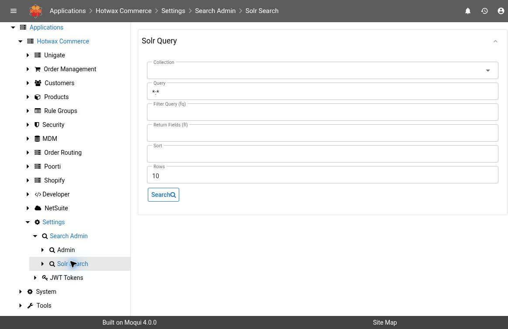

# Solr Search

Use **Settings → Search Admin → Solr Search** to inspect indexed documents without changing a collection or launching an index job. This is useful when a record exists in the source system but is missing or different in search results.

## Version And Access

This guide is based on **Maarg v6.4.0**, with **maarg-util v4.4.0**. Available collections come from the installed search schema. Shared collections are excluded from the selector for users without **SEARCH_ADMIN** permission.

Query results can contain personal and confidential business data. Limit the query and returned fields to the investigation, and redact results before sharing them.

## Run A Targeted Query

1. Open **Settings → Search Admin → Solr Search**.
2. Choose the relevant **Collection**.
3. Enter a **Query** using field names from that collection's schema. Prefer a known document identifier or a narrow business condition.
4. Set **Return Fields (fl)** to only the fields needed for the investigation.
5. Keep **Rows** small, such as the default 10, and select **Search**.
6. Read the result count and returned JSON. Use **Previous** and **Next** when the result spans multiple pages.

*Demo screenshot: maarg-util v4.3.0. The Collection is unset, Query defaults to `*:*`, and Rows defaults to 10. No search was executed for this screenshot; result behavior below is verified from the v4.4.0 source.*

| Field | Behavior |
| --- | --- |
| Collection | Required to select the index to query; confirm its purpose before searching |
| Query | Lucene/Solr query expression. Empty input defaults to `*:*`, which matches all documents |
| Filter Query (fq) | Optional additional filter; useful for restricting a main query |
| Return Fields (fl) | Comma-separated stored field names. Blank returns all stored fields. The collection's unique-key field is added automatically if omitted |
| Sort | Optional sort expression using valid schema fields, such as `id asc` only when `id` is the appropriate field |
| Rows | Documents per page; defaults to 10 and is capped at 10,000 |

The screen's example field names are illustrative. Check the collection schema before copying an expression such as `status:ACTIVE` into another collection. Use positive row counts and keep broad queries bounded.

## Interpret The Response

The summary shows **Showing … of … document(s)**. Each result displays its document identifier and formatted JSON. The identifier comes from the collection's configured unique key, with `id` as the fallback.

An empty result can mean the query is too narrow, the wrong collection was selected, the record has not been indexed, or the source record does not qualify for that document type. It does not by itself prove data loss.

A field omitted from the returned JSON may be excluded by **fl** or may not be stored in Solr. Use [Search Admin → View Fields](search-admin.md#diagnose-schema-differences) to compare schema definitions before concluding the source data is missing.

When comparing pages, choose a suitable deterministic sort if the collection supports it. Documents may change while you are investigating, so pagination is not a point-in-time export.

## Diagnose A Missing Or Stale Document

1. Confirm the environment, collection, and document type.
2. Start with the narrowest valid identifier query and a small field list.
3. Remove optional filters one at a time to distinguish a query mismatch from an absent document.
4. Compare the relevant source record and its eligibility for this index. A search index is a derived representation, not the authoritative business record.
5. Review schema status and the outcome of the responsible indexing service.
6. If a reindex is needed, agree on the specific service and scope before using [Search Admin](search-admin.md#inspect-an-indexing-operation).

## Troubleshooting

| Symptom | Check |
| --- | --- |
| Expected collection is missing | Confirm installed schema, environment, and permissions. Shared collections are omitted from this screen's selector without SEARCH_ADMIN |
| Query Error shows a Solr HTTP error | Check the collection, expression, field names, and Solr availability. Save a redacted error with its timestamp |
| Query failed is displayed | Check the connection and the reported error before changing the query or rerunning an index |
| No result appears after selecting a collection | Confirm search is configured for this instance and inspect Search Admin availability; collection selection alone does not establish a successful query |
| Unexpectedly many documents return | Blank Query uses `*:*`. Add a targeted query/filter and a minimal return-field list |
| Field list still includes an identifier | The screen adds the collection's unique key to identify each result |

## Verification Scope

Query construction, defaults, pagination, field selection, and permission-based collection filtering were checked in the v4.4.0 source screen. No query result is presented here as proof of indexing correctness or completeness.
