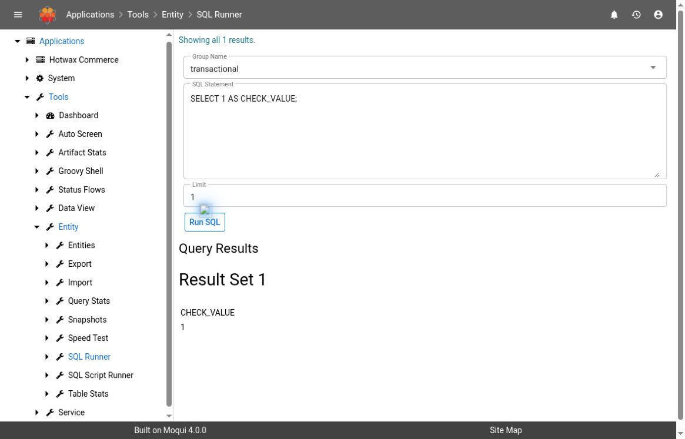
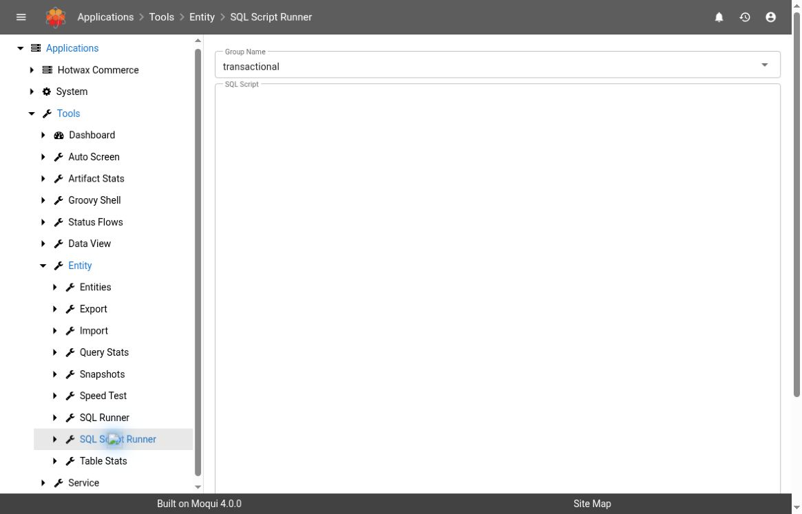

# SQL Tools

Use **SQL Runner** when an authorized investigation needs a direct database query and the entity tools cannot answer it clearly. Use **SQL Script Runner** only for an explicitly reviewed sequence of statements whose execution and failure behavior are understood. These tools execute submitted SQL; neither is a read-only query sandbox or a migration manager.

## Version And Access

This guide uses **Maarg v6.4.0**, **moqui-runtime v4.1.0**, and **moqui-framework v4.2.0**. The observed route is **Tools > Entity > SQL Runner** or **SQL Script Runner**. Use your deployment's authorized route rather than assuming another environment's menu layout.

Both screens check the **SQL_RUNNER_WEB** permission and authorization for **all actions** on that screen. The datasource's database permissions also govern what submitted SQL can do. Ask the administrator to investigate a denial; entity-browser access alone does not establish permission to use direct SQL.

**Verification scope:** Controls and execution semantics below are source-verified. Both forms were observed in the hosted demo on October 3, 2026, displaying framework 4.0.0 and util 4.3.0. A literal-only `SELECT 1 AS CHECK_VALUE;` query returned one value; it read no application table. No script, data change, schema change, or recovery procedure was executed. See [Getting Started](getting-started.md#documentation-baseline-and-demo-evidence) for displayed-version versus commit differences.


**Run SQL** executes immediately. SQL can modify or delete data, change schema, acquire locks, or call routines with side effects. The Limit field does not restrict affected rows. Do not submit production changes, generated migration statements, or SQL from a ticket without the required review and approval.


## Choose The Tool

| Need | Tool And Boundary |
| --- | --- |
| Find a record by entity fields and inspect relationships | Start with [Entity Inspection](entity-inspection.md) |
| Inspect a small direct SQL result | SQL Runner displays result sets and database update counts |
| Execute a reviewed sequence of simple statements | SQL Script Runner splits on semicolons and attempts statements in sequence; it provides no atomicity or fail-fast guarantee |
| Apply a schema migration or recover business data | Prefer the team's supported migration or business-service process, with a reviewed recovery plan |

Direct SQL uses JDBC rather than generated entity services. It does not invoke the normal entity/service mutation path, so do not assume its validation, event rules, audit behavior, or cache invalidation will run. Database constraints and triggers can still apply. A database change can therefore leave the application or downstream integrations inconsistent even when the SQL succeeds.

## Before You Run A Read Query

1. Confirm the environment, incident time, and intended datasource group. Record these before execution.
2. Use Entity Detail or an approved schema reference to establish the actual table and column names. An entity's logical name, a view entity, and a physical SQL table are not interchangeable.
3. Identify the database dialect and applicable query/lock timeout policy. The screens do not set a statement timeout themselves.
4. Choose only the columns needed for the investigation. Avoid credentials, tokens, personal information, payload bodies, and broad `SELECT *` output.
5. Use exact keys or a narrow indexed range. For a multi-row query, add a deterministic order and an appropriate database-side row bound using the confirmed dialect.
6. Review the complete statement. A statement beginning with `SELECT` can still invoke a function with side effects or request locks; use only understood read operations.

## Run And Interpret A Bounded Query

1. Open **SQL Runner**.
2. Select **Group Name**. The options come from configured datasource groups, with `transactional` as the form's default choice. Confirm the selection; do not assume it is the datasource for the entity you are investigating.
3. Enter one reviewed read-only statement in **SQL Statement**.
4. Keep **Limit** small and positive, such as 50. The default is 500. This controls displayed rows, separately from any database-side limit in the statement.
5. Select **Run SQL** once. Wait for the result before deciding whether another query is necessary.
6. Review the message and **Query Results** together. Check the returned key values against the incident scope before drawing conclusions.

For a harmless connectivity check on databases that support `SELECT` without a `FROM` clause, an operator can use:

```sql
SELECT 1 AS CHECK_VALUE;
```

This checks that the selected connection can execute that literal query. It does not verify application tables, data correctness, business permissions, or write capability. Some database dialects need a different syntax.



*The demo returned CHECK_VALUE = 1 with Limit = 1. This verifies this literal query and result display only.*

For a record investigation, a query can follow this shape:

```sql
SELECT RECORD_ID, STATUS_ID
FROM EXAMPLE_RECORD
WHERE RECORD_ID = 'DEMO-001';
```

The table, columns, and value here are invented. Replace them only after checking the real schema and the authorized record. For a composite key, include every required key column. A non-unique filter also needs an appropriate database-side row bound and ordering.

### What Limit Does

The screen executes the submitted statement first, then reads its result set and copies rows into the display until the positive Limit is reached. It does not rewrite the SQL to add a database limit, set a maximum affected-row count, or make the statement read-only.

- The default is **500 displayed rows per result set**.
- **Zero or a negative limit disables this display cap** in the source. Do not use it for routine investigation.
- A display limit cannot prevent an expensive scan, join, sort, function call, or update.
- Reaching the display cap means additional rows existed in that result set. The display is incomplete.
- “Showing all” means the returned result set was fully displayed, not that the whole table or business process was checked.

### Read The Messages

| Result | Interpretation |
| --- | --- |
| `Showing all … results.` | Every row returned by that result set was displayed; SQL predicates and database-side limits still define the scope |
| `Only showing first … rows.` | The display cap was reached; narrow the query before requesting more |
| `Query altered … rows.` | The driver returned an update count; it is not a business-level success or recovery verification |
| Exception text | Execution or result processing failed; investigate before retrying, especially if the submission could change data |
| SQL warning absent from the page | JDBC warnings are written to application logs rather than displayed as a complete warning list |

SQL Runner can display multiple result sets when the database driver returns them. That is not a promise of portable multi-statement script support. Keep diagnostic submissions to one understood statement and use a supported database client for more complex execution requirements.

## Understand SQL Script Runner Before Using It

SQL Script Runner offers **Group Name**, a **SQL Script** text area, and **Run SQL**. Its source execution is intentionally simple:

1. Split the submitted text at every semicolon.
2. Obtain a connection for the selected datasource group.
3. Attempt each resulting fragment, creating a statement for that fragment.
4. Display update-count or exception messages where produced.
5. Continue to the next fragment after a statement exception.

This has operational consequences:

- **It is not a SQL parser.** Semicolons inside quoted values, comments, procedure bodies, or dialect-specific blocks can split the text incorrectly. Do not paste a general-purpose database dump or migration script into it.
- **An error does not stop the script loop.** Earlier statements may have succeeded, and later statements may still be attempted. Whether subsequent work succeeds also depends on the database's transaction state.
- **SELECT results are discarded.** The source opens and closes result sets without displaying their rows. A script with only successful read queries can produce no useful result messages. Use SQL Runner to inspect query results.
- **Messages are not a migration ledger.** Preserve the reviewed statement order and verify actual database state separately. Do not infer an all-or-nothing outcome from the final message.
- **Rerunning can repeat successful work.** Do not submit the whole script again after a partial failure until each prior statement's outcome has been established.



*UI-observed form only. No script was submitted, and transaction/recovery behavior was not runtime-tested.*

## Commit And Rollback Are Not Managed By These Screens

Both source screens set `begin-transaction="false"`. Neither calls JDBC commit or rollback, changes auto-commit mode, provides a commit/rollback button, or keeps an interactive database session for the next page submission. The connection is obtained and closed within the request's execution scope.

The effective commit behavior depends on the datasource, driver, database, surrounding execution context, and submitted SQL. Do not describe either runner as automatically rolling back on error, or assume that a displayed exception undoes earlier changes. DDL can have database-specific implicit-commit behavior.

Do not submit `BEGIN` in one request and expect a later **Run SQL** request containing `ROLLBACK` to control the same connection. Even explicit transaction statements inside one script require database-specific review and testing; the script runner continues after caught statement errors. Use a database tool or migration process with verified transaction handling when a change depends on commit/rollback guarantees.

## Procedure For A Separately Approved Change

The following is a review and verification procedure, not approval to execute a change:

1. **Define the change.** Record the environment, datasource/schema, exact statement set, target keys, expected affected rows, and business reason. Identify application events, caches, audit requirements, and external effects that direct SQL would bypass.
2. **Choose the supported path.** Prefer the business service for business-state corrections and the deployment/migration process for schema changes. Select a SQL tool only when the responsible owner has approved that path.
3. **Prepare recovery.** Confirm the required backup or restore point, reversibility, expected locks, execution window, and transaction behavior for this database. A compensating SQL statement is not necessarily a complete rollback of business effects.
4. **Test in isolation.** Use synthetic data to check success, failure partway through, row counts, and recovery. Do not use production as the test of whether the runner commits.
5. **Review before execution.** Have the required reviewer confirm the final statements and expected scope. Any changed target or expanded scope requires renewed review.
6. **Execute once through the approved path.** Preserve each result. If the connection fails or the result is uncertain, stop and establish current database state before retrying.
7. **Verify from a fresh read.** Check the exact affected keys and schema, then verify the application's business state and any required downstream behavior. For schema work, rerun the appropriate metadata check. An update count alone is insufficient.
8. **Close with evidence.** Record what actually changed, failed, was recovered, or remains unknown. Escalate unexpected row counts or partial completion immediately to the change owner.

## Troubleshooting

| Symptom | Check |
| --- | --- |
| Permission error before execution | Ask the administrator to check SQL_RUNNER_WEB and all-action screen authorization; do not route around the denial |
| Expected datasource is missing | Verify the environment and datasource configuration with its operator |
| Selected group has no DataSource | Some configured groups may not expose JDBC; confirm the intended SQL-capable datasource |
| Table or column is not found | Check the datasource, physical schema, case/quoting, installed component version, and whether the name belongs to a view entity |
| Result is empty | Check the predicates, types, timestamp conventions, schema, and selected datasource before assuming missing business data |
| Query is slow despite a small Limit | The limit is only for display; ask the database operator to inspect the query plan, locks, and database-side timeout rather than repeatedly resubmitting |
| Script shows errors followed by more messages | Statements are attempted after an error; determine each statement's actual outcome before any retry |
| Script SELECT shows no rows | Expected for this source: result sets are discarded. Run a separately reviewed read in SQL Runner |
| Application disagrees with direct SQL | Check replica timing, application caches, view conditions, and bypassed business processing with the owner |
| Browser times out after a possible write | Treat the outcome as unknown. A client timeout is not proof of rollback or proof that execution stopped |

## Capture Useful Evidence

- Environment and component versions, incident/execution time, and timezone
- Selected datasource group, confirmed database/schema, and database dialect
- Reviewed SQL with confidential values redacted for the audience
- Display Limit, database-side bound, predicates, and ordering
- Exact result/update/error messages and a minimal redacted row sample
- Expected versus observed counts and the fresh-read verification result
- For a change: approval reference, statement order, recovery plan, and verified per-statement outcome

Do not publish raw query results, credentials, connection strings, customer records, or internal database inventories. Keep detailed evidence in the approved incident or change record.

## Related Guides

- [Entity Inspection And Relationships](entity-inspection.md)
- [DB Missing Columns](db-missing-columns.md)
- [Log Files](log-files.md)
- [Maarg Glossary](glossary.md)
