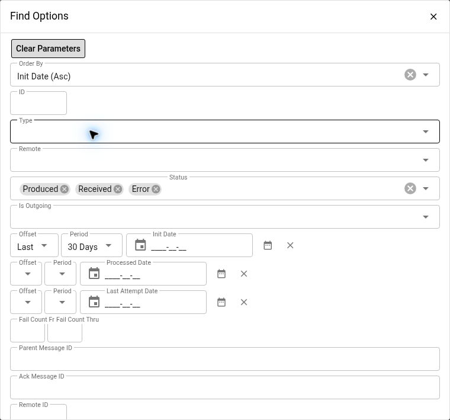

# Investigate System Messages

Use this runbook when an integration request is queued, an incoming payload has not been processed, or a system message reports an error. Follow one message from its identity and timestamps to its error history and downstream result before considering a retry.

See the [Maarg glossary](glossary.md#system-message-framework) for the framework's concepts. For the current Shopify product flow and its specific message/job names, use [Shopify product sync](../shopify/product-sync.md).

## Before You Start

- Confirm the environment, integration, affected shop or store, and approximate incident time with its time zone.
- Obtain a system message ID, remote operation/message ID, or message type if available.
- Use an authorized System account. Message text, error text, remote configuration, and downloaded payloads can contain customer data or credentials.
- Identify the integration owner before replaying a message. A send can create another external operation; consumption can repeat internal business changes.

**Navigation:** Open **System > Sys-Sys Messages > Messages**. This menu label appears in both the release definition and the verified demo. Use the application's menu; do not assume that a System screen shares the OMS URL mount. Menu visibility depends on permissions and installed components.

**Verification scope:** Detailed controls and processing behavior in this guide were checked against the Maarg 6.4.0 release definitions, using runtime 4.1.0, framework 4.2.0, and util 4.4.0. Only navigation and list filters were inspected in the demo, which reported framework 4.0.0 and util 4.3.0. The screenshot below illustrates that demo's filters; it does not verify the release's processing behavior. No payload, remote configuration, or send/consume/reset/edit/cancel action was opened or exercised there. Check your installed release before using a recovery action.

## 1. Find The Message, Including Completed Messages

1. Search **ID** when you know the system message ID. Otherwise combine **Type**, **Remote**, and an **Init Date** range around the incident.
2. Use **Remote ID** to find an operation known to the external system. Distinguish it from the local system message ID.
3. Set **Is Outgoing** to `Y` for outgoing messages or `N` for incoming messages, when known.
4. Check **Status** and date filters. The initial list is filtered to Produced, Received, and Error with a default date window. Clear or expand these filters to find Sent, Consumed, Cancelled, or older messages.
5. Select **Find**, then open the message's **ID**.

The shortcuts **Outgoing Produced Queue**, **Incoming Received Queue**, and **Error Queue** are useful starting points. Their counts summarize those status/direction categories; they are not counts of the rows remaining after all your search filters. An empty filtered list does not establish that the integration has no messages.

*Upper portion of Find Options, captured read-only in the demo. The observed defaults are Init Date ascending, Produced/Received/Error, and Last 30 Days. This image does not show message contents or a processing result.*

## 2. Establish Identity, Direction, And Timing

On the message detail, collect the following without changing the record:

| Field or section | What it establishes |
| --- | --- |
| **ID**, **Remote ID**, **Type**, **Remote** | The local record, external correlation reference, processing category, and configured connection. |
| **Is Outgoing** and **Status** | Which part of the integration is being investigated and whether the framework records it as queued, active, complete, or failed. |
| **Init Date** | When the local message was initialized. Compare it with when the source operation was expected. |
| **Last Attempt Date** and **Fail Count** | Whether attempts are occurring and whether failures are accumulating. |
| **Processed Date** | A processing milestone recorded by the handler. Interpret it with the current status and integration flow, not as proof that every downstream step finished. |
| **Status History** | The sequence of recorded status changes, with timestamps and the recorded user when available. |
| Error list | Error dates and text, newest first. Compare errors across attempts rather than reading only the current status. |
| **Parent Message**, **Child Message**, and acknowledgement links | Related records to inspect when one operation generates several messages or an acknowledgement. |

A message can have failed attempts while still showing **Produced** or **Received**. The standard send/consume handlers restore the previous status on an unsuccessful attempt, add an error entry, and increment Fail Count. The retry processor can later move the message to **Error** after its retry limit is reached. Do not use the absence of Error status as evidence that no failure occurred.

## 3. Diagnose The Current Stage

| What you see | First checks | Avoid |
| --- | --- | --- |
| **Produced** with no recent attempt | Check the sender job, its type scope, schedule, paused state, and integration-specific dependencies. | Sending it immediately without knowing whether another sender will pick it up. |
| **Produced** with increasing Fail Count | Read the latest error and compare it with earlier attempts; verify the remote and sender configuration. | Repeated sends while the same cause persists. |
| **Sending** longer than expected | Establish whether the sender is still active and whether the external system accepted the request. | Resetting to Produced merely because the page has not changed. |
| **Sent** but the business operation is incomplete | Check the remote operation and the integration's confirmation, polling, or downstream processing step. | Assuming Sent proves that the remote business operation finished. |
| **Received** with no recent attempt | Check the configured consumer and its job or background execution. Review prior errors and retry timing. | Treating Received as an unprocessed draft that is safe to edit. |
| **Consuming** longer than expected | Check the active consumer, logs, and downstream work before intervention. | Starting another consumption or manually changing its status. |
| **Consumed** but expected records are missing | Follow the downstream import or business process and inspect its result/counts. | Replaying the message before identifying which stage actually failed. |
| **Error** | Read error history, Fail Count, and Last Attempt Date. Correct the cause and assess replay safety. | Resetting the status solely to clear the Error Queue. |
| **Rejected** or **Cancelled** | Determine why processing was rejected or intentionally cancelled, and confirm the intended business outcome with the owner. | Reopening the workflow without understanding the decision. |

For example, Shopify product messages can be Consumed after handing a result file to Data Manager. Follow the [product-sync verification steps](../shopify/product-sync.md#run-and-verify-a-sync) to check the final import rather than stopping at the system message status.

## 4. Inspect Configuration And Payload Safely

### Check Type And Remote

Open **Type** to inspect the configured produce, send, receive, and consume services. Confirm that the expected handler is present. Do not change a handler just to make a failed message proceed: the configuration applies to other messages of that type as well.

Open **Remote** when the diagnosis requires checking the connection. Confirm the remote identity, destination, message type, authentication method, and relevant mappings. A remote's send-service setting can override the message type's sender, so inspect both when diagnosing unexpected dispatch behavior.

Remote Detail can display authentication secrets and private-key fields. Do not copy its full page into a ticket or public screenshot. Have an authorized administrator verify credentials through the approved secret-management process. The remote's **Messages** link returns to a list filtered for that remote.

### Inspect The Message Body

**Download Message Text** retrieves the payload. Download only when needed and handle it as potentially sensitive data; use an approved local location and sanitized excerpts for support.

**Edit Message Text** opens an editable payload. Opening the dialog does not require saving it. Its **Update** action changes the existing message body; it does not itself reset the status or launch a retry. However, a queued message may be processed by an automatic worker, so saving a change can affect the next attempt immediately.

If a payload correction is approved:

1. Preserve the original payload and error evidence in an authorized location.
2. Have the integration owner validate the precise correction and determine how to prevent a worker from processing it during the edit.
3. Apply only that correction to the intended message and save once.
4. Reopen the record, verify the saved body and current status, then follow the agreed retry plan.

Do not use **New Incoming Message** as a payload viewer or scratchpad. Its **Receive and Consume** action saves an incoming message and initiates processing.

## 5. Recover One Message Before Considering A Batch

Before any recovery action, confirm that the cause is fixed, the earlier execution is no longer active, and the operation can safely be repeated. Check the external result when a timeout leaves delivery uncertain. Preserve the original status, Fail Count, timestamps, and error text, and obtain approval for the specific message and business effect.

### Outgoing Message: Send Message

For an outgoing message in Produced or Error, **Send Message** attempts dispatch using the configured sender. It can create external side effects. Do not use it if the earlier operation may already have been accepted unless the integration owner has established a safe duplicate-handling strategy.

After one approved attempt, refresh the message and check its status, Last Attempt Date, Fail Count, new errors, and Remote ID. Then verify the external operation or next processing stage. A returned page alone is not confirmation of the business outcome.

### Incoming Message: Consume Message

For an incoming message in Received, **Consume Message** on the detail screen starts consumption in the background. The initial confirmation means processing started; refresh and follow the status and downstream result.

In the release verified here, the screen can also show Consume Message for an Error message, but the underlying consumer rejects Error unless error consumption is explicitly allowed. The standard detail action does not enable that option. After diagnosis and approval, use **Reset from Error** to return an incoming Error message to Received, then recheck its state before any manual consumption. A scheduled consumer may pick it up first.

### Error Message: Reset From Error

**Reset from Error** returns an outgoing message to Produced or an incoming message to Received and sets Fail Count to zero. It does not correct the payload or configuration and does not erase error-history records. It also does not itself send or consume the message.

Reset makes the message eligible for the configured queue processor again, subject to that processor's retry timing and filters. Coordinate with the owner before resetting; do not assume that you will have time to make additional edits before processing resumes.

### Sending Message: Reset To Produced

**Reset to Produced** is available for Sending messages. It changes the recorded state; it does not interrupt a sender or undo an external request. The screen warns of double sending if the message is actually still being sent.

Use this only after an administrator establishes that the prior sender is inactive and the integration owner resolves whether the remote already accepted the operation. If the outcome is uncertain, escalate instead of resetting.

### Cancel Message And Send Ack Message

**Cancel Message** is available for Produced, Received, Error, or Rejected messages. It marks the message Cancelled; it cannot cancel a message already Sending, Sent, Consuming, Consumed, or Confirmed. Cancellation does not reverse prior external or internal business effects.

**Send Ack Message** queues an acknowledgement for an eligible incoming message. It is an integration action, not a diagnostic test. Use it only when the integration's acknowledgement workflow and the owner require it.

## 6. Treat Batch Actions As Broader Operations

The list provides **Send Produced Messages > Send All** and **Consume Received Messages > Consume All**. These are not actions on selected rows. The visible list's Remote, Type, ID, and date filters are not supplied by these dialogs to restrict the batch.

The verified dialogs default to:

| Batch | Retry Minutes | Retry Limit |
| --- | --- | --- |
| Send Produced Messages | 60 | 24 |
| Consume Received Messages | 10 | 3 |

Retry Minutes determines eligibility relative to the last attempt; it is not a promise that every message will complete within that interval. Retry Limit governs failed-attempt eligibility. These batch processors normally select queued messages, not Error messages, and a pass is bounded rather than an unlimited drain of the queue. The default selection limit is 200 messages.

Scheduled jobs can supply different retry settings and type scopes. Inspect the actual job through [Investigate service jobs](service-jobs.md) rather than assuming the dialog defaults describe your integration.

Use a batch action only after the owner approves its actual scope across eligible messages. Verify the resulting individual messages and downstream results; a reduced queue count or successful job wrapper is not enough.

## Escalation And Completion

Provide the environment/release, message ID, type, remote identifier, direction, current status, incident time and time zone, Init/Last Attempt/Processed dates, Fail Count, sanitized error excerpt, and related job run/import/remote operation IDs. State which recovery actions, if any, were taken and what changed afterward.

Escalate instead of replaying when the external outcome is unknown, another worker may still be active, retries are not known to be safe, or several unrelated messages could be affected. Close the investigation only after the expected downstream business result is verified.
