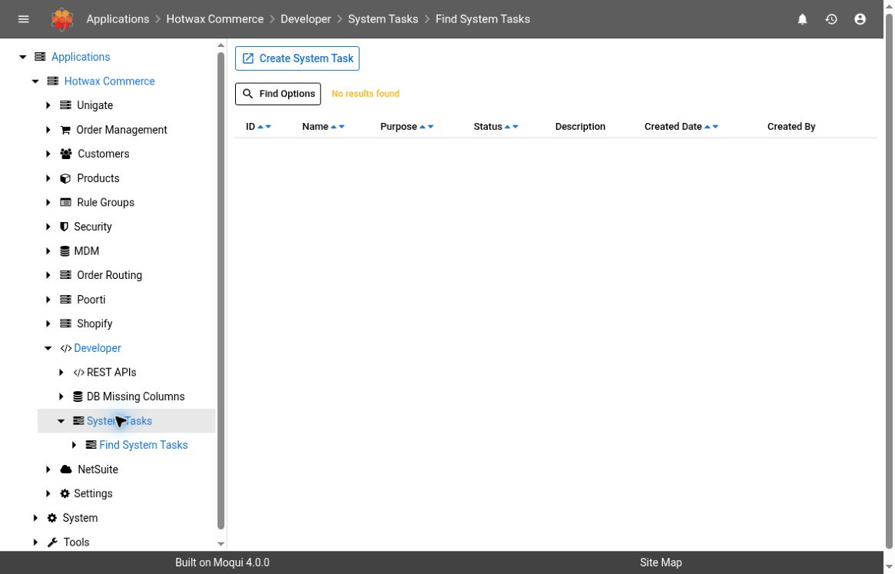
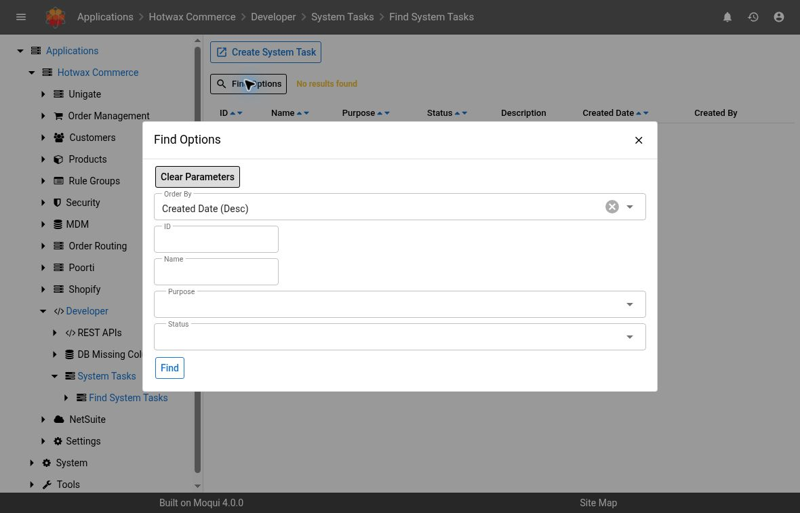

# System Tasks

Use `System Tasks` to find operational issues that need investigation and record progress in one place. For example, a component upgrade that reports a data-load failure can create a task with the purpose `Data Load Failure`.

This guide covers the screens in Maarg 6.4.0 with `maarg-util` 4.4.0. Labels and available options can differ on other versions.


The workflow is checked against the tagged source above. Screenshots show an authorized demonstration instance running `maarg-util` 4.3.0 (`ef99b1c7`), whose task-list screen source matches 4.4.0. The list and filters were inspected; task creation, details, comments, and status changes remain source-verified only.


## Before You Start

- Use an authorized account in the intended environment.
- Confirm the task and affected component before changing a status or adding a comment.
- Use synthetic data in a separate demonstration environment when preparing screenshots.


Task descriptions and comments may contain operational details from an error. Review them before sharing. Keep credentials, customer data, internal addresses, and unreviewed error logs out of documentation and screenshots.


## Find A System Task

1. Open `Hotwax Commerce > Developer > System Tasks`.
2. Review the task list. It initially includes tasks with the statuses `Created`, `In Progress`, and `On Hold`, with the newest tasks first.
3. Select `Find Options` and narrow the results by task ID, name, purpose, or status.
4. Select `Find`.
5. Select a task's `ID` to open its details.

The screenshots show an empty demonstration list. The tagged source supplies the active-status defaults; the observed filter dialog did not display selected status values. Check your current filters when a record is missing.

To find a completed or cancelled task, include `Completed` or `Cancelled` in the status filter. These statuses are outside the initial active-task filter.

| Column | What It Shows |
| --- | --- |
| `ID` | The task identifier and link to its details |
| `Name` | A short description of the task |
| `Purpose` | The task category, such as `Data Load Failure` |
| `Status` | The task's current progress |
| `Description` | Additional context about the issue |
| `Created Date` | When the task was created |
| `Created By` | The user associated with task creation |

## Review Task Details

The detail page shows the task's ID, name, purpose, status, description, creation date, and creator.

Use the `Comments` section to review investigation notes. It shows the comment, author, and date. Use `Status History` to review the available status records, including the status, date, and user who set it.

For an upgrade data-load failure, use the component and version in the task name to locate the matching upgrade records and logs. The task description may contain only part of the error. Review the complete failure before deciding how to recover.

## Record Progress

### Add A Comment

1. Open the task.
2. Select `Add Comment`.
3. Enter a concise note in `Comment`, such as the check performed, its result, and the next step.
4. Select `Add`.
5. Confirm the note appears in `Comments`.

### Change A Status

1. Select `Change Status`.
2. Choose a value in `New Status`.
3. Select `Update`.
4. Confirm the task's displayed status.

The standard statuses are `Created`, `In Progress`, `On Hold`, `Completed`, and `Cancelled`. Choose a status that reflects the investigation and your team's recovery process.


Changing a task status updates its tracking record. It does not retry the failed data load or repair the underlying issue. Verify the approved recovery separately before marking the task completed.


## Create A Task Manually

When your team's process calls for a manual tracking task:

1. Return to the task list.
2. Select `Create System Task`.
3. Complete the form:
   - `Name`: a short, recognizable task name
   - `Purpose`: the appropriate configured category
   - `Description`: useful investigation context without secrets or customer data
4. Select `Create`.
5. Confirm the new task appears in the list with the status `Created`.

Creating a task adds a record to the selected environment. Use existing tasks when possible and avoid creating demonstration records in shared or production environments.

## Troubleshooting

| Symptom | Check |
| --- | --- |
| A known task is missing from the list | Review the status filter and other search criteria. Completed and cancelled tasks are excluded initially. |
| A task description does not include the full failure | Check the corresponding upgrade records and application logs through approved access. |
| The page or an action is unavailable | Confirm the installed version and ask the environment administrator to review your access. |
| A task is completed but the underlying issue remains | Verify the recovery outcome. Status changes do not execute recovery actions. |

For related platform terms, see the [Maarg Glossary](glossary.md).
