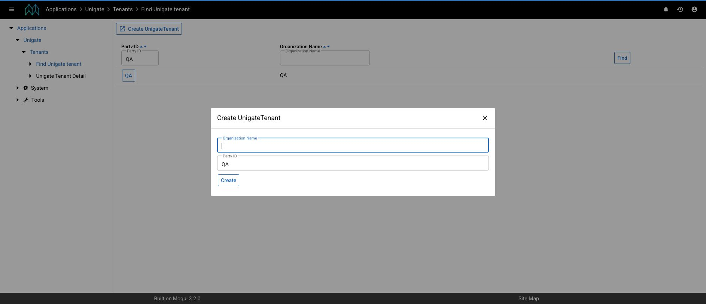
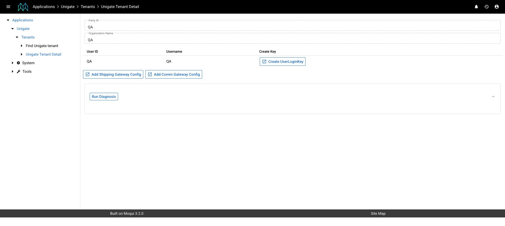

# Set up Unigate email integrations

Use this guide to connect an OMS tenant to Unigate and route product store email events through a communication provider such as Klaviyo.

This setup has three parts:

1. A tenant and login key in Unigate identify the OMS instance.
2. A communication gateway auth record in Unigate stores the provider connection.
3. A product store email setting in OMS selects the provider connection for each email event.

This page covers email integrations. Configure carrier connections separately from `Unigate > Shipping Gateway` in OMS.

## Before you start

Collect the following information:

- The tenant ID and organization name. Use a stable, recognizable tenant ID such as `BRAND_UAT`.
- The OMS product store ID.
- The provider base URL and credential. For Klaviyo, use a private API key created for the correct environment.
- A test order and non-customer email address for validation.
- Access to the approved secret manager where the generated Unigate login key will be stored.

Use matching environments throughout the setup.

| OMS environment | Unigate application | Unigate REST URL |
| --- | --- | --- |
| UAT or development | [Open Unigate UAT](https://unigate-uat.hotwax.io/qapps) | `https://unigate-uat.hotwax.io/rest/s1/unigate/` |
| Production | [Open Unigate production](https://unigate.hotwax.io/qapps) | `https://unigate.hotwax.io/rest/s1/unigate/` |


Do not connect a UAT OMS instance to production Unigate. The OMS instance URL and Unigate URL must belong to the same environment.


## Step 1: Create the Unigate tenant

1. Sign in to the matching Unigate environment and open the `Unigate` application.
2. Select `Create UnigateTenant`.
3. Enter the client or instance name in `Organization Name`.
4. Enter the tenant ID in `Party ID`.
5. Select `Create`.

<figure><figcaption><p>The tenant form collects the organization name and party ID. Enter an explicit party ID so the same tenant ID can be used in OMS.</p></figcaption></figure>

The new tenant appears in the tenant list. Unigate also creates an API user with the same ID and adds it to the `UNIGATE_API` group.

`Party ID` is optional in the service, but enter a stable ID during onboarding. If it is left empty, Unigate generates a numeric party ID, which is harder to recognize and map to OMS configuration.

Do not create separate `Party`, `UserAccount`, or `UserGroupMember` records for a normal onboarding. The tenant creation service creates them together.

## Step 2: Generate and store the login key

1. Open the tenant from the tenant list.
2. Find the API user on the tenant detail page.
3. Open the approved secret manager so it is ready to receive the new key.
4. Select `Create UserLoginKey`.
5. Copy the generated key immediately and store it in the approved secret manager.

<figure><figcaption><p>The tenant detail page lists the API user and the action that generates its login key.</p></figcaption></figure>

Selecting `Create UserLoginKey` generates and displays a new key immediately; there is no confirmation step. Each selection creates an additional active login-key record and does not expire earlier keys. During a key rotation, revoke the previous key through the approved access-management process.

Unigate stores a hash of the login key, so the original value cannot be retrieved later. Generate a new key if the value is lost.


Treat the login key and provider API key as secrets. Do not paste them into GitHub, documentation, tickets, chat, or screenshots. If a key is exposed, replace it and update the affected configuration.


## Step 3: Connect OMS to the Unigate tenant

1. Sign in to the matching OMS instance.
2. Open `Unigate > Communication Gateway`.
3. Select `Setup Tenant`.
4. Complete the form:

| Field | Value |
| --- | --- |
| `Tenant ID` | The tenant ID created in Unigate |
| `Description` | A recognizable description such as `Brand UAT Unigate connection` |
| `Instance URL` | The matching Unigate REST URL from the environment table |
| `API Key` | The login key generated in Step 2 |

5. Select `Create`.

The `Active Tenant` section displays the tenant ID, API key, and Unigate base URL. The `Communication Gateway Auths` section becomes available after tenant setup is complete. Treat this page as sensitive and do not capture it in screenshots or screen recordings.

The OMS record created by this form is `UNIGATE_CONFIG`. OMS reads the API key from `publicKey` and the tenant ID from `internalId`, then sends them to Unigate in the `api_key` and `tenant_Id` request headers.

## Step 4: Add the provider connection

From `Unigate > Communication Gateway` in OMS:

1. Select `Add Comm Auth`.
2. Complete the provider fields.

For Klaviyo, use the following values:

| Field | Value |
| --- | --- |
| `Config` | `Klaviyo gateway` |
| `Gateway Auth ID` | A unique ID such as `KLAVIYO_BRAND_UAT` |
| `Description` | A clear environment-specific description |
| `Base URL` | `https://a.klaviyo.com/api/` |
| `Public Key` | `Klaviyo-API-Key <private-api-key>` |
| `Auth Header Name` | `Authorization` |

Leave `Username` and `Password` empty for Klaviyo unless the provider configuration requires them.

3. Select `Add`.

The new auth ID appears in `Communication Gateway Auths`. Although the form labels the credential as `Public Key`, a Klaviyo private API key is sensitive and must be handled as a secret.

The `KLAVIYO` communication gateway configuration is installed with Unigate. Do not create another `CommGatewayConfig` record during tenant onboarding.

The Unigate tenant detail page also has an `Add Comm Gateway Config` action for controlled administrative recovery. Use `Add Comm Auth` in OMS for the standard onboarding flow because OMS sends the record to Unigate under the active tenant. Do not screenshot either configuration list because the current screens display stored credential fields.

## Step 5: Route an email event through the provider

From `Unigate > Communication Gateway` in OMS:

1. Select `Add Email Setting`.
2. Complete the email setting:

| Field | Value |
| --- | --- |
| `Store` | The product store that sends the email |
| `Email Type` | The event to configure, such as `READY_FOR_PICKUP` |
| `From Address` | The approved sender address |
| `Subject` | The subject and Klaviyo metric name for the event |
| `Gateway Auth ID` | The auth ID created in Step 4 |

3. Select `Add`.

The gateway auth ID selects the provider credential. OMS automatically assigns `UNIGATE_CONFIG` as the system message remote ID when the setting is created; it is not an input field in the current form.

Repeat this step for each product store and email type that should use Unigate.

## Step 6: Validate the integration

Complete validation in UAT before configuring production.

1. Reopen `Unigate > Communication Gateway` and confirm the active tenant uses the UAT Unigate URL.
2. Confirm the communication gateway auth has the expected auth ID, config, and provider base URL.
3. Confirm the product store email setting shows the expected gateway auth ID. OMS assigns `UNIGATE_CONFIG` automatically in the underlying record.
4. Trigger the configured email event with a controlled UAT order and non-customer email address.
5. Confirm OMS reports a successful request.
6. In Klaviyo, confirm:
   - the event metric matches the configured `Subject`;
   - the profile email matches the test recipient;
   - `properties.dataFields[0]` contains the expected order, pickup, totals, and line item data.

Unigate calculates `subtotal` and `savings_total` from the order items and adjustments before sending the Klaviyo event.

## Troubleshooting

| Error or symptom | Check |
| --- | --- |
| `Missing authentication headers.` | Complete `Tenant ID` and `API Key` in the OMS tenant setup. OMS must send both `tenant_Id` and `api_key`. |
| `Invalid credentials.` | Verify the login key belongs to the configured tenant ID. Generate a new login key and update OMS if the original key was lost or replaced. |
| `Could not find SystemMessageRemote with ID UNIGATE_CONFIG` | Complete `Setup Tenant` in `Unigate > Communication Gateway`. |
| `No sendUrl found in SystemMessageRemote with ID UNIGATE_CONFIG` | Add the matching environment URL to `Instance URL`. |
| `Gateway Auth ID is not configured for store ...` | Edit the product store email setting and select the provider auth ID. |
| `No valid gateway auth config found for tenant` | Verify the selected gateway auth ID exists for this Unigate tenant. |
| `Email gateway configuration not found` | Verify the auth record uses the installed `KLAVIYO` config. |
| Klaviyo returns an authorization error | Verify `Auth Header Name` is `Authorization` and `Public Key` contains the complete `Klaviyo-API-Key <private-api-key>` value. |
| Event is accepted but has unexpected data | Check the product store email subject, recipient, selected template, and the order data used for the UAT test. |

## Configuration reference

Use the UI steps above for normal onboarding. The following records show the current data model for controlled deployment data or troubleshooting.

### OMS tenant connection

```xml
<moqui.service.message.SystemMessageRemote
    systemMessageRemoteId="UNIGATE_CONFIG"
    description="Brand UAT Unigate connection"
    sendUrl="https://unigate-uat.hotwax.io/rest/s1/unigate/"
    publicKey="GENERATED_UNIGATE_LOGIN_KEY"
    internalId="BRAND_UAT"/>
```

### Unigate provider connection

```xml
<co.hotwax.unigate.CommGatewayAuth
    commGatewayAuthId="KLAVIYO_BRAND_UAT"
    commGatewayConfigId="KLAVIYO"
    tenantPartyId="BRAND_UAT"
    description="Brand UAT Klaviyo connection"
    baseUrl="https://a.klaviyo.com/api/"
    authHeaderName="Authorization"
    publicKey="Klaviyo-API-Key PRIVATE_API_KEY"/>
```

### OMS product store email setting

```xml
<org.apache.ofbiz.product.store.ProductStoreEmailSetting
    productStoreId="STORE"
    emailType="READY_FOR_PICKUP"
    fromAddress="store@example.com"
    subject="Ready To Pick-Up Notification"
    gatewayAuthId="KLAVIYO_BRAND_UAT"
    systemMessageRemoteId="UNIGATE_CONFIG"/>
```
