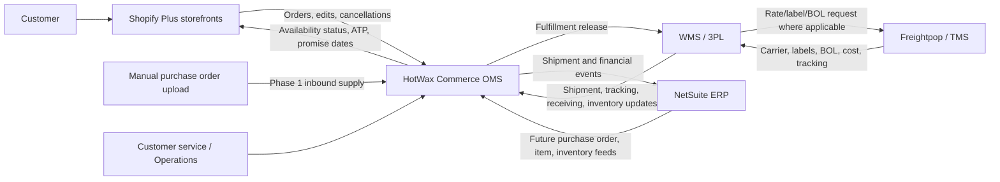
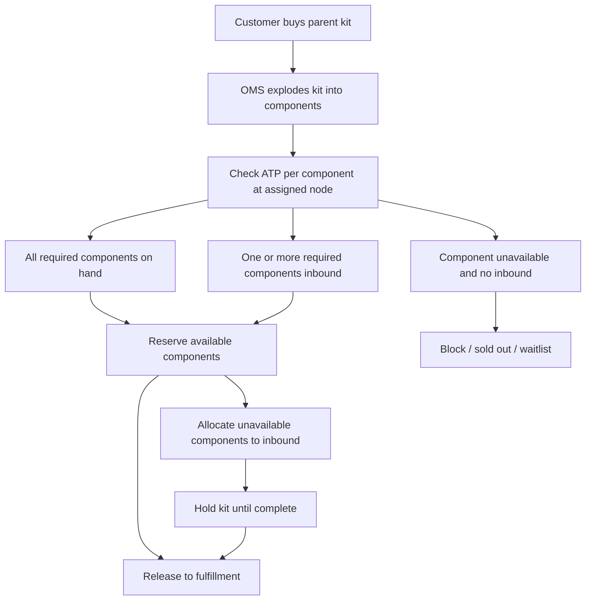
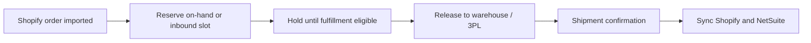

# JM Agency implementation overview

Learn about JM Agency, the HotWax Commerce Order Management System (OMS) implementation scope, and the business rules that drive order orchestration, pre-order allocation, kit reservations, Shopify availability, NetSuite integration, and future warehouse and transportation integrations.

## Current implementation baseline

The latest onboarding checklist and revised implementation notes narrow Phase 1 to an OMS-first implementation.

| Area | Current baseline |
| --- | --- |
| Client | JM Agency / 21 TSI Group / 13635180 Canada Inc |
| Primary contacts | Julien Methot, Nicolas Methot |
| HotWax Commerce role in Phase 1 | OMS and order orchestration layer |
| Phase 1 go-live target | October 1, 2026, to create a buffer before the November 1 peak-season freeze |
| Phase 1 scope | Shopify order import, node-level available-to-promise (ATP) inventory, manual purchase order upload, pre-order allocation, kit/component reservation, Shopify metafield sync, order lifecycle, basic OMS reporting |
| Phase 1 fulfillment model | Single Montreal fulfillment node in the latest onboarding checklist; warehouse execution remains outside Phase 1 |
| Deferred scope | Warehouse management system (WMS), Freightpop/transportation management system (TMS), third-party logistics (3PL) integrations, full NetSuite purchase order/inventory automation, live checkout rate optimization, advanced cross-node routing |
| Subscription trigger | In the onboarding checklist, subscription starts once JM can manage pre-orders with manual purchase order uploads in HotWax. The master services agreement says subscription starts once Phase 1 and the system are live with OMS, 3PL, and warehouses integrated. This must be reconciled. |

Older discovery and requirements documents describe a broader Phase 1 including HotWax WMS, Freightpop, and GoBolt. Treat those documents as future-state design and backlog material unless the project team explicitly changes the scope baseline.

## Client background

JM Agency operates a multi-brand ecommerce business selling bulky wellness, outdoor, and fitness products. The business started as an ecommerce growth effort and expanded into several brands and Shopify storefronts over roughly six years.

The company is heavily pre-order driven. In early discovery, Julien explained that JM has manually managed tens of thousands of pre-orders, often by manually releasing inbound quantities on Shopify and updating customer-facing date text. This has created operational pain when containers are delayed, when several inbound batches exist for the same SKU, or when customer service needs to know which customer belongs to which inbound shipment.

The client is also expanding from a single operational footprint into a regional fulfillment model. This makes generic, company-wide inventory and pre-order availability insufficient. JM needs availability and promise dates to be calculated by customer region, node, SKU, inbound supply, and kit/component availability.

## Business model and brands

JM Agency sells through six Shopify Plus storefronts across several legal entities and brands.

| Brand / storefront | Geography | Notes |
| --- | --- | --- |
| Nordik Recovery Canada | Canada | Saunas and recovery products; split fulfillment is expected to be allowed in future phases. |
| Nordik Recovery USA | United States | US storefront; some products may be fulfilled from Canada for the foreseeable future. |
| Montreal Weights | Canada | Fitness products and many kit/bundle SKUs. No split fulfillment by default. |
| Ascend | Canada | Fitness products; may share components with Montreal Weights bundles. No split fulfillment by default. |
| Maddle Canada | Canada | Paddle boards and related products; Montreal-only in current understanding. |
| Maddle USA | United States | US storefront; currently can share Montreal inventory for some products. |

Important business characteristics:

* Each brand/storefront may map to a different legal entity.
* Products may be sold across more than one storefront.
* Kit components can belong to different legal entities.
* Some products are large, heavy, and expensive to ship cross-country.
* Some products are centralized at Montreal while others are intended to be regional.
* Customers interact with Shopify, while HotWax is intended to own operational orchestration.

## Scale of operations

| Metric | Source value | Notes |
| --- | --- | --- |
| Monthly order volume | Approximately 1,500 orders/month in solution docs; approximately 2,500 orders/month in an earlier sales call | Confirm current run rate before final publication. |
| Peak daily volume | A bit under 300 orders/day around BFCM 2026 | Peak season begins around November 1 and extends through mid-March for finished products. |
| SKU count | Approximately 300 SKUs | Includes bulky and small accessories. |
| Kit SKU count | Approximately 150 kit SKUs | Montreal Weights alone may have around 100; Nordik around 50. |
| Shopify storefronts | 6 Shopify Plus storefronts | All storefronts are expected to connect to a single HotWax OMS instance. |
| Fulfillment nodes | Montreal in Phase 1 baseline; future Canadian nodes include Toronto, Calgary, Vancouver; future US nodes discussed include Chicago/Atlanta and Los Angeles | Exact Phase 1 node list changed across documents. |

## Current operational challenges

JM Agency is implementing HotWax to solve the following problems:

* Manual pre-order operations do not scale across multiple inbound batches.
* Generic Shopify availability cannot express node-specific or regional pre-order dates.
* Customer service needs visibility into the inbound purchase order or container tied to each pre-order.
* Inventory must be protected regionally so one region's demand does not consume another region's inbound supply.
* Kits require component-level reservation, including available components that must be held while unavailable components are inbound.
* Split fulfillment needs to be controlled by brand and SKU, not treated as a universal default.
* NetSuite should become the accounting, purchasing, and inventory ownership system, but it should not become the order-routing brain.
* Warehouse and transportation platforms should execute physical operations, while HotWax decides what should happen to the order.

## Implementation objectives

The implementation is designed around these objectives:

1. Establish HotWax Commerce as the central OMS for all six Shopify storefronts.
2. Enable intelligent pre-order management before full NetSuite integration is live.
3. Calculate ATP at node and SKU level using on-hand, inbound, reserved, and safety stock.
4. Allocate pre-orders to specific inbound purchase orders or inbound inventory slots.
5. Reserve kit components immediately when available and hold release until required components are complete.
6. Sync availability status, sellable quantity, and promise dates to Shopify metafields for JM's product detail page widget.
7. Preserve a clean separation between OMS decisions, WMS execution, TMS execution, and ERP financial ownership.
8. Support future WMS, TMS, 3PL, and NetSuite integrations without redesigning the business workflow.

## Solution scope

### Phase 1: Order management foundation and pre-order management

Phase 1 is the active implementation baseline in the latest onboarding checklist.

In scope:

* Shopify integration for all six storefronts.
* Product store and facility setup in HotWax.
* Manual purchase order upload into HotWax.
* Node-level ATP and Online ATP calculations.
* Pre-order allocation against confirmed inbound inventory.
* Kit and bundle component management.
* Promise date calculation.
* Shopify metafield sync.
* Reserve, Hold, Release, Ship lifecycle setup.
* Operational dashboards and reports for blocked orders, pre-sellable inventory, and inbound status.
* Customer service visibility into allocation, promise date, and purchase order linkage.

Out of scope for Phase 1:

* HotWax WMS or custom WMS execution.
* Freightpop/TMS integration.
* GoBolt/3PL integration.
* Full NetSuite purchase order and inventory automation.
* Live rate checkout through Shopify Functions.
* Advanced cross-node availability API.
* Advanced FIFO reallocation across out-of-order inbound shipments.
* Advanced business intelligence dashboards.
* Multi-entity intercompany automation.

### Phase 2: Warehouse, transportation, and third-party logistics integrations

Phase 2 is expected to automate fulfillment execution after the OMS foundation is live. Source documents differ on whether Freightpop acts as the WMS, TMS, or both. The latest meeting says JM signed with "Frank Pop/Freightpop" for warehouse and transportation needs, reducing custom WMS development and shifting HotWax work toward interface and data mapping.

Potential Phase 2 scope:

* Freightpop integration for carrier rate shopping, labels, bills of lading (BOL), tracking, and shipment cost.
* 3PL integrations such as GoBolt for Toronto, Calgary, Vancouver, and possibly US fulfillment.
* Fulfillment order push from HotWax to the WMS or 3PL.
* Inventory, receiving, fulfillment, and tracking updates back into HotWax.
* Shipment confirmation sync to Shopify and NetSuite.
* Label correction, void/reissue behavior, and exception reconciliation.

### Phase 3: NetSuite ownership transition

Phase 3 transitions inventory and purchase order ownership to NetSuite while preserving the OMS workflow.

Potential Phase 3 scope:

* Automated NetSuite purchase order feed replacing manual purchase order upload.
* Inventory and item receipt sync.
* Shopify-to-NetSuite journal entries or order postings.
* NetSuite as inventory and purchasing system of record.
* Financial events, COGS, deferred revenue recognition, and intercompany flows.
* Payout reconciliation, if approved as custom work.

## System architecture

The target architecture separates customer experience, order decisions, warehouse execution, transportation execution, and financial ownership.



## System responsibilities

| System | Primary responsibility | Notes |
| --- | --- | --- |
| Shopify | Customer-facing commerce, checkout, payment, order creation, product detail page (PDP) widget, customer notifications | Shopify should not own allocation, available-to-promise (ATP) inventory, pre-order allocation, or fulfillment routing. |
| HotWax Commerce Order Management System | Order orchestration, ATP, reservations, pre-order allocation, kit/component reservation, routing, release timing, Shopify sync | HotWax determines what should happen to an order. |
| NetSuite | Purchasing, purchase order ownership, inventory ownership, accounting, deferred revenue, cost of goods sold (COGS), financial reporting | NetSuite should not be forced to become the order-routing brain. |
| WMS / 3PL | Physical receiving, picking, packing, shipping, cycle counts, warehouse inventory | Exact systems and integration scope vary by phase. |
| Freightpop / TMS | Carrier rate shopping, label generation, BOL, shipment cost, tracking, customs documents where supported | Source documents vary on whether Freightpop owns WMS execution or only TMS/carrier execution. |
| Klaviyo / messaging tools | Customer communication templates | Can receive promise date changes if custom notification flows are implemented. |

## Product, SKU, and kit model

JM requires product modeling that supports:

* Standard SKUs.
* Shopify bundles and virtual bundles.
* Fixed bundle products with parent SKUs.
* Kit/component relationships.
* Product associations across brands/entities.
* SKU-level routing classifications.
* SKU-level fulfillment classifications.
* Product dimensions, weights, HS codes, country of origin, and fulfillment attributes.

### SKU fulfillment groups

| SKU group | Behavior |
| --- | --- |
| Regional bulky SKUs | Example: outdoor saunas. Lock to regional node where possible. Cross-node fulfillment only by surcharge or manual override. Other-node inbound inventory should not be exposed by default. |
| Centralized SKUs | Example: ice baths currently stocked only in Montreal. Fulfill nationally from Montreal even when the customer's regional node is elsewhere. |
| Small accessories | Ship with main product if available at same node; otherwise split, hold, or consolidate based on brand and SKU rules. |
| Required kit components | Reserve immediately if available; allocate against inbound if unavailable; hold core kit release until all required components are available. |
| Low-value pre-order blacklist | Do not expose as pre-orderable on Shopify, but still reserve if included in a larger order. |

### Kit and bundle rules

JM requires component-level kit logic:

1. Shopify sells a parent kit or bundle.
2. HotWax explodes the parent into component SKUs.
3. Each component is checked independently at the assigned node.
4. Sellable parent quantity is based on the limiting component.
5. If any required component is unavailable but inbound, the parent kit becomes pre-order.
6. The parent kit promise date is the latest required component availability date.
7. Available components are reserved immediately.
8. Unavailable components are allocated against inbound purchase order or inventory.
9. The kit remains on hold until all required components are available.
10. Reserved components do not expire; they remain committed until cancellation or fulfillment.



## Inventory and available-to-promise rules

HotWax calculates ATP by node and SKU.

```text
ATP = Quantity On Hand + Inbound Quantity - Reserved Quantity - Safety Stock
```

Key rules:

* Inventory must not be treated as one global pool by default.
* Each fulfillment node maintains its own on-hand, reserved, available-to-sell, and inbound inventory.
* Safety stock is deducted before inventory is shown as sellable or pre-orderable.
* Reserved inventory is removed from future availability calculations.
* Once all inbound quantity for a purchase order or inbound record is allocated, Shopify should show sold out for that node.
* Low-value SKUs may be blacklisted from customer-facing pre-order release while still reserved internally when part of a larger order.

## Purchase orders and inbound inventory

In Phase 1, JM can manually upload purchase orders into HotWax. This allows pre-order allocation to start before NetSuite is live.

Required HotWax purchase order fields from the NetSuite implementation note:

| Field |
| --- |
| External ID |
| Product Store ID |
| Facility ID |
| External Facility ID |
| ID Type |
| Product SKU |
| Quantity |
| Available-to-Promise Quantity |
| Unit Price |
| Expected Arrival Date |

The NetSuite business process review confirmation states that the committed NetSuite purchase order feed currently exports one promise/arrival date value per exported purchase order row from `expectedreceiptdate`, formatted into the `arrival-date` CSV column.

If a master purchase order is split across warehouses, inbound shipments, or containers, child-level data is required for accurate allocation and promise dates. If all inventory remains associated only with a master purchase order, HotWax cannot know which warehouse or inbound date should support a customer promise.

### Purchase order feed direction

Current source notes indicate:

* Phase 1: manual CSV upload into HotWax.
* Future: NetSuite exports purchase order CSV files every 15 minutes and pushes them to HotWax SFTP.
* Some transcripts also mention future automatic/API integration. The authoritative integration pattern must be confirmed.

## Pre-order management

JM does not need simple pre-order holding. JM needs node-specific, component-level pre-order allocation.

The required pre-order flow:

1. Customer enters a postal code or is assigned a region by JM's storefront logic.
2. Shopify product detail page widget reads HotWax-provided metafields.
3. Customer places an order on Shopify.
4. HotWax imports the approved order.
5. HotWax identifies the assigned fulfillment node or region.
6. HotWax checks on-hand inventory at the assigned node.
7. If on-hand inventory is available, HotWax reserves it immediately.
8. If local inventory is sold out but inbound inventory exists, HotWax allocates the order to the inbound purchase order or container slot.
9. HotWax holds fulfillment release until all required inventory is physically available.
10. When receiving confirms availability, HotWax releases eligible orders to fulfillment.
11. Shopify and customer-facing data are updated with current promise status.

### First-in, first-out allocation

When current inventory is unavailable, HotWax should allocate pre-orders using first-in, first-out logic against the earliest eligible inbound inventory for the assigned node.

If inbound shipments arrive out of order, the expected future requirement is to reallocate received inventory to the oldest eligible pre-orders while respecting node, region, SKU, kit, and component constraints. This is listed as advanced future scope in newer planning documents.

## Shopify metafields and product page availability

Shopify remains the customer-facing experience. HotWax supplies operational data for JM's product detail page widget through metafields.

JM owns the product detail page widget and storefront changes. HotWax supplies the inventory, availability, and promise data.

Expected metafields/data:

| Data | Description |
| --- | --- |
| Inventory availability status | In Stock, Pre-Order, Sold Out by variant and node. |
| Pre-order status | Whether a variant is on pre-order at the assigned node. |
| Promise date start | Earliest expected ship date from OMS ATP calculation. |
| Promise date end | Latest expected ship date or customer-facing buffer. |
| Sellable quantity | ATP quantity at the assigned node. |
| Kit status | In Stock, Pre-Order, On Hold, based on component availability. |
| Fulfillment status and tracking | Shipped status, carrier, tracking numbers after dispatch. |

Important decisions:

* Client storefront reads HotWax metafields and determines display logic.
* Customer-facing availability should depend on postal code/region.
* Cross-node inventory should not automatically appear in Phase 1.
* Cross-node express shipping/surcharge is a future option.
* Shopify order-level pre-order properties may be static once captured; HotWax remains the better source for current allocation/promise status.

## Order import and lifecycle

Every order should pass through four logical stages.

| Stage | Meaning |
| --- | --- |
| Reservation | Inventory is committed to the order and removed from future sellable availability. For inbound inventory, a pre-order slot is allocated. |
| Hold | Order is waiting until all required inventory becomes eligible for fulfillment. Pre-orders and no-split kits remain here until complete. |
| Release | Order or fulfillment stream is sent to WMS/3PL/manual warehouse execution once inventory is physically available. |
| Shipment | WMS/3PL confirms shipment; HotWax updates order status, Shopify tracking, and NetSuite fulfillment/financial events as configured. |



## Order routing and fulfillment rules

Routing must be based on customer location, SKU eligibility, brand/product store, inventory availability, and pre-order state.

### Phase 1 routing

The latest onboarding checklist states Phase 1 is single-node Montreal. Older design docs mention Shopify proximity routing and multiple Canadian nodes in Phase 1. Current Phase 1 documentation should use the single-node OMS baseline unless scope is changed.

Phase 1 configuration should still prepare for SKU rules:

* Ice Bath: Montreal only.
* Saunas: regional/multi-node in future; Montreal in latest Phase 1 single-node baseline.
* Fitness brands: Montreal now, Calgary possible later.
* Maddle: Montreal only.
* Nordik Recovery: split fulfillment allowed in future.
* Montreal Weights, Ascend, Maddle: no split by default.

### Future multi-node routing

Future routing can introduce:

* Province/postal-code-to-zone mapping.
* BC to Vancouver.
* AB to Calgary.
* ON/East to Toronto or Montreal depending cost rules.
* QC/Maritimes to Montreal.
* USA customers to USA nodes.
* Cross-node inventory only when a surcharge/manual override is configured.
* Express cross-node shipping option if assigned node is sold out but another node has on-hand inventory.

## NetSuite integration

NetSuite is expected to become the system of record for:

* Purchase orders.
* Vendor data.
* Item master and item dimensions.
* Inventory ownership.
* Inventory valuation.
* Item receipts.
* Financial accounting.
* Cost of goods sold and deferred revenue recognition.
* Intercompany accounting.

### Confirmed and discussed integration details

| Area | Current understanding |
| --- | --- |
| Native connector | HotWax has a native NetSuite connector. Acumatica would require partner/custom integration. |
| Purchase order date source | `expectedreceiptdate` mapped to `arrival-date` in committed purchase order feed. |
| Purchase order feed direction | NetSuite pushes CSV to HotWax SFTP every 15 minutes in the business process review confirmation. |
| HotWax to NetSuite order posting | July 23 notes describe file-based SFTP, with NetSuite reading the file. |
| Shopify source of truth | Shopify remains the source of truth for order edits in the current architecture. NetSuite-to-Shopify update pushback is not available out of the box. |
| Kit posting | Majority of kit orders should be posted to NetSuite as broken-down inventory line items rather than one kit record. Some exceptions may remain kit records. |
| Discounts | Discounts map to NetSuite discount items; generic or specific mapping may be used. |
| Free gifts | Shopify order tag should sync to a NetSuite custom body field so accounting can reclassify $0 items as marketing expense. |
| Payout reconciliation | Not available out of the box. Achievable as custom work, but still open. |
| Customer dedupe | Needs confirmation. Discussed fields include Shopify customer ID, email, and shipping address. |
| Actual shipping cost | Needs confirmation by provider. Freightpop/3PL shipment cost may need to flow to HotWax and then NetSuite. |
| 3PL pick/pack fees | No committed order-linked import found in reviewed NetSuite scripts. |

## Warehouse, third-party logistics, and Freightpop integration

This section describes future-state and deferred scope.

### Warehouse and third-party logistics systems

| System | Role discussed |
| --- | --- |
| Freightpop / "Frank Pop" | Latest meeting says JM signed with this vendor for warehouse and transportation needs. Source naming should be verified. |
| GoBolt | Canadian 3PL for Toronto, Calgary, Vancouver in older multi-node design. API docs may be parcel-focused; full WMS API scope must be confirmed. |
| Radial | Mentioned in revised plan as a possible US warehouse partner. |
| Future US 3PL | Chicago/Atlanta and Los Angeles discussed earlier for Nordik Recovery USA. |

### Future fulfillment release

When an order is released:

* HotWax sends fulfillment order data to the WMS or 3PL.
* Payload should include order ID, line items, SKUs, quantities, customer address, shipping method/service, special instructions, node identifier, and kit/component detail.
* The WMS or 3PL executes physical fulfillment.
* The WMS or 3PL returns shipment status, carrier, tracking, cost, and exceptions to HotWax.
* HotWax updates Shopify and NetSuite.

## Warehouse fulfillment and pickup

Older WMS requirements and scenario videos describe a rich warehouse execution model. Treat this as future-state unless the project re-adds WMS to scope.

### Carrier and SKU batching

Nicolas described the warehouse picking model as carrier-first and SKU-first:

* Work is grouped by carrier/courier.
* Within a carrier batch, identical SKUs for different customers are picked together.
* Batches may contain 200 to 400 items.
* New orders can join an open batch until picking starts.
* Once picking begins, the batch should lock and new work should move to a later batch.
* Multiple pickers should be able to work the same batch without double-picking.

### Product handling attributes

Two independent boolean attributes were emphasized:

| Attribute | Meaning |
| --- | --- |
| Ready to Ship | Product already has shipping-ready packaging and can receive a label directly. |
| Packable | Product can be consolidated into a box or polymailer with other packable items. |

Operational rules:

* Large ready-to-ship, non-packable items receive one label per unit.
* If one small ready-to-ship packable item is ordered, label can be applied directly.
* If more than one packable item is ordered, consolidate into one package where allowed.
* Packable but not ready-to-ship items require box recommendation.
* LTL and pickup do not use parcel packable/ready-to-ship logic.

### Three-way scan validation

Future WMS workflows require proof-grade scan validation:

1. Scan expected warehouse location.
2. Scan shipping/supplemental label or package reference.
3. Scan product/box barcode.
4. Validate all three before label application.
5. Record picker, SKU, label, location, timestamp, and result.

### Less-than-truckload pallet workflow

Less-than-truckload (LTL) shipments require a two-phase flow:

1. Before picking, system estimates parcel vs LTL using SKU dimensions, weight, destination, and rates.
2. If LTL is selected, shipment goes to a pending packing/LTL hold state.
3. Warehouse builds the pallet.
4. Picker scans items onto the pallet record.
5. Picker enters actual dimensions and weight.
6. Actual dimensions are sent to Freightpop or the TMS.
7. The BOL is generated only after actual dimensions are confirmed.
8. Pro number and tracking flow back to HotWax.

### Warehouse pickup

Pickup is a warehouse-side workflow:

* No carrier label.
* No Freightpop rate shopping.
* Staff pick items using scanner flow.
* Customer receives ready-for-pickup notification.
* Staff load items into customer vehicle.
* Customer signs on scanner.
* Partial pickup should be supported when the customer cannot take all items.
* Oversized/weight warnings are recommended before pickup.

## Returns and exception handling

Returns were not discussed in detail and remain an open scope item.

Known exception requirements:

* Missing item can be marked during picking without cancelling the entire order.
* Damaged item can be removed from current fulfillment flow.
* Available items should continue where business rules allow.
* Missing/unavailable items should stay backordered at the relevant node, especially Montreal, unless manually cancelled.
* Customer service can cancel remaining unfulfilled items if the customer does not want to wait.
* Label correction must support cancel individual label, void all labels, or regenerate labels depending on carrier capability.
* Inventory adjustments from rejection should update inventory through HotWax variance workflows where configured.

Open returns questions:

* Who generates the return label?
* Is return receiving handled in HotWax, WMS, or another process?
* Is Freightpop involved in return label generation and tracking?
* How does return receipt link to refund and inventory reconciliation?

## Reporting and monitoring

Phase 1 operational reporting should support:

* Blocked orders.
* Orders held for pre-order.
* Orders missing components.
* Orders ready to release.
* Pre-sellable inventory by node.
* Inbound status by SKU, node, and purchase order.
* Reserved, available, inbound, and pre-sold quantities.
* Kit limiting component and component shortages.
* Promise date changes.
* Low-value SKU blacklist status.
* Shopify metafield sync status.

Future reporting can include:

* Carrier performance.
* Actual vs estimated transit time.
* Claims tracking.
* Cost per shipment.
* Cross-node shipment volume.
* Cross-node surcharge revenue.
* Inventory consumed outside assigned region.
* Advanced business intelligence dashboards.

## HotWax Commerce configuration notes

Expected HotWax configuration areas:

| Configuration | Purpose |
| --- | --- |
| Product stores | One per Shopify storefront/brand. Enables brand-specific routing and split rules. |
| Facilities | Montreal in Phase 1 baseline; additional nodes as future facilities. |
| Shopify connectors | All six Shopify Plus stores. |
| Manual purchase order import | Phase 1 source for inbound supply. |
| Kit associations | Parent-child kit/component relationships. |
| Routing rules | Product store, SKU group, node, region, and future cross-node rules. |
| Safety stock | SKU/node-level stock buffers deducted from ATP. |
| Pre-order blacklist | Low-value SKUs not shown as pre-orderable. |
| Metafield schema | Status, promise date range, sellable quantity, kit status, tracking. |
| Jobs/feeds | Create Orders, Fulfilled, Brokered, Inventory, Cycle Count Variance, purchase order import, metafield sync. |
| User roles | Customer service, operations, admin, integration users. |

## Customizations and fit-gap summary

### Phase 1 order management customizations

Likely custom or configured work:

* Node-level pre-order allocation.
* Component-level kit pre-order availability.
* Parent kit promise date using latest required component date.
* Shopify metafield schema for node/variant availability.
* Manual purchase order upload format and validation.
* Promise date calculations and optional date-range display.
* Low-value SKU pre-order blacklist.
* Product store-specific split/no-split routing rules.
* Customer service visibility into purchase order allocation and promise date history.

### Deferred and future customizations

Future-state custom work captured in fit-gap documents:

* Proof-grade scanner event model.
* Three-way scan validation.
* Carrier/SKU batch picker views.
* Dynamic batch growth and locking.
* Multi-picker concurrency.
* Large-item label-first workflow.
* Small-item bulk pick and packing desk workflow.
* Cartonization and item-to-box mapping.
* Parcel-vs-LTL decisioning.
* Virtual palletization.
* LTL pallet/BOL workflow.
* Carrier API or Freightpop extensions.
* Partial pickup proof and signature.
* Carrier/trailer handoff proof.
* Returns workflows.

## Project phases and timeline

Multiple timelines exist in the source documents. The latest onboarding checklist should be used unless superseded.

| Version | Phase 1 target | Notes |
| --- | --- | --- |
| Requirements Analysis Document | August 12, 2026 | Includes broader WMS/Freightpop flows. |
| HotWax OMS/WMS/TMS Process Flows | August 22, 2026 | Includes Freightpop and GoBolt in Phase 1. |
| Revised Implementation Plan | August 18, 2026 in one table; October 1, 2026 in another table | Introduces phased parallel development. |
| Onboarding checklist | October 1, 2026 | Latest practical baseline; OMS-only Phase 1. |
| Older process flow | November 28, 2026 | Older broader go-live target. |

Current recommendation: document Phase 1 as OMS-only with an October 1, 2026 target and call out WMS, TMS, 3PL, and NetSuite as parallel or later tracks.

## Commercial and operational boundaries

| Item | Current understanding |
| --- | --- |
| OMS implementation | $30,000 one-time fixed bid, paid in three installments. |
| Monthly subscription | $2,500/month, includes up to 5,000 orders/month. |
| Additional order volume | $0.50/additional order above 5,000/month. |
| WMS, TMS, and 3PL customization | $150/hour time and materials. |
| Post-go-live custom work/support requiring engineering | $150/hour time and materials. |
| AWS | Client-owned environment. HotWax initial setup included; post-go-live involvement billed hourly. |

Commercial inconsistency: the MSA states the subscription covers OMS/WMS features and starts once OMS, 3PL, and warehouses are integrated. The onboarding checklist and pricing sheet say subscription starts once manual purchase order pre-order management is live. This must be resolved before external publication.

## Risks, assumptions, and dependencies

| Risk / dependency | Impact | Mitigation / status |
| --- | --- | --- |
| Kit component list not delivered | Blocks kit promise dates and hold logic | Required for approximately 150 kits. |
| SKU routing rules not finalized | Blocks accurate regional routing and brand rules | Confirm per brand and product category. |
| Shopify metafield schema not signed off | Blocks product detail page widget and storefront display logic | Must align with JM dev team. |
| Safety stock not provided | ATP may expose too much inventory | Default may be zero if not provided. |
| Low-value SKU blacklist missing | Low-value items may become pre-orderable and block larger orders | Provide blacklist before pre-order launch. |
| NetSuite delayed | Phase 1 can continue with manual purchase order upload, but flip-switch planning is impacted | Keep manual upload path stable. |
| NetSuite integration pattern unclear | API vs SFTP expectations can diverge | Confirm purchase order feed and order posting direction. |
| WMS/TMS vendor scope evolving | HotWax custom scope can change materially | Confirm Freightpop/GoBolt/Radial responsibilities. |
| Returns not scoped | Post-purchase process unclear | Scope before WMS/TMS implementation. |
| Shipping cost and payout reconciliation open | Accounting workflows may require custom build | Confirm with finance/NetSuite team. |
| Peak season change freeze | Missed go-live creates high risk | Preserve October 1 target and avoid risky changes after November 1. |

## Open questions

### Product and inventory

* What is the final kit component file for approximately 150 kits?
* Which components are required versus optional/splittable?
* What are the final SKU routing groups per brand?
* What are safety stock levels by SKU and node?
* Which SKUs should be blacklisted from pre-order display?
* What product attributes will be maintained in NetSuite versus Shopify versus HotWax?

### Shopify

* What is the final metafield schema?
* Does the product detail page widget need five-state postal-code availability in Phase 1 or later?
* How will Shopify checkout handle future express cross-node shipping?
* Are custom checkout statuses required, or is HotWax order visibility sufficient?

### NetSuite

* Is `expectedreceiptdate` sufficient, or are multiple promise date fields required?
* Will Chinese Ready, Port Arrival, and Warehouse Arrival dates be implemented?
* Is the NetSuite-to-HotWax purchase order feed SFTP, API, or both?
* Is HotWax-to-NetSuite order posting SFTP, API, or both?
* Which order edits are expected to sync to NetSuite and WMS?
* How should Shopify payouts be reconciled?
* How are 3PL handling/pick-pack fees linked to orders?
* What exact customer dedupe fields are used?
* When should intercompany events be booked for cross-brand kits?

### Warehouse, transportation, and third-party logistics

* Is Freightpop the WMS, TMS, or both?
* Is "Frank Pop" in meeting notes the same as Freightpop?
* What exact Freightpop API scopes are available?
* What exact GoBolt API scopes are available?
* Are GoBolt docs sufficient for receiving, inventory, fulfillment order, and tracking APIs?
* What carriers must be live first?
* What are the LTL trigger thresholds?
* What are auto-booking exception thresholds?
* Who owns carton master data?
* Can Freightpop generate US commercial invoices automatically?
* What is the source of truth for HS codes?
* What are DDP/DDU defaults for US shipments?

## Appendix: Source document map

| Source | Use in this document |
| --- | --- |
| `JM Agency/01-Discovery/JM-Agency-onboarding-checklist.docx` | Latest Phase 1 scope, Oct 1 go-live, onboarding dependencies, risks, commercial baseline. |
| `JM Agency/01-Discovery/Revised Implementation Plan.docx` | Phased architecture, OMS-first implementation, roles, future NetSuite transition. |
| `JM Agency/01-Discovery/Requirements Analysis Document.docx` | Rich OMS/WMS/Freightpop flows, metafields, lifecycle, open items. |
| `JM Agency/01-Discovery/JM Requirement_.docx` | Original client requirements for regional allocation, pre-orders, kits, Shopify sync, 3PL/TMS, NetSuite. |
| `JM Agency/01-Discovery/HotWax NetSuite BPR Confirmation Q&A - Final.docx` | NetSuite purchase order feed, SFTP push, bundle explosion, edits, customer sync, payout gaps. |
| `JM Agency/01-Discovery/NetSuite Implementation - JM Agency.docx` | Required purchase order fields, master purchase order vs child data, kit CSV fallback. |
| `JM Agency/01-Discovery/JM Warehouse Execution + Shipping Orchestration Fit-Gap Analysis.docx` | Future WMS/TMS fit-gap and custom development summary. |
| `JM Agency/01-Discovery/JM WMS Requirements Effort Estimation Matrix.xlsx` | WMS effort areas and future custom implementation categories. |
| `JM Agency/05-Meeting-Notes/Stellargrade _-_ Hotwax - 2026_07_23 10_29 EDT - Notes by Gemini.docx` | Latest NetSuite/Stellargrade meeting notes, SFTP/file-based integration, bundle posting, free gift tagging, payout reconciliation. |
| `JM Agency 2/Hotwax OMS - Discovery Questions for Solution Design.docx` | Client answers on fulfillment network, regional rules, purchase orders, Shopify widget, kits, volumes, entities. |
| `JM Agency 2/HotWax_OMS_WMS_TMS_Process_Flows.docx` | Older full OMS/WMS/TMS process flow; useful as future-state design and contradiction source. |
| `JM Agency 2/HotWax WMS Client Requirements - Julien Methot.docx` | WMS requirements from Nicolas/Julien warehouse workflow discussion. |
| `JM Agency 2/TMS_Feature_Requirements (1).docx` | TMS requirements for carrier rate shopping, LTL, customs, returns, reporting. |
| `JM Agency 2/WMS Implementation Plan.docx` | Alternative HotWax WMS-first position if Freightpop is not used. |
| `JM Agency 2/Warehouse Fulfillment and Inventory Management with HotWax.docx` and `.pdf` | Reference explanation of HotWax order management, warehouse fulfillment, transfer orders, purchase order receiving, and cycle counts. |
| `JM Agency 2/Questions for Julien and Nicolas.docx` | Clarifications on carrier/SKU picking, LTL, pickup, ready-to-ship and packable attributes. |
| `JM Agency 2/Strategic Proposal for JM Agency.docx` | Early proposal and pricing history. |
| `JM Agency 2/JM Agency Pricing_.xlsx` | Final updated pricing and older pricing variants. |
| `JM Agency 2/JM Agency x HotWax Commerce - MSA.docx` | Legal/commercial terms and subscription trigger inconsistency. |
| Call transcripts | Discovery rationale, original pain points, demo confirmations, phase prioritization, and volume/business context. |
| Scenario videos | Confirmed HotWax demo scenarios: order routing, order fulfillment, transfer order fulfillment/receiving, cycle counts, inventory adjustment from rejection. Video inspection was limited to generated thumbnails due local video tooling limitations. |
