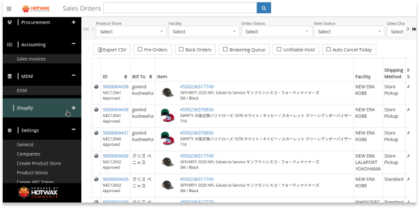
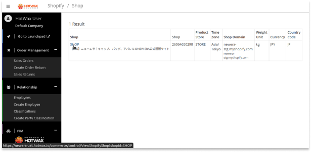
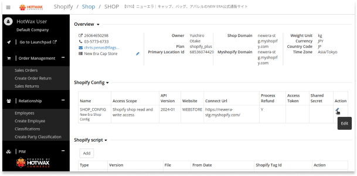
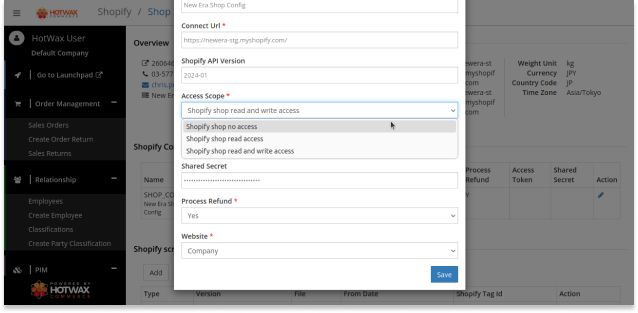
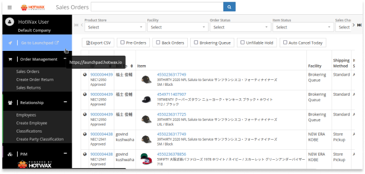
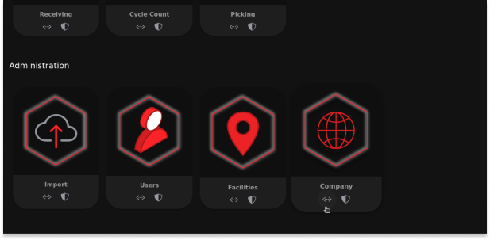
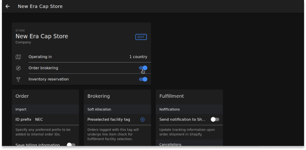

# Troubleshooting Document: Rollback to Previous Configuration with Safety
How to perform a rollback in HotWax Commerce OMS when issues arise on deployment to ensure order fulfillment continues seamlessly.

## Objective:
Due to issues like data discrepancies, import order failures, improper inventory synchronization, and brokered feed generation errors, we must safely revert changes and restore stability in the OMS environment. This is essential to maintain operational continuity and ensure smooth order processing and fulfillment.

## Steps for Safe Rollback:

### Login:
Log in to the Hotwax Commerce OMS using your username and password.

### 1. Change Shopify Shop Access Scope:

#### Navigate to Shopify Section:
- Click on the hamburger navbar at the top left corner of the screen (if the left slider is not visible).
- Navigate to the `Shopify` section in the left slider.
  

#### Access Shopify Shop Settings:
- Go to `Shopify` > `Shopify shop` and click on `SHOP`.
  

- Inside SHOP, go to the `Shopify Config` section.
- Find the Action field and click on the edit icon, which will open a pop-up window.
  

#### Change Access Scope:
- In the pop-up edit screen, navigate to the `Access Scope` section.
- Select `Shop no access` from the drop-down menu.
  

#### Save Changes:
- Save the changes by clicking the `Save` button on the pop-up.

### 2. Disable Order Brokering:

#### Navigate to Launchpad Section:
- Click on the hamburger navbar at the top left corner of the screen (if the left slider is not visible).
- Click on the `Go to Launchpad` section inside the left slider.
  

#### Navigate to the Administration section:
- Open the `Company` app inside it.
  

#### Access Company Store:
- Inside the `Company` app, click on the `STORE` (i.e., New Era Cap Store).
  

#### Disable Brokering:
- Inside the `New Era Cap Store`, navigate to the section (i.e., STORE) where you will find details about the company name, order brokering, operation country, and inventory reservation.
- Click on the order brokering toggle button next to it to disable order brokering.
  

- Changes will be saved automatically.

This document provides a structured approach to handling deployment-related issues in HotWax Commerce OMS, ensuring operational continuity and swift resolution of challenges encountered during deployment processes.
