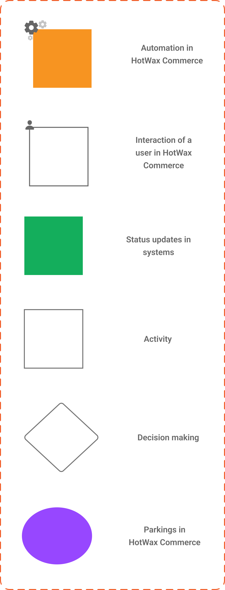

# Introduction

* [**Order Lifecycle BPM:** ](orderlifecycle.md)The model outlines the end-to-end flow of an order, from its creation to fulfillment. Learn about the different stages and transitions that an order undergoes as it progresses towards completion.
* [**Store Fulfillment Lifecycle BPM:**](store.fulfillment.md) The model outlines the journey of fulfilling orders allocated to stores, and the status changes they undergo throughout the process. Learn about how orders are processed and fulfilled within the store network.
* [**Warehouse Lifecycle BPM:**](warehousefulfillmentlifecycle.md) The model outlines the journey of fulfilling orders allocated to warehouses, and the status changes they undergo throughout the process. Learn about how HotWax Commerce stays updated on orders fulfilled within the warehouse network.
* [**Inventory Lifecycle BPM:**](Inventorylifecycle.md) The model outlines the process of synchronizing inventory data from various systems, calculating Available-to-Promise (ATP), and the changes inventory undergoes. Learn about the events that trigger increases or decreases in inventory.
* [**Transfer Order Lifecycle BPM:**](transferorderlifecycle.md) The model outlines the process of inventory movement involving three types of transfer orders, from warehouses to stores, between stores, or from stores to warehouses.
* [**Returns Lifecycle BPM:**](returns-lifecycle/README.md)The model outlines the journey of web and in-store returns creation and completion, and the interactions between different systems involved in the return process. Learn about how web and in-store returns are managed in HotWax Commerce.
* [**Exchanges Lifecycle BPM:**](exchanges-lifecycle/README.md) The model outlines the journey of web and in-store exchange creation and completion, and the interactions between different systems involved in the exchange process. Learn about how web and in-store exchanges are processed in HotWax Commerce.

By understanding the different events that trigger actions and the resulting outcomes, you'll gain a comprehensive understanding of our operations. Stay tuned as we continue to update and expand upon these models to offer even greater insights into our operations.

## Notations

Before we delve into the specifics of each business process model, let's familiarize ourselves with the notations used in our BPM flow charts.&#x20;

<figure><figcaption>
Notations
</figcaption></figure>
